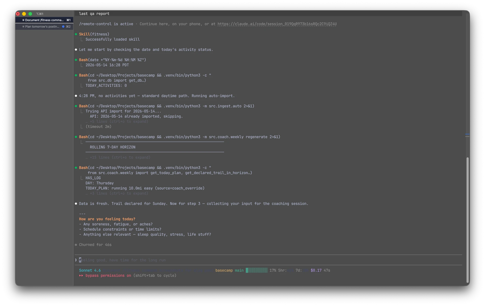
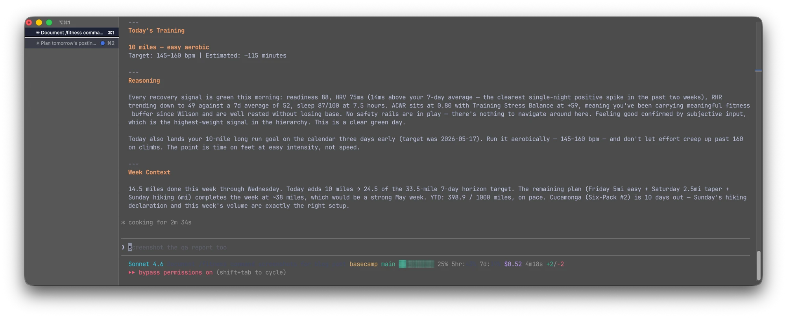

*This is Part 4 of a 4-part series on my fitness project's evolution. [Part 1](/posts/claude-fit-the-ai-fitness-app-that-didnt-need-ai) covers Claude-Fit, the AI agent prototype. [Part 2](/posts/garboard-from-chatbot-to-dashboard) covers Garboard, the dashboard that outgrew its AI. [Part 3](/posts/basecamp) covers Basecamp's architecture, the metrics layer, and why Claude became the coach instead of the backend. This one is about what actually happened once I started using it.*

---

On April 10th the coach told me to run two miles flat, and I ran 5.2 miles with 515 feet of gain. By that evening my left ankle, five days into recovering from a lateral ATFL sprain, was hurting more than it had the day before. The coach caught it the next morning, flagged the hills as the aggravating factor, and pushed the trail return another two weeks. The overshoot was mine. The course correction came from a system I'd been using for about twelve days.

That's the weird thing about having an AI as a training partner. It doesn't prevent you from being stupid, it just notices, and it remembers, and the next conversation has that pattern baked in.

## The Coach Agent

The coach is 473 lines of prompt sitting in `.claude/agents/coach.md`. No code, no model fine-tuning, no vector database, just a markdown file that tells Claude how to think about my training. It's invoked by a `/fitness` skill that pulls today's Garmin data, asks me how I'm feeling, and hands the whole thing off to the agent.

The structure matters more than the length. The prompt is organized as a decision framework with explicit signal priority, where subjective feel is the highest-weight input because the 2024 PMC4789708 study shows subjective self-report outperforms objective measures in 85% of cases where the two disagree. Sleep trends come next, then HRV read as a 7-day rolling average and not a single reading, then RHR trends, then ACWR, then body composition, then composite scores like Body Battery and Training Readiness, and last, single-day metrics. The coach is required to work down the hierarchy before arriving at a recommendation, which means the recommendation is the output of the reasoning, not the input.

**The subjective input protocol** is the part I didn't expect to matter as much as it does. The agent's instructions explicitly require it to ask how I'm feeling, what my energy level is, whether anything hurts, what my schedule looks like, before it prescribes anything. Not as a courtesy, as a signal. On a morning where HRV is 38ms and readiness is 32 but I tell the coach I slept poorly because of one weird night and I actually feel fine, it holds the plan. On a morning where HRV looks great and I say I feel off, it prescribes easier anyway.

**The research integration** is the other half. Every non-obvious decision requires a citation: recommending rest against my preference means citing the specific threshold being triggered, capping distance due to a spike rule means citing PMC12421110, ACWR-based load restrictions mean citing PMC12487117. The research docs live in `docs/research/` as markdown, the coach reads them as part of its context, and if a situation arises that no doc covers, the coach flags a research gap for the research agent to fill later.

**The decision order**, which I had to rewrite the prompt to enforce, is that the recommendation is the last thing printed in the response. All the data gathering, the status file updates, the coaching log saves happen above, and what I see at the bottom of my terminal is the prescription block and the reasoning. The original version buried the recommendation under a wall of tool output, and I'd miss it half the time. A one-line rule in the prompt fixed it.

## The Status File

The coach doesn't have memory between sessions by default because Claude Code spins up a fresh context each time, so the coaching system writes its own memory to `data/coach-status.md` after every session and reads it back at the start of the next one. The file is about 150 lines covering the current training phase, this week's plan and progress, key metrics with cached trend directions, active concerns with the date each was first noticed, YTD goals, active research references, coaching insights learned from outcomes, and a daily log of what was recommended versus what actually happened.

The status file is why the coach can say "your HRV has been declining for three days" without recomputing the entire history every morning. The file says it, written by yesterday's coach, who was doing the same thing the day before. On Sundays the coach does a full refresh, archives the old status file to `data/coach-history/`, and regenerates everything from scratch against the current database. On weekdays it's just a delta update. Agents without persistent state relearn their context every session and end up contradicting themselves, and a markdown file on disk that the agent writes and re-reads has turned out to be enough.

## Mondays, or How the Coach Grades Itself

The coach agent is not alone. A separate agent called coach-qa runs every Monday before the daily session, reviews the past week's recommendations against what actually happened, validates the signals the coach cited, and writes insights back to the status file. It's 267 lines in `.claude/agents/coach-qa.md` and it's the part of the system I'm most proud of, because it's the thing a rules engine could never do.

The workflow is nine phases: load the status file, pull the past week's coaching log, read the snapshot for outcome correlation, check the archive for multi-week trends, run adherence analysis, validate each signal the coach cited, audit research references, clean up the status file, and archive a QA report to `data/coach-qa/YYYY-MM-DD.md`. Insights carry a four-week expiry rule, so anything that doesn't get re-validated gets dropped. The output reads like a coaching review written about me. Here's the first paragraph of the April 13th report, verbatim:

> Adherence: 6/7 coached days (86%), 1 major deviation. Fri 04-10: rec run 2mi (flat, easy, ankle gate test) → actual running 5.2mi with 515ft gain. DEVIATED, 160% overshoot. Caused ankle regression by evening. This is the critical deviation of the week.

That's the coach-qa catching the April 10th mistake, correlating it with the next-day data, and writing an insight that gets added to the status file: "Apr 10 overshoot directly caused ankle regression, injury-gated recommendations are ceilings, not targets." That insight then shaped later recommendations, which started explicitly framing prescribed distance as a ceiling and not a target, because the prompt tells the coach to apply learned insights from the status file.

The feedback loop is the point. A rules engine never grades itself, and a coach with explicit signal validation can notice that one of its inputs is systematically wrong for this athlete and demote it, which is what happened with Body Battery and Training Readiness early on. Both are Garmin's proprietary composite scores, both are the kind of single-number wellness readout that feels like it should matter, and both turned out to be poor predictors of my actual performance. Low BB days showed faster paces and higher HR, and low readiness days did the same. The coach-qa flagged the pattern, and the signal priority in the main coach prompt now explicitly says "these use proprietary, unvalidated algorithms. Never let them be the primary driver."

## What the Coach Changed About My Training

Three weeks of daily use produced a stack of specific decisions that came out of coaching conversations rather than rules.

**The HR source bug.** On April 16th I paired a COOSPO H808S chest strap with the watch. The coach-qa had been flagging for months that my January-February peak HR readings looked suspicious, with sustained averages over 190 for 10-30 minutes at a pace that didn't justify it. The chest strap run that afternoon hit a clean 160 average and 188 peak on a hilly five-miler, with heart rate dropping smoothly to 108 between intervals instead of the wrist optical's dropouts to 62. The wrist HR had been cadence-locking during hard running, pinning at a value near my stride rate. The database migrated to track `hr_source` per activity, and every subsequent citation of a peak HR now gets weighted by source: strap-sourced cited confidently, wrist-sourced during intensity flagged as potentially cadence-locked.

**The flex trail day.** The original weekly template had Sunday locked as the trail day, but the coach noticed over several weeks that I was consistently shifting the trail session to Friday or Saturday depending on weather, work, and how I was feeling midweek. Rather than treating those moves as deviations, the template got rewritten. Trail day is now any of Friday, Saturday, or Sunday, I decide mid-week, and the taper day auto-slots the day before whichever I pick. This came from the coach-qa pattern analysis, not from me having the idea.

**The ankle recovery protocol.** When I rolled my left ankle on Pyles Peak's descent on April 5th, I didn't have a research doc on return-to-running. The coach made a reasonable call based on general principles, plan as if healthy and gate on daily feel, but the coach-qa flagged it as a research gap for two consecutive weeks, and the research agent produced `docs/research/ankle-sprain-recovery.md`, which established phase-based return criteria and the rule that hills, not distance, are the aggravating factor for a lateral ATFL sprain. That rule then showed up as an insight in the status file after April 10th, confirmed by three data points from the recovery week: the 5.2-mile run with 515 feet of gain that caused regression, the 3.2-mile run with 115 feet that didn't, the 4.1-mile run with 190 feet that didn't. The coach knew it before I did.

**The hill naming shelving.** Not every decision the coach participated in was additive. On April 16th I tried to build an automated hill-naming system, using GPS tracks, Overpass API street geometry, and spatial snapping to classify every climb in my history to a named street. It worked technically and it produced wrong answers, because composite climbs that traversed three or four parallel streets got classified by whichever street had the largest single-street slice, often 22% against 20% against 17%, and the winning street wasn't the one I thought of as "the hill" anyway. We shelved it as ADR-012 and kept the per-activity terrain context from the track analysis module. The side effect was worth more than the feature: the same pipeline backfilled GPS tracks from 94 previously untracked FIT files during the exploration, jumping coverage from 20 to 114 activities, which the coach still uses for elevation profiles across my entire training history.

## Where It's Worse Than Rules

The coach is better than the rules engine at the things I listed above, and it's also worse at a few things, and I want to be honest about them. The rules engine produced the same recommendation for the same inputs every single time, and the coach doesn't. Ask it twice on the same day with the same snapshot and the same feeling and you'll get two recommendations that roughly agree but differ in specifics, sometimes 4 miles and sometimes 4.5, sometimes intervals described as 4x400m and sometimes 5x400m. For daily use this doesn't matter because I'm running one session not two, but for trusting the system over long periods it matters a little, because regressions are harder to catch when there isn't a clean pass/fail and the only signal is a pattern of recommendations getting subtly worse over a week.

The rules engine also ran in under 100 milliseconds where a coaching session takes 30-90 seconds, and every session is tokens where the rules engine was free. Both of those are livable for daily use, and the Claude Max subscription absorbs the cost. The bigger issue is prompt drift. I've rewritten the coach prompt probably fifteen times over these three weeks, tuning the decision framework, adding athlete-specific patterns, fixing the recommendation-last bug, adjusting how the coach handles ACWR above 1.3 when I want to push. Each change is fast because it's a markdown edit, and each change risks introducing a subtle new bias that I won't catch until the coach-qa surfaces it two weeks later. Rules engines have bugs, prompts have something more like vibes, and tuning vibes is less precise than tuning logic.

If I were starting over tomorrow I'd keep the coach and I'd build a small deterministic wrapper around it for safety rails. The ACWR above 1.5 hard constraint, the single-session spike rule, the three-consecutive-hard-days rule, these are things where I want the same answer every time, and I don't want them to depend on whether the coach remembered to check them. Right now they're in the prompt as section 4 and they work, but belt-and-suspenders is the right answer for anything that can cause injury.

## Through-Line

I started this series in Part 1 with a 419-line design document, four AI agents, a nutrition coach, a restaurant finder, a food recognition system, a chat orchestrator. Within eight hours I was deleting agents, within a day I had a Garmin dashboard, and three months later, after the dashboard, after the rules engine, after the pirate-garmin authentication crisis, after Zion, after the ankle, I'm back to having an AI as the coaching layer.

The difference is where the AI lives. Claude-Fit put Claude in front of data that was already structured and legible, asking a language model to interpret numbers I could have read myself. Basecamp puts Claude behind deterministic metrics and research and my own daily self-report, in the slot where reasoning about messy cross-domain context is what's actually needed. The metrics are calculated by code I wrote tests for, the research is written down in markdown docs that don't change unless I change them, the status file is a typed memory, and the coach operates on top of all of that and asks how I'm feeling before it prescribes, because the study says that's the highest-weight signal.

The agents I deleted on February 15th weren't wrong because AI was wrong for fitness. They were wrong because AI was trying to do the thing that code does better. What the 473-line coach prompt is doing, that the 400 rules engine tests couldn't, is reading the gap between what the numbers say and what's actually going on, and asking me about it. The hammer I reached for twice now, first on Claude-Fit and again on Basecamp, is the same hammer. The second time I pointed it at a different nail.

Whitney is three months out. I'm running Cowles in the morning, and the coach already knows it.
