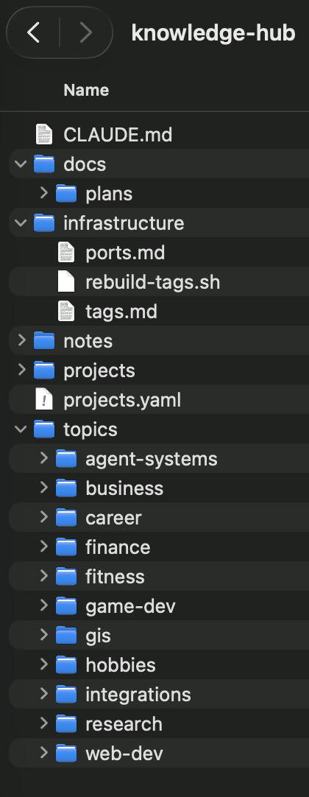
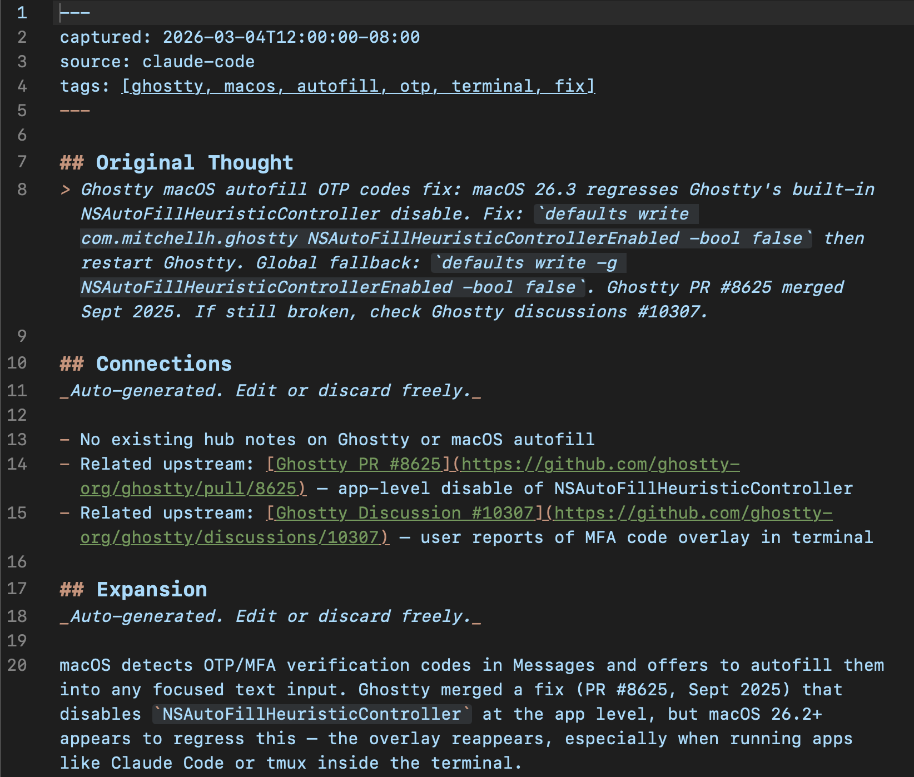
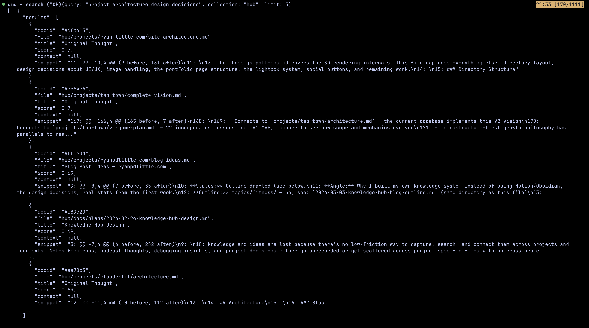

I have 11 active projects, a career in transition, fitness goals, a side business, and notes scattered across repo docs, Google Drive, and my own memory. I needed one place to search all of it. So I built one in a day.

## The Problem

Project docs live in git repos. Career notes are in Google Drive. Fitness data is in Garmin Connect. Everything else is in my head. And when I start a new Claude Code session, which is how I build most things now, the first thing that happens is Claude goes through a bunch of project files trying to "catch up." Reading full files it doesn't need, rebuilding context from scratch. What's the architecture of my fitness dashboard? What port is the dev server on? What did I decide about that database schema last week?

I bounce between projects a lot. And that initial catch-up search was happening every single time. It ate up context and tokens before I even asked my actual question. I started going through my usage really fast just asking simple things or trying to implement something small, because half the work was Claude reading files to figure out where we left off.

The other issue was that most of it wasn't written down at all. I'd make a decision about some project architecture or figure out a tricky bug, and then just... move on. Next session I'd have to explain it again. I kept telling Claude to write things down in the CLAUDE.md or memory files, but that got annoying fast, and those files were getting bloated. Every line in CLAUDE.md costs tokens on every single prompt, so stuffing project details in there that I only need occasionally is wasteful.

I wanted a single place where I could say "store this in the knowledge hub" and know it was written down, searchable, but not eating tokens every conversation. Something that could slim down my CLAUDE.md and memory files to just the stuff that's needed every prompt, while keeping everything else a quick search away. Skipping that long initial file crawl where Claude reads through a bunch of stuff it doesn't need has noticeably sped up how fast I can get into actual work.

## Why Not Notion or Obsidian?

I'd heard of both before but never felt like I was missing out on much. I keep notes in markdown already. They're fine. The idea of using a big collection of markdown files as context for AI coding tools clicked for me after watching [Greg Isenberg interview Internet Vin](https://www.youtube.com/watch?v=6MBq1paspVU) about his Obsidian + Claude Code setup. The concept made a lot of sense. But I didn't want to run Obsidian to get there.

The one Obsidian feature that actually interests me is the document connections, the graph view and backlinks. But I'm not adding a whole separate app for something that adds so little on top of what I can do with plain files. And I live in the terminal. Claude Code is my main development environment. My workflow is: start a conversation, explain what I'm working on, build. The problem isn't writing notes. It's *finding* them later, from inside the tool I'm already using.

What I actually wanted: a git repo full of markdown files with a search engine I could wire into Claude Code via MCP. If I stop using the search tool tomorrow, I still have a folder of useful markdown. The files are the thing, not the app.

## What I Built

The hub is a private GitHub repo. Simple structure:

```
knowledge-hub/
├── topics/         ← knowledge by domain (career, fitness, finance, GIS...)
├── projects/       ← per-project docs (architecture, decisions, research)
├── docs/           ← plans and docs about the hub itself
├── infrastructure/ ← port registry, config references
└── projects.yaml   ← maps project names to local paths and repos
```

There's a `notes/` inbox directory too, but it stays empty in practice. Notes get placed directly into the right topic or project folder by the capture skill (more on that below).



I actually started building this for Little Hammer Labs first. Halfway through planning that one I realized I should experiment on my personal setup before implementing it for the business. So I spun up the personal hub in a day and started using it. The LHL version ended up being way more involved: full vector search with local models (their machine can handle it), overnight maintenance agents, a confidential document system to keep client info out of the private GitHub repo, and a full archival system. It's got a lot more docs and I overengineered that one too, but it hits 90%+ accuracy on finding documents from simple queries. I've also started working on plugging the LHL knowledge hub into our business Discord bot so the team can search it from anywhere.

### The Note Format

Every note has three sections: **Original Thought**, **Connections**, and **Expansion**.

Original Thought is whatever I captured in the moment. It never gets edited by automation. Connections are auto-generated links to related notes, projects, and patterns across the hub. Expansion adds broader context and reusable takeaways. So a quick thought I jot down during a debugging session gets enriched automatically, but the original stays intact.



### Search

By coincidence, right after the Isenberg video, I came across [Nat Eliason on Peter Yang's channel](https://www.youtube.com/watch?v=nSBKCZQkmYw&t=1044s) talking about OpenClaw and a tool called qmd that's being built into it. [Query Markdown Documents (qmd)](https://github.com/tobi/qmd) is a local markdown search engine. It does BM25 keyword search, same algorithm behind Elasticsearch, running locally with basically no overhead. I'm not using OpenClaw, but qmd works fine on its own as an MCP server. It indexes every markdown file in the repo and I can search it from Claude Code.

This matters because my machine has 8GB of RAM. I tried vector search first (semantic, embedding-based). It loaded local ML models and my MacBook came to a complete stop. Everything froze until the models finished. I accidentally triggered it a second time and that was enough for me. I deleted the models, hard-blocked the vector search tools with hooks so they can never run again, and switched to BM25. After a little tinkering, mainly upping the document results from 3 to 5, it finds what I need basically every time. 30ms, no meaningful RAM, no frozen laptop.

Since qmd runs as an MCP server, Claude Code can search my whole knowledge base at the start of any conversation. No copy-pasting, no re-explaining project architecture. The AI starts with context.



Each result in that JSON looks like this:

```json
{
  "docid": "#6fb615",       // unique ID — use with qmd get for instant retrieval
  "file": "hub/projects/ryan-little-com/site-architecture.md",  // where it lives
  "title": "Original Thought",
  "score": 0.7,             // BM25 relevance score (0 to 1)
  "snippet": "This file captures everything else: directory layout, design decisions..."
}
```

Five results from five different projects, ranked by how well they matched "project architecture design decisions." The whole search took about 30ms.

### Automation

Two things keep it running without me thinking about it:

**Auto-reindex.** A PostToolUse hook triggers `qmd update` whenever a file gets written to the knowledge-hub directory. No cron jobs, no scheduled tasks. The index just stays current as I work.

**Capture skill.** A custom `/note` command in Claude Code captures a thought mid-conversation. It generates connections and expansion, then drops the file into the right directory. One command and it's indexed.

### The Companion Doc Rule

Not everything in the hub is markdown. There's a game balance simulation spreadsheet, my UCSB transcript PDF, a few Python scripts. The rule is that every non-markdown file gets a companion `.md` with the same name, containing a title, context, and links. That way qmd can index everything. Binary files get searchable metadata.

**Current stats:**

- 55 markdown documents indexed
- 11 topic areas, 11 projects tracked
- Search latency around 30ms
- Near zero RAM overhead

## What I'd Do Differently

**Skip vector search on constrained hardware.** I covered this above, but if you're on 8GB of RAM, just go BM25 from the start. Don't even bother with embedding models. I wasted time on it and the keyword search turned out to be more than good enough once I tuned the result count.

**Don't over-engineer capture.** I originally built a Siri Shortcuts to Cloudflare Worker pipeline so I could dictate notes from my phone. The idea was having the knowledge hub available to me everywhere. In practice, I'd come up with an idea on a run or a walk and be so excited about it that I'd just come home and start working on it immediately. That basically negated any reason to have quick mobile capture. The Siri/Cloudflare path was overkill for how I actually work. And then Anthropic shipped both remote control mode and voice for Claude Code within the next two weeks, which essentially gave me what I wanted anyway with zero effort on my end. Should have just waited.

I also set up a weekly consolidation job using headless Claude to process pending notes. It hit launchd permission issues and never actually matched any notes. The `/note` skill in Claude Code covers 95% of what I need. Should have started there.

**Keep your documents alive or they'll mislead you.** This is the one I'm still learning. A knowledge hub is only useful if the information in it is current. I've run into situations where a project doc says one thing but the actual codebase has moved on, or a decision got made in a conversation but never propagated to every place it needed to be updated. When that happens, the hub actively works against you because Claude finds the stale doc and treats it as truth.

You need a source of truth somewhere that you can actually rely on. For me that's the project tracker, a single document that lists every active project, its current status, and what's next. I update it at the start and end of sessions. If something contradicts the tracker, the tracker wins. Without that, you end up with a pile of markdown that's half outdated and half useful, and you can't tell which is which. Keeping an active list of projects and ideas and making sure it stays current is honestly the hardest part of this whole system, but it's also the most important.

## What's Next

The core system mostly just runs now. The index updates on every write, notes land in the right place, and every new conversation starts with context instead of a blank slate. I don't really think about the hub as a separate tool anymore. It's just part of how I work.

I'm still improving it though. Recently added living documents and custom `/hello` and `/bye` skills that review project status at the start and end of each session, which has been really helpful for keeping track of where things stand across all 11 projects. The longer I use it, the more useful it gets. Every design decision I write down, every debugging note, every project doc is searchable in the next session. The hub gets better just by me doing my normal work.
