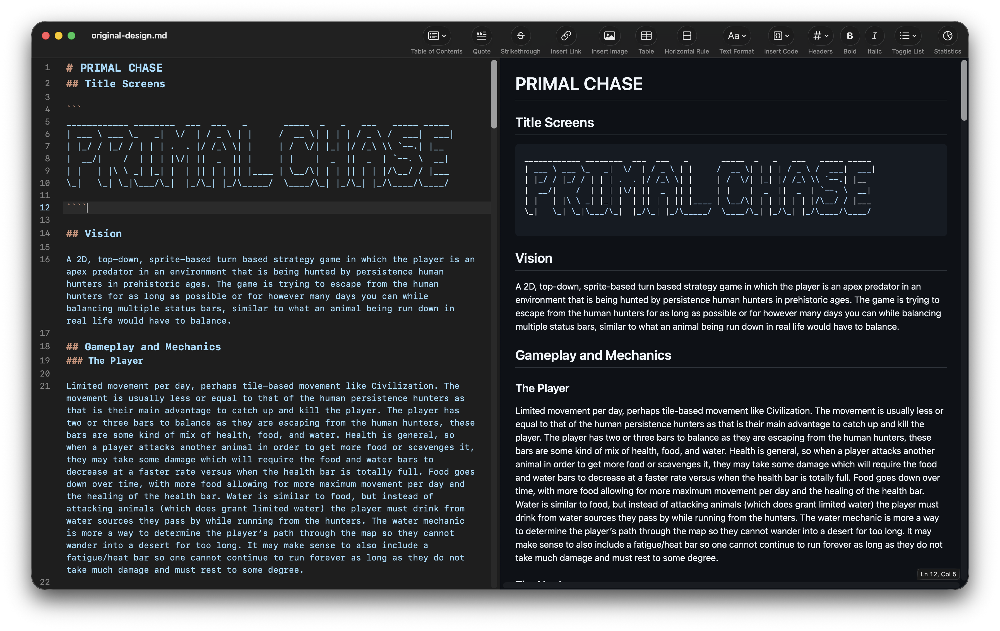
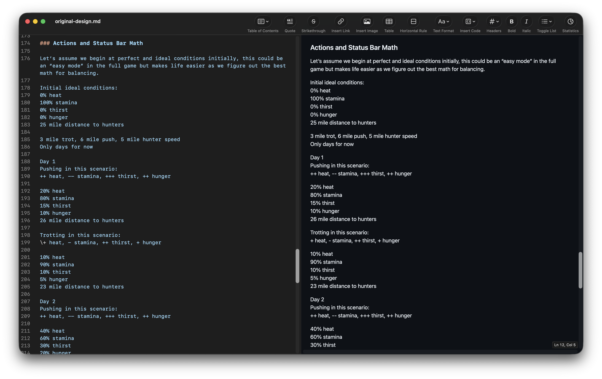

*This is Part 0 of a 5-part series on building [Primal Chase](https://primalchase.com), a browser-based survival game about being hunted by persistence hunters. This series covers V1, from design doc to shipped game, and a second series will follow when V2 development begins. [Part 1](/posts/building-primal-chase-part-1) covers the prototype. [Part 2](/posts/building-primal-chase-part-2) covers making it shippable. [Part 3](/posts/building-primal-chase-part-3) covers systems and balance. [Part 4](/posts/building-primal-chase-part-4) covers visual identity.*

---

## Two Sentences

Primal Chase started as two sentences in a notes file, no context, no design, just a raw idea I kept coming back to:

> Player is an animal in ancient times being hunted down by ancient human persistence hunters. Every night you can show a map to show progress of humans coming after you and tracking you.

I've always known about persistence hunting, how humans can't outrun most animals in a sprint but can thermoregulate through sweat while most animals can only pant, and how over long distances that advantage is insurmountable. Humans just follow, for hours, for days, until the animal overheats and collapses. It's one of the most unsettling things our species does, and I couldn't think of a single game that explored it from either side. A real hunting strategy that shaped human evolution, and nobody had built a game around it.

## Why Unwinnable

Early on I made a decision that shaped everything else: no win condition. You can't escape the hunters, you can only delay them.

This wasn't a limitation, it was a deliberate design choice. I've always preferred score-chasing games over ones with a finish line because a game you can win has finite replayability, and once you beat it the tension is gone. A game where you're always trying to survive one more day than last time gives you a reason to come back, and every run becomes a new high score attempt with a new set of encounters and a new story about how you almost made it but your heat spiked on day 8 and you had to rest and the hunters closed the gap.

If the game were winnable, like escaping to some safe zone or reaching a certain distance, then the strategy just becomes "find the optimal path to the exit." But with no exit, every decision is a genuine trade-off where you're not asking "will this get me to the goal?" but instead "will this buy me one more day?"

## The Name

The working title was "Hunted Hunter," the predator becoming prey. I liked the irony but it had two problems. First, it locked the concept to a hunter-type animal, and I wanted the option to eventually add other species like prey animals, pack hunters, or birds, so the name needed room for that. Second, "Primal Chase" just had a better ring to it, and critically primalchase.com was available. For a browser game the domain is the distribution.

The taglines came through iteration: *"Outrun Their Speed, Outlast Their Stride"* and *"How long can a King outrun a shadow?"* I'm still not fully satisfied and I want to make more and better ones, but those two set the tone for the game's voice.

## The Planning Doc

On January 12th I started writing a planning document, not a design doc for a specific implementation but a full exploration of what the game could be, and it went through 15 revisions across January 12-17 before I was happy with it.



The original vision was ambitious: a 2D top-down, sprite-based game with tile-based movement like Civilization, procedurally generated worlds with biomes like mountains, plains, jungle, and desert, each with different movement penalties and animal spawn rates. The player would navigate a map and make spatial decisions about which direction to flee.

That's not what I built. Not yet, anyway.

### Scoping Down to the Core

I wanted to know if the fundamental tension of "every action that helps you survive costs distance to the hunters" was actually fun before investing in map systems, pathfinding, and procedural generation. The fastest way to test that was to strip the game down to its essence with text-based decisions, no map, no sprites, just the core loop. If the loop was fun the map and biomes and sprites could come later, and if it wasn't then no amount of visual polish would save it. So I scoped V1 to pure text with the goal of getting something playable and shareable with friends for feedback before committing to the bigger systems.

### The Status Bars

The planning doc defined four stats and five actions, and then I worked through the math by hand to validate the balance.



Four stats: **heat** (builds with exertion, kills at 100%), **stamina** (drains with movement, kills at 0%), **thirst** (builds over time, kills at 100%), and **hunger** (constant drain, kills at 100%). Five actions: **push** (double distance, heavy cost), **trot** (normal distance, moderate cost), **rest** (no distance, recover), **drink** (reset thirst, lose distance), and **eat** (reset hunger, lose distance).

I ran the numbers for a player who only pushes:

| Day | Heat | Stamina | Thirst | Hunger | Hunter Distance |
|-----|------|---------|--------|--------|-----------------|
| 1   | 20%  | 80%     | 15%    | 10%    | 26 mi           |
| 2   | 40%  | 60%     | 30%    | 20%    | 27 mi           |
| 3   | 60%  | 40%     | 45%    | 30%    | 28 mi           |
| 4   | 80%  | 20%     | 60%    | 40%    | 29 mi           |
| 5   | 100% | 0%      | 80%    | 50%    | **DEAD**         |

Pure pushing kills you by day 5 from heatstroke. You gain distance every day but you're dead before it matters. Now trotting:

| Day | Heat | Stamina | Thirst | Hunger | Hunter Distance |
|-----|------|---------|--------|--------|-----------------|
| 1   | 10%  | 90%     | 10%    | 5%     | 23 mi           |
| 2   | 20%  | 80%     | 20%    | 10%    | 21 mi           |
| 3   | 30%  | 70%     | 30%    | 15%    | 19 mi           |
| 4   | 40%  | 60%     | 40%    | 20%    | 17 mi           |
| 5   | 50%  | 50%     | 50%    | 30%    | 15 mi           |

Pure trotting keeps you alive but the hunters close 2 miles every day and you get caught around day 12. The sweet spot of mixing pushes, trots, rests, and situational actions should land around 7-10 days for an average player and 15+ for a great one.

This napkin math told me the core design was sound. The tension between "gain distance but burn stats" and "recover stats but lose distance" creates real decisions, not just optimal plays.

### The Hunter Model

The hardest constraint on the hunter model was that you can't have the hunters die of thirst in an unwinnable game. If the hunters could fail then the core premise breaks, so any system where they have their own needs and could run out of food or water was off the table immediately.

The planning doc explored two approaches anyway. Version 1 gave the hunters their own status bars for food, water, and fatigue with different weights than the player, where humans would fatigue slower because of sweating vs panting and could oversaturate their bars by carrying supplies. Version 2 simplified them to a constant speed with a tracking mechanic where they move at a steady rate, slow down when they lose the trail, and speed up after finding water sources.

I went with something even simpler: constant base speed plus daily escalation of +0.1 speed per day. The escalation is what makes the game mathematically unwinnable, because on day 1 the hunters move at 5 miles and by day 10 they're at 6 and you just can't keep up forever. The Version 2 tracking mechanic did make it in though, where hunters can be "lost" via specific encounters and enter a reduced-speed tracking mode, but they always find the trail again and each time they do they get faster.

### Example Screens as Spec

Instead of wireframes I wrote out exactly what each screen should look like in the planning doc, the play screen, the death screen, the exact text and button labels:

```
DAY 4

VITALS
[ | | | | | | | . . . ] 70% HEAT
[ | | | | . . . . . . ] 40% STAMINA
[ | | | | | | | | . . ] 80% THIRST
[ | | . . . . . . . . ] 20% HUNGER

THE HUNT
The Hunters are located 5 miles from your location.

THE CURRENT SITUATION
You have reached a dry riverbed. To your left you see a vulture
circling overhead. To your right you see some scrub trees offering
a little bit of shade.

TIME TO DECIDE:
[1] PUSH forward and gain 3 miles at the cost of 20 heat and 15 stamina.
[2] TROT at a steady pace and gain 1.5 miles at the cost of 5 heat and 5 stamina.
[3] REST under the shade of the scrub trees.
[4] DIG into the dry riverbed in search of water with a 50% chance.
[5] SCAVENGE whatever is making that vulture circle overhead.
```

Writing these out forced me to answer design questions that wireframes don't, like what information does the player actually need, how should stat costs be communicated, and whether the hunter distance should be precise or vague. I went with precise because the player needs to make informed decisions instead of guessing.

I also wrote death screen narratives for every death cause, caught, heatstroke, exhaustion, dehydration, and starvation, with three variants each so dying doesn't feel repetitive. The death screen prose went through a lot of iteration to get the tone right, aiming for atmospheric and primal without being overwrought. The caught death screen was the one I kept coming back to:

> *The rhythm of the footfalls has finally stopped. You tried to find a lead, but their stride was unbroken. Your muscles seized, your lungs burned like the midday sun, and as you looked back one final time, the shadow of the spear was already long upon the dust.*
>
> *The savanna has a new master.*

### The Encounter System

The biggest design challenge was variety, because a text game where you see the same situations gets boring fast. The planning doc laid out a three-layer hybrid approach.

**Layer 1: Combinatorial generator.** Every phase the game picks a terrain, an opportunity, and a pressure, then composes them into a narrative. Terrains are where you are (dry riverbed, acacia grove, salt flat), opportunities are what's available (vulture circling, shade, fresh tracks), and pressures are what's threatening (overheating, hunters gaining, storm). With roughly 20 terrains, 30 opportunities, and 15 pressures, that's about **9,000 unique combinations** from modular building blocks.

**Layer 2: Hand-crafted signatures.** Around 50 fully written encounters that override the generator, things like river crossings, rival predators, and brush fires. These provide narrative peaks that a generator can't match, and they can only fire once per run so they stay special.

**Layer 3: Rare events.** Less than 1% chance per phase. Eclipses, stampedes, lightning fires. The kind of moments that create stories you tell people about.

### The Non-Negotiable

One decision in the planning doc shaped everything that followed: **all balance numbers live in a single config file.** No hardcoded values in game logic, ever. This is standard in commercial game development but rare in solo projects because it requires discipline upfront. The payoff is that you can change the entire feel of the game, from how fast the hunters move to how much pushing costs to how scarce water is, by editing numbers in one file without reading any game logic.

```javascript
const CONFIG = {
  actions: {
    day: {
      push:  { distance: 6, heat: 20, stamina: -20, thirst: 15, hunger: 10 },
      trot:  { distance: 3, heat: 10, stamina: -10, thirst: 10, hunger: 5  },
      rest:  { distance: 0, heat: -25, stamina: 20, thirst: 0,  hunger: 3  },
      drink: { distance: 0, heat: 10, stamina: -5, thirst: -100, hunger: 0 },
      eat:   { distance: 0, heat: 15, stamina: -5, thirst: -50, hunger: -100 }
    }
  }
};
```

Every number you see when you play Primal Chase, the distance you cover, the heat you gain, the speed of the hunters, all of it traces back to this object. When I later built a simulation engine to run thousands of games for balance tuning it was trivial because all the knobs were already in one place.

## The Tech Stack

Vanilla HTML, CSS, and JavaScript. No frameworks, no build step, no dependencies.

This wasn't ideology, it was pragmatism. The game is a single-page app with text rendering, stat bars, and a canvas for share images, and React or Vue would add a build step, a node_modules folder, and abstraction layers over problems I don't have. The game's complexity is in its systems like encounter generation, hunter AI, and balance tuning, not its rendering. A framework would add overhead to the easy part and nothing to the hard part.

Hosting on GitHub Pages sealed it. Push to main, it deploys. No CI pipeline, no server, no cost. For a game that's pure client-side logic this is the right answer.

## From Planning to Building

The planning doc sat for about a month. I iterated on it across multiple sessions in mid-January, let it marinate, and then on February 13th I committed it to a fresh repo alongside three pixel art logo variants and a Python balance simulation script.

A month of design, 15 revisions, and a validated core mechanic. The entire first playable version would ship in a single afternoon, and that's [Part 1](/posts/building-primal-chase-part-1).
