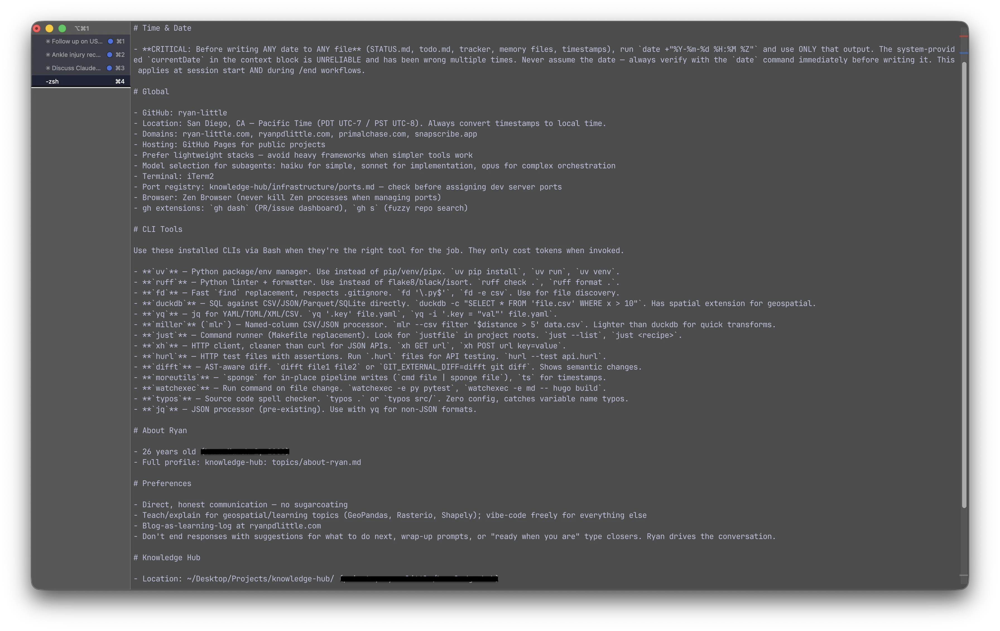
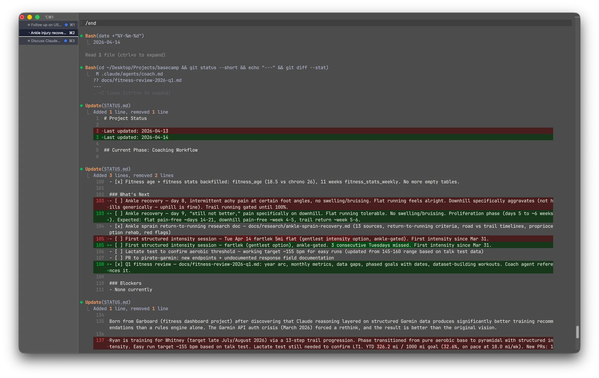

The first thing Claude Code does when I start a session is run a shell script. Not a prompt, not a greeting, a script that checks whether my knowledge hub has any stale docs. By the time I type my first message, Claude already knows which project I'm in, what CLI tools I have installed, how I like my commits formatted, and where to find context about whatever I'm working on.

That's what this post is about. Not Claude Code the product, but the environment I've built around it, where custom skills, CLI tools, a searchable knowledge hub, and hooks tie together into something that carries context across sessions and projects.

## The Layered Config

Claude Code reads CLAUDE.md files, plain markdown that tells it how to behave. I have two layers: a global file at `~/.claude/CLAUDE.md` that applies to every session, and per-project files that live in each repo.

The global file is where I put things Claude would get wrong without explicit instruction. My GitHub username, my timezone, which CLI tools are installed and how to use them, preferences like "don't end responses with suggestions for what to do next." It's about 60 lines, and I've kept it tight on purpose. There's research suggesting compliance with CLAUDE.md instructions drops as the file gets longer, so I did a cleanup pass where I cut anything that failed the test of "would removing this actually cause a mistake?" Most of it could go.



Per-project files are more specific. This blog's CLAUDE.md describes the Hugo setup, content workflow, and points to the writing style guide in my knowledge hub. My fitness app's file explains the database schema and Garmin API patterns. Fifteen of my projects have their own files, and each one means Claude can drop into a project cold and start working without me re-explaining the same context I explained last session and the session before that.

## Skills

The problem I kept running into was that some workflows need to be rigid and some need room for judgment, and I wanted both in the same system.

Skills are markdown files that Claude loads on demand, like scripts for workflows I repeat. I have 11 custom ones. `/commit` always runs the same git commands in the same order, no decision-making involved. `/blog` is the opposite, it scaffolds a post from the writing style guide and blog ideas backlog but adapts based on whether I'm writing a technical series or a personal one. `/socratic-exploration` is almost entirely open-ended, designed to ask me questions rather than produce output.

`/end` is the one I'd miss most. It reviews what we did, updates the project tracker, captures decisions to the knowledge hub, syncs my todo list, and commits everything. Before I built it I'd close a session and realize the next morning that I never wrote down why I made a particular decision, or that my tracker was two days stale. Now closing out takes one command and leaves a clean trail for the next session to pick up.



## CLI Tools Over MCP

Claude Code supports MCP servers for extending its capabilities, but I moved away from them for most things after I noticed the token cost. Every MCP server adds its tool definitions to every prompt. I had five servers running with 58 tools between them, and that burned roughly 55K tokens before the conversation even started, on every single message. That's cost and context window eaten up by tools I might not use in a given session.

CLI tools cost zero tokens until you invoke them. So instead of an MCP server for file search, Claude uses `fd`. Instead of a code formatter, it runs `ruff`. Instead of an HTTP client server, it calls `xh`. I installed 12 CLI tools in a single afternoon, documented each one in my global CLAUDE.md, and Claude picks them up naturally.

```markdown
# From my global CLAUDE.md
- **`duckdb`** — SQL against CSV/JSON/Parquet/SQLite directly.
- **`fd`** — Fast find replacement, respects .gitignore.
- **`ruff`** — Python linter + formatter. Use instead of flake8/black/isort.
- **`typos`** — Source code spell checker. Zero config.
```

The ones I reach for most are `duckdb` for querying data files with SQL, `fd` for finding files by pattern, and `typos` for catching misspellings in variable names. Single binaries, Homebrew install, no configuration.

## The Knowledge Hub

I wrote a [whole post about the knowledge hub](/posts/building-a-personal-knowledge-hub), so I won't rehash the search engine or the indexing hooks here. The part that matters for Claude Code is what it solves: the cross-session memory problem.

Every project has a counterpart directory in the knowledge hub with decisions, research notes, and reference material that doesn't belong in the codebase. When Claude starts a session in my blog repo, it can search `qmd` for the writing style guide, past editorial decisions, and the blog ideas backlog. When it's in my fitness project, it can pull up training philosophy docs and Garmin API notes. The context lives in one place and is accessible from any project, which means I don't have to stuff project history into CLAUDE.md where it would burn tokens on every prompt.

Claude also has a MEMORY.md file per project for lighter-weight persistence, things like "the blog publishes Tuesdays and Fridays at 6am PDT" or "this user prefers integration tests over mocks." These load automatically every session and carry forward small preferences. The hub handles deep context, MEMORY.md handles quick recall, and between the two I rarely repeat myself.

## Subagents

Claude Code can spawn subagents, separate Claude instances that handle tasks in parallel. I use three models depending on the work: Haiku for lookups, Sonnet for implementation, Opus for complex reasoning.

My `/fitness` skill is a good example of the split. The main session collects Garmin data and asks how I'm feeling, then delegates the actual coaching recommendation to a Sonnet subagent with training philosophy docs loaded. The main session orchestrates while the subagent does domain-specific thinking with its own context.

For code exploration I'll send an agent to trace through an unfamiliar part of a codebase while I keep working on something else. When I needed screenshots of my blog at different points in its history, I dispatched parallel agents to check out separate git commits and run Playwright against each one at the same time, which would have been tedious to do one by one.

## What This Actually Looks Like

Here's how a post for this blog comes together. I type `/blog`, and Claude loads the writing style guide from my knowledge hub, five docs covering voice, narrative structure, prose craft, anti-AI rules, and media guidelines. It checks `blog-ideas.md` for whatever's next and creates a page bundle with the right Hugo frontmatter. For the Zion hiking post, that meant pulling GPS tracks for three trails, building Leaflet maps with satellite imagery and heart rate coloring, and generating a step timeline from 576 Garmin data points across six days. For the Primal Chase series, it meant loading game design context from the knowledge hub and coordinating assets across five installments. The tools and context are already wired in, so the real work starts immediately instead of fifteen minutes into the session.

When the draft is done, I add it to `publish-schedule.yml` with a target date and the GitHub Actions workflow handles the rest, flipping `draft: false` on the right morning and triggering a deploy.

When I'm done for the day I type `/end`, and the session closes cleanly: tracker updated, todo synced, decisions captured, everything committed. The next time I open the project, Claude knows what's done and what's next.

That handoff is the part I didn't expect to matter as much as it does. The individual pieces are just config files, markdown scripts, and CLI tools. But when the shell script fires before my first message, loading project context and picking up where the last session left off, it stops feeling like a chat window and starts feeling like a development environment.
