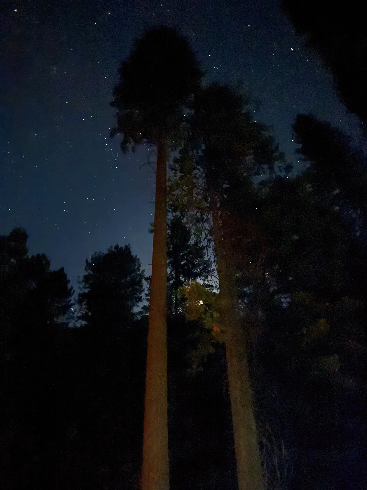
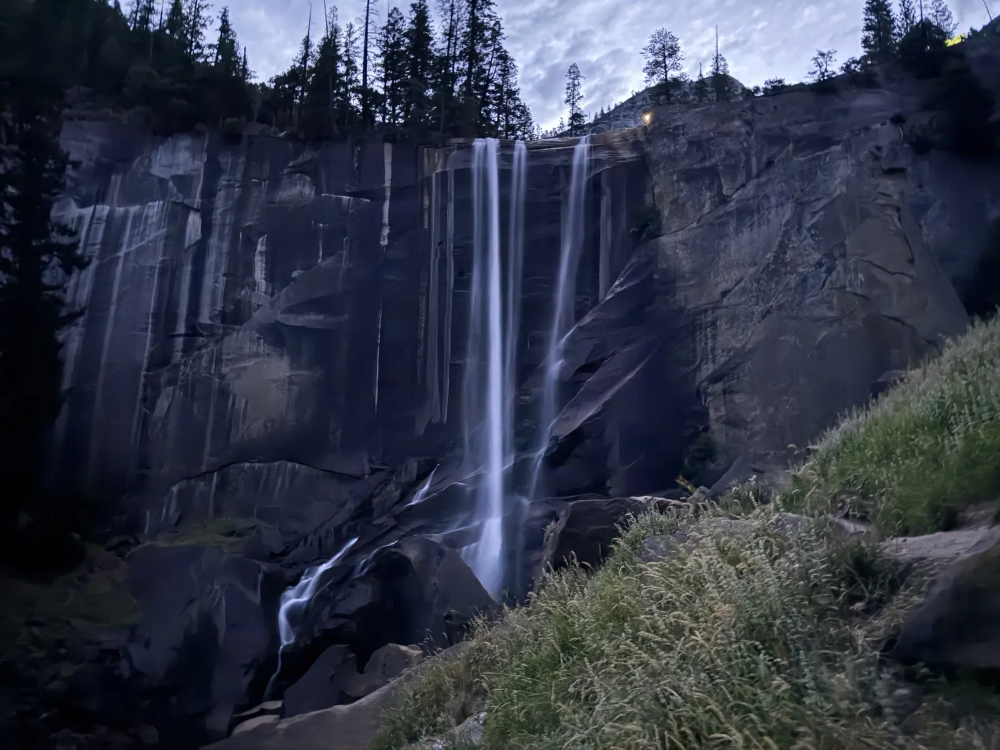
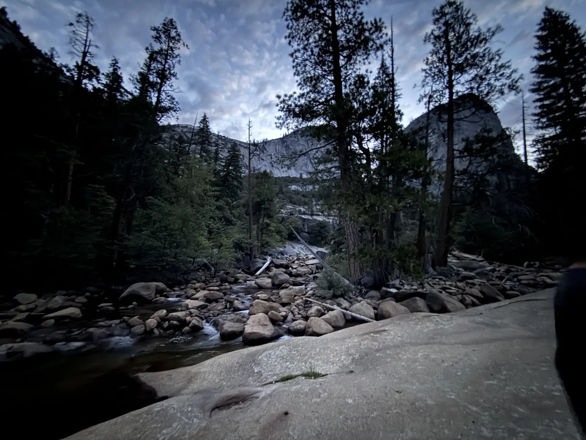
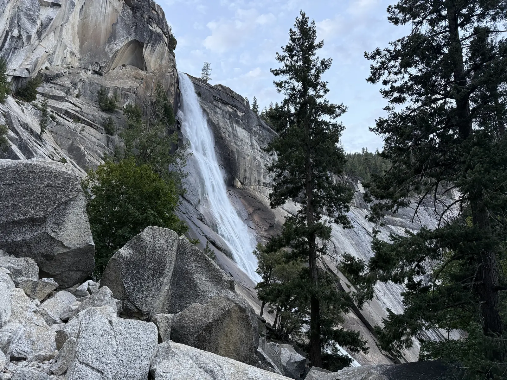
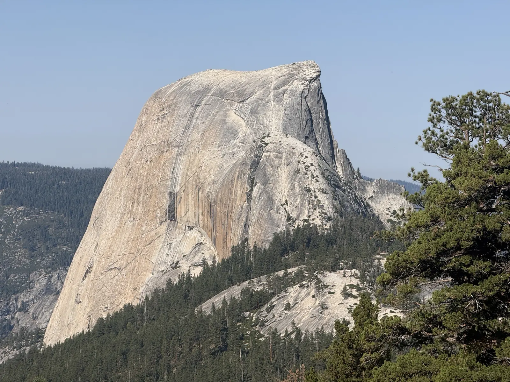
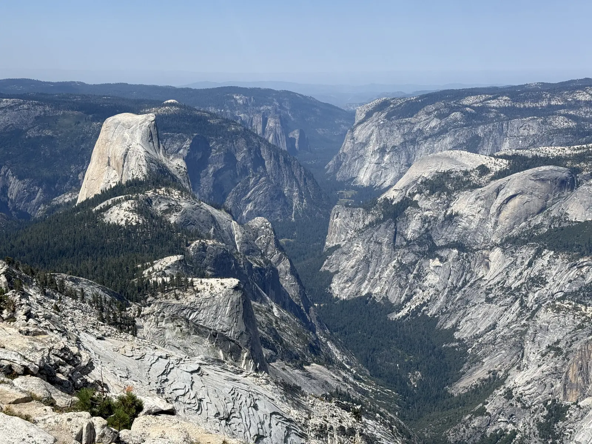
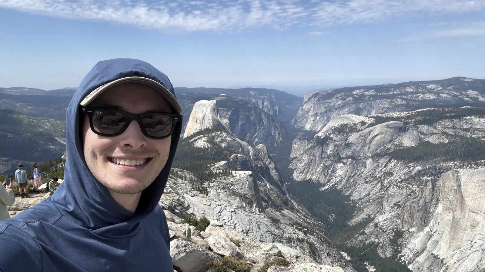
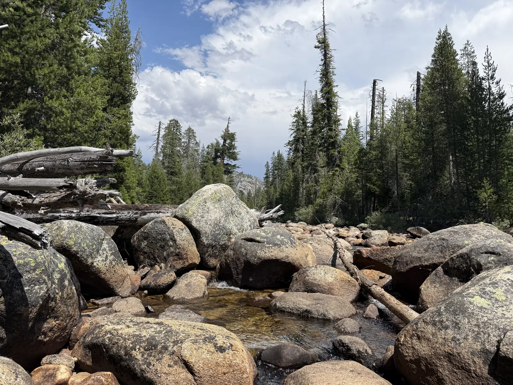

Hardin Flat Road is a Forest Service road just outside the Big Oak Flat entrance, and by Friday night it was hot enough that I gave up on the sleeping bag entirely and slept on top of my pad with nothing over me. Sam did about the same. Neither of us slept, three hours and fifty-four minutes on my watch, and for once none of it was nerves or wind or a bad pad, it was just heat.

The plan had been Half Dome. You enter a daily lottery two days before you want to hike, roughly fifty permits a day, and we put in on Thursday and didn't get it.

So we went up Clouds Rest instead. It's the bigger day of the two out of that trailhead, longer and with more climbing in it, which puts it closer to what Whitney is going to ask, and Whitney is on the 23rd with Sam and our friend Hunter both on the permit. The two trails share their first five miles though, and a Half Dome permit covers a group rather than one person, so we had a quieter second reason for being on that trail.



Twenty and a third miles, 6,716 feet of gain, eleven hours and eighteen minutes from Happy Isles at 4:37 in the morning back to the same valley floor at 3:55 in the afternoon.

## The long way is a real distinction

Almost everyone who hikes Clouds Rest starts at the Sunrise Lakes trailhead up on Tioga Road, where it's about fourteen and a half miles and 2,300 feet of climbing, an easier day than Half Dome. From the valley you start at 3,995 feet instead of a little over 8,000, and the exact same summit costs you twenty miles and just under 6,000 feet, which is roughly a thousand feet more than Half Dome asks from that same parking lot.

Same mountain, and the trailhead you pick decides whether it's a pleasant day out or the biggest thing you can walk out of Yosemite Valley and do.

## Vernal, then Nevada, in the dark

The first two miles up the Mist Trail climb 1,374 feet, and they're stairs for most of it. We were on them in headlamps with the falls somewhere off to the left making a lot of noise in the dark, and then the sky started going blue behind the granite and Vernal Fall came out of it.

Above Vernal the trail flattens out across open slabs where the river runs wide and shallow before it goes over the edge, and there were already a good number of people on it at quarter to six without it feeling busy.

Then the trail stands up again. The climb past Nevada Fall gains 849 feet in three quarters of a mile on a staircase built into the side of the canyon, well back from the water, and it's the steepest sustained thing either of us climbed all day. It comes at mile three, when you're still telling yourself the day hasn't really started.

By the top of Nevada it was full daylight and we'd done 2,200 feet with steady company the whole way.

## Counting people on the cables

Past the Half Dome junction the crowd disappears almost completely. Half Dome takes nearly everybody, and what's left is a long climb up the shoulder toward Clouds Rest, 3,876 feet over five and a quarter miles, steady rather than steep in any one place.

It's also where Half Dome comes into view properly, side-on and enormous, and I kept stopping to look at it. Not out of any romance about the thing. I was trying to count people on the cables, working out how full the day looked and what our odds were of finding a group with a spare slot on the way back down.

I took that photo at 9:25 from 8,386 feet. Two hours later I was looking down on it.

## The spine

The last stretch to the summit is a bare granite fin with the ground falling away on both sides, wide enough to walk but not by a lot, and you go up it directly. There's apparently a sand trail that skirts around the side, which I don't think either of us knew about at the time. We just walked the ridge because it was in front of us.

It was fine. I've read plenty about how exposed it is, and nothing about it read as dangerous while I was on it, just very open.

The high point came at 11:10, ten and a quarter miles and six and a half hours in. My watch called it 9,948 feet and the maps say 9,926, and either way you come out standing on top of a fin of rock with Half Dome below you and Yosemite Valley running away west between walls.

## Forty-seven minutes

I was on top for forty-seven minutes. Six days earlier I'd [stayed twelve minutes on San Gorgonio](/posts/san-gorgonio-again/) and left early to get ahead of the heat, so this was a different kind of day almost by definition.

Some of that is Sam. He isn't in the same hiking shape I'm in right now, and we took a lot of breaks getting up there and a long one at the top, and if it had been my day alone I'd have eaten something and started down. But I'm not sure I'd have wanted to. That's the best summit view I've had all year, better than Langley and better than Gorgonio, and there's a difference between a summit you're glad to reach and one you actually want to sit on.

## Down

The descent took four hours and forty-five minutes, and a good chunk of that wasn't walking.

We stopped to filter water, which I'd carried the filter for on top of the three liters in the Salvo, and it turned out to be the best decision of the day. Cold water straight out of a creek at mile twelve on a hot afternoon is worth more than the weight of anything else I was carrying.

We also stopped properly at the Half Dome junction and asked a few groups coming through whether they had room on their permit. None of them did. That was the last real chance and we knew it, and then it was just the walk out.

The crowds came back all at once. Below Nevada Fall the Mist Trail on an August Saturday afternoon is a queue, and it was beyond hot by then in the direct sun on that granite, so we mostly just put our heads down and moved through it. Down the same stairs we'd climbed in the dark, this time on sixteen-mile legs, in a line of people.

## The biggest day at the smallest effort

6,716 feet is the most climbing I've done in a day this year, more than San Jacinto in May by a few hundred feet, and it was also the least I've worked on any of them.

Going uphill my heart rate averaged 149. On Gorgonio six days earlier the uphills averaged 157, on a smaller mountain. Sixty-seven percent of the whole day sat in zone one, and 4,397 calories and 49,572 steps came out the other end of eleven hours.

That isn't fitness arriving in six days. It's the climb rate, 594 feet an hour here against 771 on Gorgonio. We went up more and we went up slower, with a lot more standing around built into it, and my heart rate did what it always does and followed the pace.

Which makes this the first big day I've done at someone else's speed instead of my own, and that's the useful part, because Whitney is going to be exactly that.

Fuel was two bananas in the morning, a bag of nuts on the climb, and an apple on the summit, with Clif bars in the pack I never touched. That's better than the two bananas and one apple I did Gorgonio on, and I'm aware it isn't better by much.

## Fifteen days

Whitney is on the 23rd, and this was the last big day before it.

I feel good about the effort. Whitney is a couple of miles longer at around twenty-two, but it climbs about 6,100 feet against Saturday's 6,716, so I've now done the harder version of the vertical and finished it stronger than I started, which is the part I'd have least believed a year ago. What I'm turning over is altitude, because Whitney tops out 4,500 feet higher than anything I did on Saturday, and whether the three of us hold together as a group without the breaks stacking up into something that puts us on that summit too late in the day.

The driving was sixteen hours around an eleven-hour hike, San Diego to a forest road and back inside forty-one hours, and I'm not sure that math works. It's hard to turn down a weekend in Yosemite, though, and I'd probably do it again.

I still haven't been up Half Dome. I looked at it for most of a day, first from underneath and then from above, and the only angle on it I don't have yet is the one from on top.
