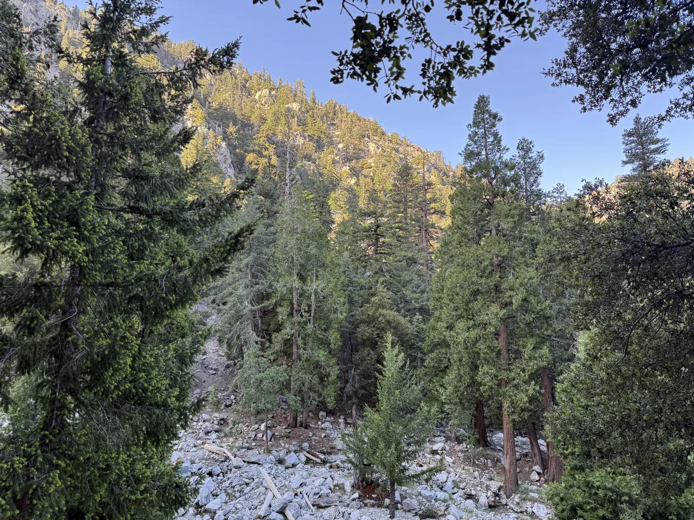
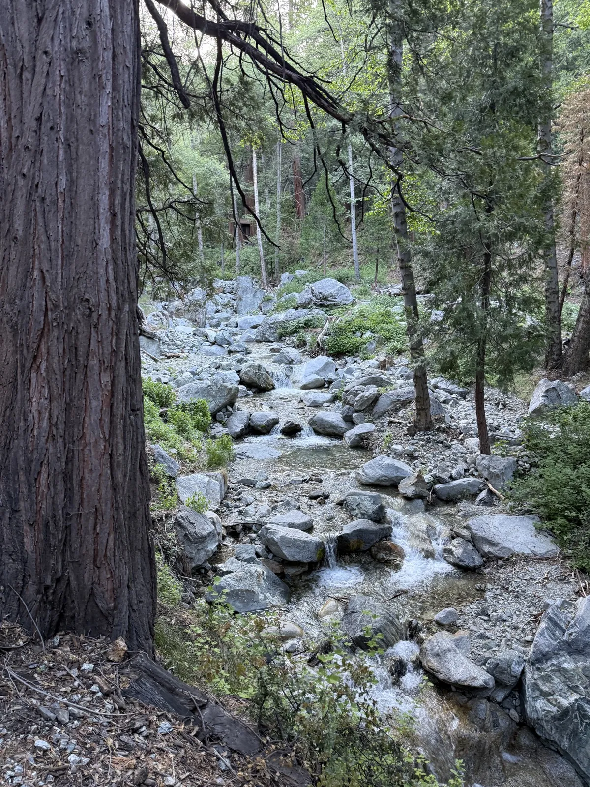
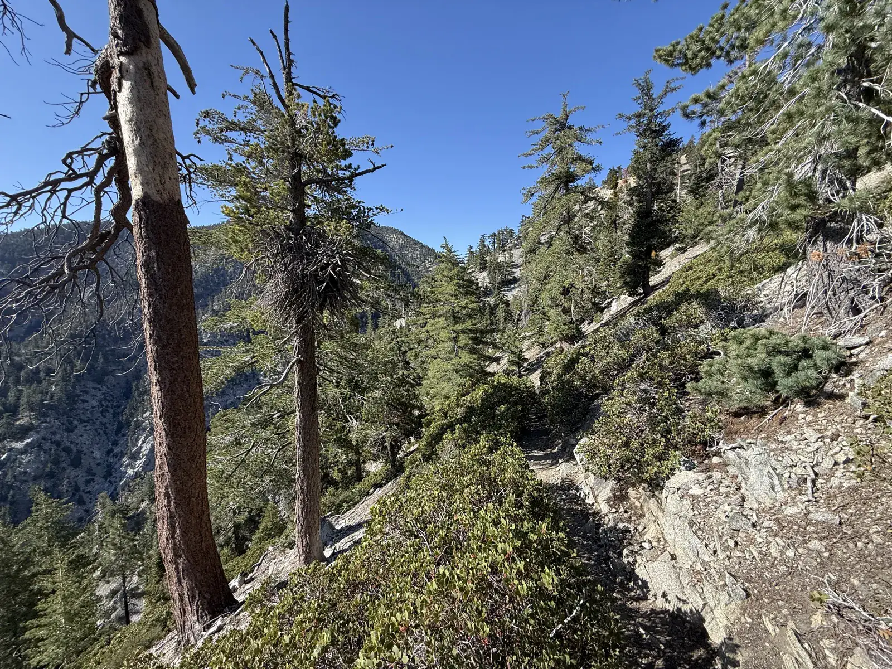
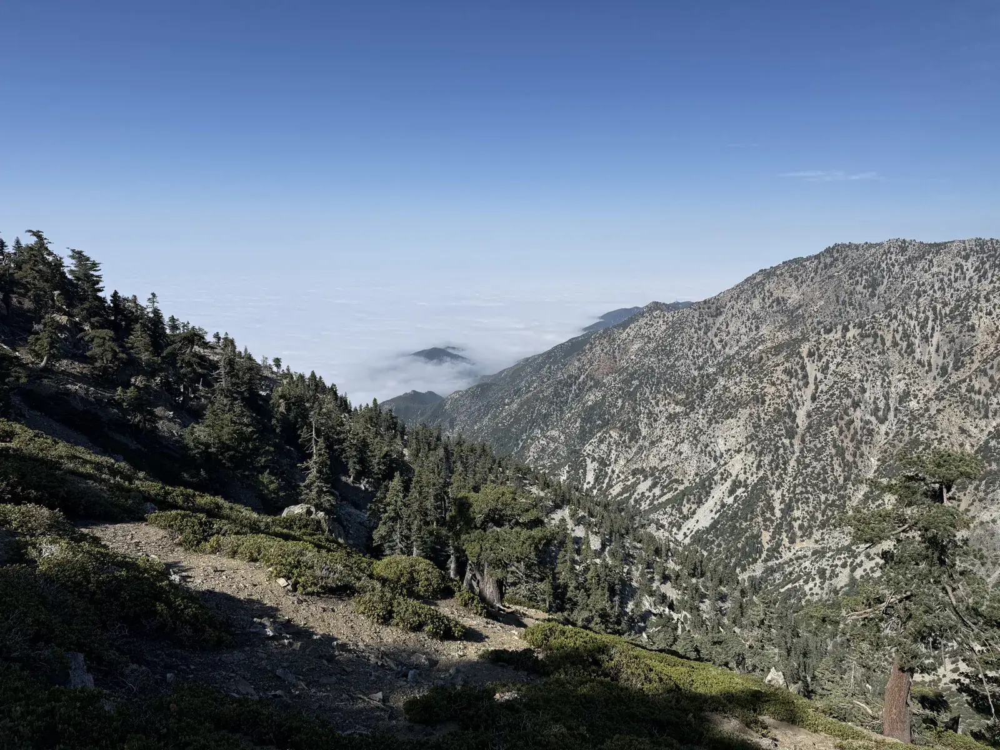
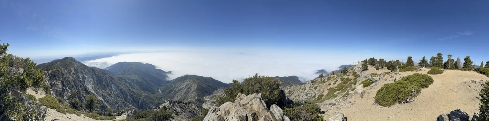
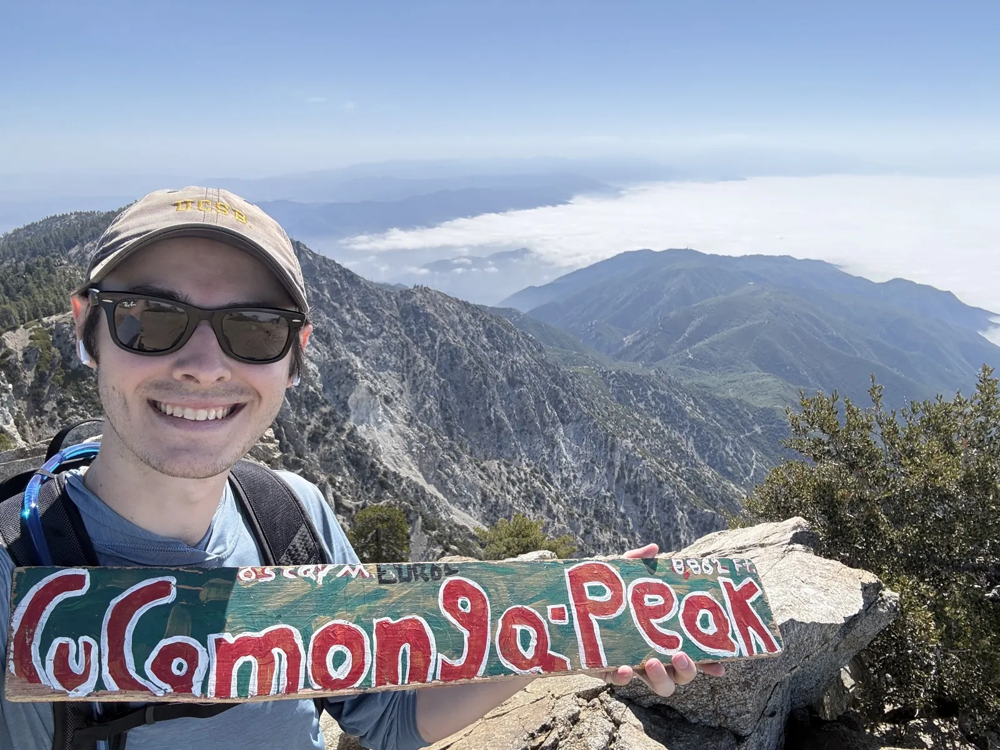
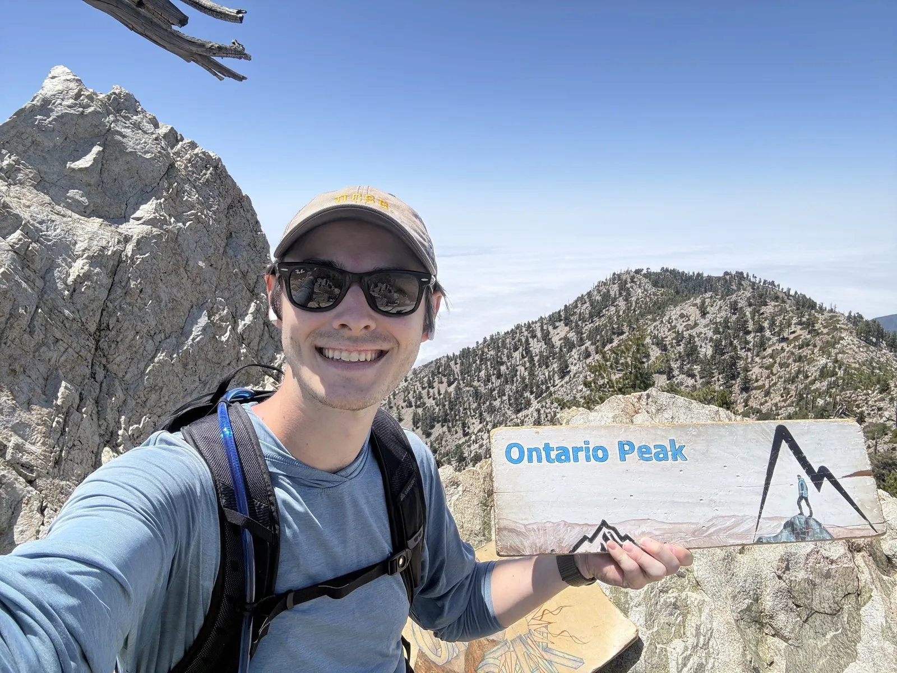
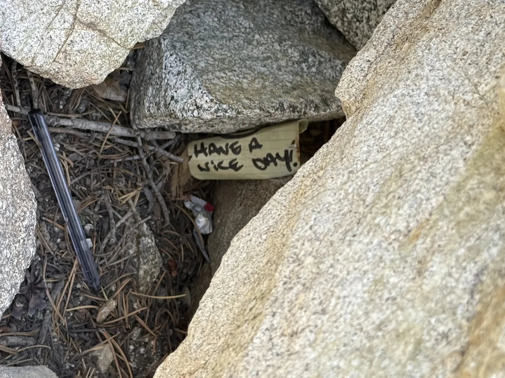
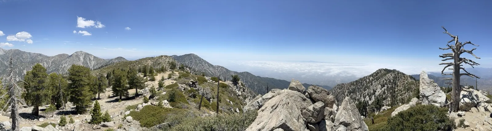

I left San Diego at 4:30 in the morning to beat the LA traffic, which worked, and then I undid the whole advantage by stopping at a Vons in Upland at 5:50 because I needed food for the trail and a bathroom and had not thought carefully enough about when grocery stores open on a holiday weekend. So I sat in the car in the parking lot waiting for the doors to unlock, not even sure they were going to, until I saw someone else walk in a couple minutes after opening and figured it was safe to follow them. Those ten-odd minutes cost me a spot in the Icehouse Canyon lot. By the time I got to the trailhead the lot was full, so I parked on the road and walked in, and when I reached the permit box every day-use permit was already claimed, the box picked clean. I started hiking without one, felt vaguely bad about it for about a minute, and then kept moving because there was nothing else to do and the mountain wasn't going to issue me a permit out of sympathy.

The day came out to 17.45 miles and 5,695 feet of gain, just over seven hours on trail, topping out at 8,884 feet according to the Garmin, which also told me my heart rate averaged 141 and spiked to 182 and that I burned 3,171 calories getting it all done. Two summits out of it: Cucamonga Peak at 8,859 feet and Ontario Peak at 8,693. Cucamonga is the second of the Six-Pack I'm working through toward Whitney. Ontario was never on the firm plan, just a maybe I'd reconsider depending on how I felt up high, and a conversation at the Cucamonga summit ended up making the call for me.

The Icehouse Canyon approach is a different animal from Mt. Wilson's Sierra Madre start. Where Wilson opens through a residential neighborhood before it figures out it's a mountain, Icehouse stays shaded and canyon-walled for the first few miles, hemmed in by oak and pine with the creek running below the trail, and at 7 in the morning it was cold enough that I was genuinely glad to have the sun hoodie on, which is not a sentence I get to write often in Southern California.

It was also packed, Memorial Day weekend in Southern California being what it is, and I worked through the crowd at a steady pace. On the last major push to Icehouse Saddle a trail runner came up from behind me, except he was taking enough breaks on the climb that I kept pace with him the whole way, which I think made me stand out to him a little. I'd cross paths with him twice more over the day, once at the Cucamonga summit and once on the Ontario trail with him heading down as I was grinding up. There was also a woman early in the canyon carrying a pack big enough to shelter a small family, clearly training for something much bigger than this, moving at a pace that looked more sustainable than half the day hikers bouncing around her with nothing on their backs.

Everything changes past the saddle. The canyon walls fall away and the trail starts running along the side of the mountain with a steep dropoff to the left, the whole world going from wooded and enclosed to open and subalpine the higher you climb. The push to the saddle is steep, and then just when you've earned the saddle the climb up to Cucamonga itself is steep all over again, gaining elevation fast in the final stretch like the mountain saved the worst of it for last.

Near the summit block of Cucamonga I started breathing harder than I'm used to, taking a couple of real stops instead of just easing off the pace the way I normally do. It's the first time in this project I'd spent sustained time above 8,000 feet, and the body noticed, flagged it mildly, and then sorted itself out without much drama. I also learned that the dramatic overhanging rock you see in basically every Cucamonga summit photo is not the actual summit. It sits a little below the true high point, and a lot of people apparently get their photo on it and call the whole thing done. I did not do that.

## Cucamonga

LA was just gone. The entire basin sat under a white cloud sea from horizon to horizon while the peaks above it baked in full cloudless sun, and the effect was that the summit felt like it was floating in a completely different atmosphere from the city buried somewhere underneath. I signed the register, walked the last bit to the real summit, took my photos, and had been up there maybe twenty minutes when I got talking to a guy in an SDSU hat who was working through the Six-Pack plus a handful of extra peaks on a timeline a lot like mine. He mentioned he was heading to Ontario Peak next.

Ontario had been a maybe all morning, the kind of thing I'd only do if I still felt good once I got up high. I felt good. The SDSU guy casually announcing his next stop was the nudge that settled it.

## Ontario

The route to Ontario isn't a clean ridge traverse, at least not the way I did it. I dropped back down to Icehouse Saddle and picked up the Ontario Peak trail from there, and that trail feels a lot longer than the mileage admits to. Every turn handed me another uphill stretch with no end in sight, the summit refusing to show up anywhere I expected it. Coming back down I passed the SDSU guy still grinding his way up and asked how it was going, and he said it felt like it just kept going and going. He wasn't wrong.

At the Ontario summit I changed my socks, which I had somehow never done on a hike before, and which I'd have started doing years ago if I'd known how much better dry socks feel against feet that have been working for six hours. I parked myself up there for a while, ate some bars, signed the register, and took photos looking back across at Cucamonga sitting on the far side of the cloud sea. Tucked between two rocks near the summit there was a note, written in marker on what looked like a wooden shim: "Have a nice day." No idea when it was left or by who, but it's a good thing to find at 8,693 feet after nine miles, and I left it where it was for whoever showed up next.

## The body math

I'd slept exactly zero hours the night before, which mostly didn't matter. The drive up was the worst of it. The second I started moving on trail I felt fine, which is either a fitness thing or just what adrenaline does to you at 4:30 in the morning, and I've decided not to interrogate it too hard.

The Salvo 16 H2O pack was brand new on this trip. I skipped the hip belt because for a pack that small it seemed like overkill, and then spent most of the climb to Cucamonga slowly realizing I was wrong and working out what to do about it on the move. Cinching the hip belt all the way down was the fix, and by the time I was coming off Ontario I had it mostly dialed.

The blood blisters I didn't find until I pulled my shoes off at the car. Both heels, in odd spots, not at the back or under the foot but off to the side in the crease between the two surfaces, and I hadn't felt a single one of them on the descent. I changed into my other pair of socks for the drive and never thought about my feet again. I also grabbed a Raising Cane's caniac meal somewhere in east LA I'd never been to before, sat in traffic for a stretch heading south, and rolled back into San Diego tired but functional, with the bonus of now knowing the drive to Baldy, which is next on the list.

Stacking this day up against Wilson: Wilson felt longer even though it isn't, because it's relentless uphill from the trailhead with almost no flat or downhill to break it up before the summit. Cucamonga and Ontario gave me more terrain variety, which made whole sections feel quicker even though the day was longer and higher overall. The altitude barely showed up as a real limiter, which I'm choosing to read as a good sign for where this whole thing is headed.

Three months out from Whitney, two peaks in, I think I could summit right now if someone made me. The Six-Pack has become its own goal at this point, and what I'm really after is enough mountain legs to move fast on the day itself, since I still have to drive back to San Diego after I come off the summit. The two friends I'm dragging along for Whitney might have a harder time keeping up than they're expecting. I'm not losing any sleep over being the one who holds us up.
