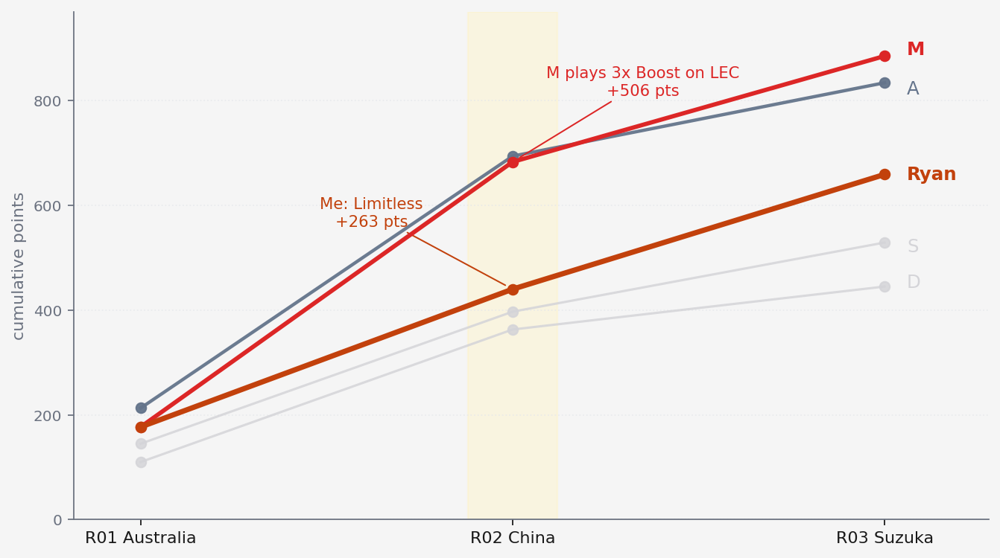
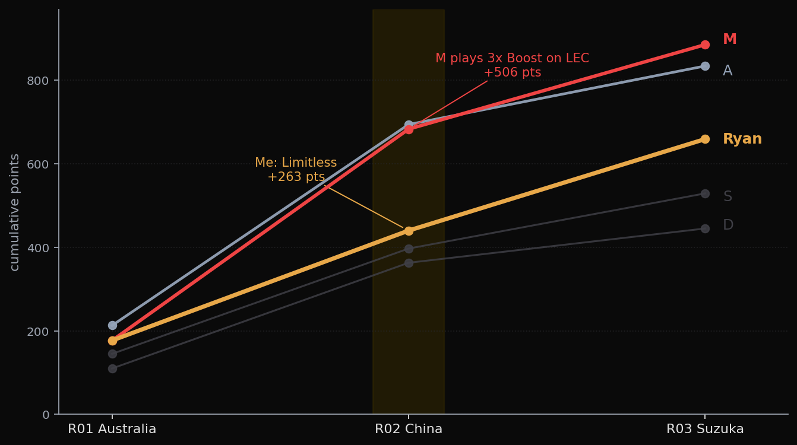

I built a Monte Carlo simulation model to optimize my F1 Fantasy team. Bayesian pace ratings, 10,000 race simulations per prediction, a proper mathematical optimizer for lineup construction. Then the Chinese GP happened, and I watched three of my five Limitless chip drivers either crash out or not start the race while my coworker scored 506 points by simply picking the two fastest cars and boosting Charles Leclerc.

## The Setup

This is my first F1 Fantasy season. I'm in a 7-person work league, team name Gasly Station, and I built the model because I wanted a quantitative edge in a game where most people just pick their favorite drivers. The repo was a proper little data product. Pydantic schemas for every entity, a DuckDB warehouse with views over race results and qualifying and pit stops and overtakes, 214 historical races pulled from Jolpica-F1 and OpenF1 covering 2016 through 2025.

The pace model fit Bayesian ratings per driver using exponential decay weighting so recent races counted more than old ones, with talent priors as early-season shrinkage targets and data-derived overtake and defense rates via empirical Bayes. The simulator ran 10,000 Monte Carlo race replays per prediction.

The optimizer was a mixed-integer quadratic program, CVXPY with SCIP as the backend, mean-variance objective with binary decision variables for each asset and each possible DRS boost assignment.

```python
x = cp.Variable(n_assets, boolean=True)       # 1 = pick
boost = cp.Variable(n_drivers, boolean=True)  # 1 = 2x DRS

objective = cp.Maximize(
    expected_pts @ x + boost_bonus @ boost
    - lambda_ * cp.quad_form(x, cov_matrix)
)
constraints = [
    cp.sum(x[:n_drivers]) == 5,    # 5 drivers
    cp.sum(x[n_drivers:]) == 2,    # 2 constructors
    prices @ x <= budget,          # $100M cap
    cp.sum(boost) == 1,            # one DRS boost
    boost <= x[:n_drivers],        # boost must be a picked driver
]
cp.Problem(objective, constraints).solve(solver=cp.SCIP)
```

The lambda parameter was adaptive, lower when trailing in the league so the optimizer would pick high-variance lineups to close the gap, higher when leading so it would protect the position. The covariance matrix penalized correlated picks so it wouldn't stack two Ferrari drivers when Ferrari was already a constructor pick. An opponent-differential adjustment let me tell it I was specifically trying to beat M and A, the two coworkers most likely to run away with the league.

The preseason team I landed on was Leclerc as my 2x DRS boost, Hadjar, Gasly, Bearman, and Lawson for drivers, with Ferrari and Alpine as constructors. The logic was sound on paper: Ferrari to capture both Leclerc and Hamilton points, Alpine as the biggest potential regulation-era upgrade on the grid with the Mercedes power unit switch, Hadjar as a Red Bull growth stock, and Bearman and Lawson as cheap appreciation plays at the budget floor.

## Australia: A Normal Start

R01 went fine. Russell won, Antonelli finished P2 in his first ever Grand Prix, Leclerc took P3, and my 2x DRS on him at a podium finish was the right call. Hadjar had a mechanical DNF on lap 10 which hurt, but Bearman climbed from P12 to P7 and was the best value pick on the team. Gasly scraped P10 for a single point. Lawson scored nothing.

177 points, tied for second in the league with M. A led at 213. A reasonable opening.

The transfers I made afterward turned out to be the smartest moves of my season so far: I swapped Alpine for Racing Bulls as my second constructor and replaced Gasly with Lindblad. That freed up $12M in budget that would matter later.

## China: The Limitless Disaster

The Chinese GP was a sprint weekend, and I had the Limitless chip available. Limitless removes the budget cap for one race, letting you stack the most expensive drivers and constructors. The model ran its optimization and printed out what it wanted me to run.

```text
=== LIMITLESS LINEUP — China R02 Sprint Weekend ===
    (Pure max expected value, no budget cap)

Expected total: 203.2 pts
DRS Boost: RUS

SELECTED DRIVERS:
  RUS  E[pts]=21.7  p_top5=61.3%  dnf=13.1%  $27.7M << DRS 2x
  ANT  E[pts]=20.7  p_top5=54.5%  dnf=12.6%  $23.5M
  LEC  E[pts]=13.0  p_top5=39.7%  dnf=18.8%  $23.1M
  NOR  E[pts]=20.3  p_top5=59.1%  dnf= 3.4%  $27.1M
  PIA  E[pts]=21.6  p_top5=57.2%  dnf= 4.0%  $25.2M

SELECTED CONSTRUCTORS:
  Mercedes  E[pts]=42.3  $29.6M
  McLaren   E[pts]=41.9  $28.8M
```

The case was that McLaren and Mercedes were the two strongest constructors by the model's pace ratings, and loading up on both would maximize expected points. I took the recommendation and swapped Leclerc out for Verstappen as a high-ceiling play despite Red Bull's struggles. The model was confident in its lineup. I was confident in my one tweak.

The sprint went okay. Russell won, Leclerc took P2 with fastest lap, Norris P4, Antonelli P5. But qualifying for the main race hinted at what was coming, with Antonelli putting his Mercedes on pole by two tenths.

Then the race happened. Norris and Piastri didn't start. Neither did Bortoleto or Albon, meaning four cars from two different teams just didn't make it to the grid. Verstappen crashed out on lap 45. My Limitless lineup, four model picks plus my Verstappen override, scored 263 points. My base team, the one I would have run without the chip, would have scored roughly 359. The Limitless chip cost me 96 points.

Meanwhile M used his 3x Boost on Leclerc and scored 506 points for the round. A used Limitless too, but she picked Leclerc, Hamilton, and Ferrari, which was just picking the obviously fast cars, and it turned out to be the right call. She scored 481.

The model's problem wasn't the math. The Bayesian pace ratings and Monte Carlo simulations ran the math correctly. The problem was that the model had no way to predict that four cars would DNS for mechanical reasons that had nothing to do with pace, and it had no way to know that a human watching qualifying would have said "Mercedes and Ferrari are clearly the two best teams, just load up on those."

## Suzuka: Going With My Eyes

For Japan I stopped listening to the model and started watching. Antonelli had won the race, set fastest lap, and taken pole at every single round. Mercedes was clearly the best car by half a second or more. So I swapped Leclerc for Antonelli as my 2x DRS, picked up Ocon to replace Hadjar who had the worst points-per-million on my roster, and kept Ferrari as a constructor to capture Leclerc and Hamilton results without needing them as individual picks.

Antonelli won again, with pole and fastest lap, because of course he did. My 2x DRS on him was worth 100 points by itself. Gasly finished P7, Lawson P9, Ocon P10, all scoring modest points. Bearman had another freak DNF, a battery overheating incident where a car overtook him at a 90 km/h speed differential and he had to swerve into the wall to avoid contact. Ferrari as a constructor contributed 75 points from Leclerc's P3 and Hamilton's P6.

219 points. I won the round.

## Where Things Stand

Three races in, the league looks like this:

| Manager | Points |
|---------|--------|
| M | 885 |
| A | 834 |
| **Ryan** | **659** |
| S | 529 |
| L | 477 |
| D | 445 |
| C | 116 |




I'm 226 points behind M and most of that gap is the China round where his 3x Boost on Leclerc outscored my Limitless by 243 points. The math is simple: I made the wrong chip call on the wrong weekend, and M made the right one.

Chip timing matters more than lineup optimization. The difference between my Limitless and M's 3x Boost wasn't driver selection, it was which weekend they chose to deploy. Sprint weekends have more variance, more opportunities for points, and more opportunities for disaster. A chip on a calm race like Suzuka would have been safer but lower-ceiling.

Chip state after R03: Limitless burned, five remaining. Wildcard, Extra DRS, No Negative, Final Fix, Autopilot. 21 races left to deploy them.

## Retiring the Model

After R02 I retired the model. Not paused, retired. The commit message is blunt: "refactor: retire prediction model, pivot to Claude-assisted reasoning." Around 36,000 lines of model code, tests, specs, and plans came out in a single PR. The git history preserves it if I ever want it back, but the working tree doesn't have a predictor in it anymore.

Bahrain and Saudi Arabia both got canceled this year, which stretched the break after Suzuka into something closer to a reset window. That is when the call actually landed.

The decision was partly about regulations. The 2026 cars are fundamentally different machines with active aerodynamics and a new power unit formula, and fitting pace parameters on 2016-2025 data produces ratings that reflect a competitive order that no longer exists. Antonelli wasn't even racing last year. Waiting until R6-R8 for enough 2026 data to recalibrate on was an option, but the other part of the decision was harder to dodge: for a 7-person work league, the model couldn't beat informed human judgment on the weekends it mattered. R02 was the proof. Why maintain 36k lines of code to get outscored by "pick the fast ones."

What replaced it is Claude-assisted reasoning on top of the same data pipeline. I kept the data product and threw out the predictor. Each race week Claude pulls current form and weather and team news from the web, runs DuckDB queries for PPM and trends and differentials, and weighs all of it against my read from watching sessions. I send screenshots of the fantasy platform for the opponent rosters and prices because there's no API for those. Then Claude presents the case and I make the call.

The shape of this decision has shown up in other projects of mine lately. Build the deterministic layer so the numbers are trustworthy, then let Claude do the reasoning on top of them, instead of trying to bake the reasoning into code that can never ask a followup question. Fantasy F1 is just the cleanest version of it, because the data is tidy and the consequences of being wrong are points in a work league, not miles on a trail.

The model was an impressive piece of engineering solving the wrong problem. A 7-person work league isn't a Kaggle competition, it's a game where the variance in outcomes is dominated by freak DNFs and regulation-era shifts that no amount of historical Bayesian fitting can anticipate. The useful layer wasn't prediction, it was having the data available for reasoning. Keeping the pipeline and dropping the predictor is what actually fit the problem.

So the strategy now is to watch the sessions, use the data to check my gut against price and ownership and circuit history, and save the remaining chips for weekends where one driver or one constructor is obviously ahead. Miami is next. McLaren looked quick at Suzuka with Piastri P2 and Norris P5, and I want to see if that holds at a power circuit before deciding whether it's real or a one-track fluke.
