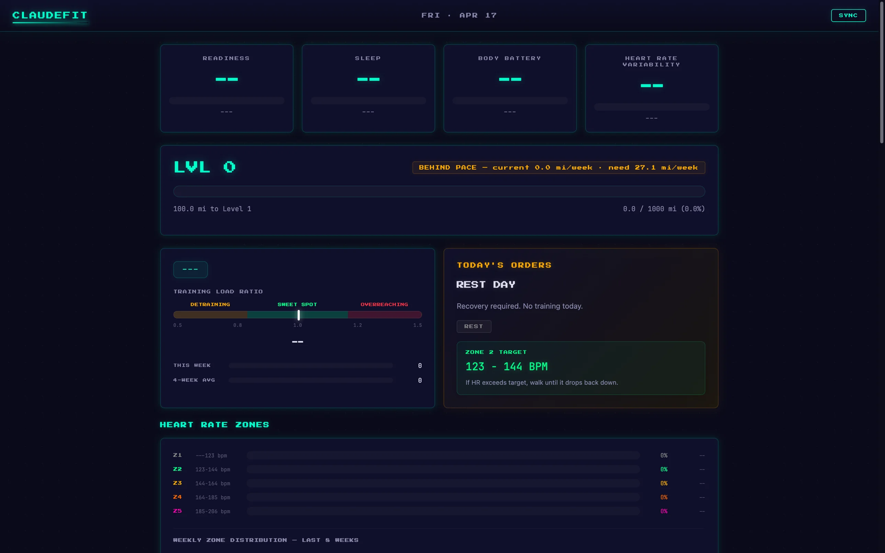

*This is Part 2 of a 3-part series on my fitness project. [Part 1](/posts/claude-fit-the-ai-fitness-app-that-didnt-need-ai) covers Claude-Fit, the AI agent prototype. [Part 3](/posts/basecamp-training-coach) covers Basecamp, where Claude became the coach instead of the backend.*

---

The first version of this project had four AI agents, a chat orchestrator, and a nutrition tracker that could identify food from photos. By the end of February I'd ripped all of it out and replaced it with if-statements.

That's not a failure story. The if-statements were better.

## What Claude-Fit Left Behind

Claude-Fit v0.1 was ambitious in the way first projects always are. Four async agents running through `claude -p` as subprocesses, prompt templates doing the "thinking," SQLite for persistence, and integrations with Garmin Connect, the USDA nutrition API, and Google Places for restaurant lookups. The fitness agent analyzed workouts and recommended training adjustments. The nutrition agent tracked macros. The food recognition agent parsed text descriptions of meals using Claude Haiku. And a chat agent tied it all together as a conversational interface.

It worked, technically. You could ask it what to do today and it would call the Garmin API, pull your recent activities, feed them into a prompt template, and return a recommendation. The problem was that every recommendation cost tokens, added latency, and wasn't meaningfully better than what a simple rule engine could produce. "You ran hard yesterday and your readiness is low, so take it easy today" doesn't need a language model. It needs a comparison operator.

The nutrition tracking had the same issue. Parsing "I had a chicken burrito and a side of rice" through Haiku to extract macros was clever, but I wasn't actually using the macro data for anything useful, and the accuracy of LLM-based food recognition wasn't good enough to base real decisions on. The food photo recognition was genuinely interesting as a concept, and it's something I'd still like to revisit, but it was solving a problem I didn't have yet because I hadn't built the system that would use the data.

So in late February I deleted all four agents, the chat orchestrator, the nutrition tracker, and the food recognition pipeline. What survived was the Garmin sync, the activity database, and a question: if AI isn't doing the thinking, what is?

## The Rule Engine

The answer was a four-layer training engine that turned out to be more capable than the AI it replaced.

**Layer 1, the template**, defines the weekly schedule. Sunday is always a hard hike because that's when I actually hike, and the rest of the week fills in around it with easy runs, recovery walks, and rest days. Monday is a recovery walk, Tuesday through Friday are easy runs, Saturday is prep rest before the Sunday push. Only Sunday is locked. Everything else can shift based on what the other layers decide.

**Layer 2, the modifiers**, adjust the template based on daily Garmin signals. Readiness below 30 means rest. Below 50 means downgrade whatever was planned. Above 60 means the day is eligible for a quality session like intervals or tempo. HRV status, body battery, sleep score, and resting heart rate trend all factor in, and each signal has its own thresholds calibrated against my actual data.

**Layer 3, the overload layer**, handles progressive load targeting. Instead of chasing an ACWR zone like most training apps, it directly targets chronic load growth at 7%, 5%, or 3% depending on how many strain markers are firing. If resting heart rate is rising and HRV has been unbalanced for two days and my check-in says I feel off, it drops from 7% to 3%. If all three performance milestones are met, VO2 max above 48, sub-8 pace on recent runs, and sustained uphill trail running, it drops to 0% and holds maintenance. The math underneath is EWMA inverse, working backward from a target chronic load to figure out what today's acute load should be.

**Layer 4, load steering**, decides whether a quality session happens. It reads the load budget from Layer 3 and the load focus phrase from Garmin, things like "anaerobic shortage" or "aerobic high shortage," and if conditions align it prescribes intervals or tempo work. Quality sessions are substitutions, not additions. You don't run extra miles for intervals, you trade an easy day's effort for a harder one at the same volume.

The whole engine is deterministic. Same inputs, same outputs, every time. I can write tests for it, which I did, about 400 of them, and I can trust that tomorrow's recommendation won't contradict today's for no reason. That's something the AI agents couldn't guarantee, and it mattered more than I expected.

## The Dashboard

With the engine handling recommendations, the frontend became the project's identity. Garboard v0.3 went through a cyberpunk phase, Press Start 2P font and neon glow effects and all, which was fun to build and terrible to actually use. The final design settled on a warm minimal aesthetic with six tabs: Today, Trends, Log, Map, Achievements, and Training Load.

The Today tab was the one I looked at every morning. A "Today's Orders" card showed the day's recommended workout with distance range, heart rate ceiling, and intensity, plus a growth indicator showing which tier the engine was targeting and how many of the three performance milestones I'd hit. Below that, a week plan strip laid out the full seven days with roles and distances, and a check-in button let me log how I was feeling so the engine could factor it in tomorrow.

The Map tab used Leaflet.js with CARTO dark tiles, showing every GPS track I'd recorded, color-coded by activity type with a heatmap mode that plotted all GPS points at once. Clicking a route overlaid stats. The Trends tab had 12-week distance charts, running heart rate with zone overlays, HRV and resting heart rate trends, and a pace vs heart rate scatter plot, all rendered on Canvas 2D because I didn't want a charting library for a personal dashboard.

Achievements tracked 25 definitions, some repeatable weekly or monthly, some one-time unlocks. There was an XP and leveling system tied to mileage, and the pixel art sprites from the cyberpunk era survived the redesign because they'd grown on me.

The whole frontend was vanilla HTML, CSS, and ES modules. No build step, no framework. Four-kilobyte JavaScript files loading directly in the browser. FastAPI served the backend, SQLite held the data, and the server ran at localhost:8100 on my laptop.

## The Garmin Auth Nightmare

If the training engine was the best part of Garboard, the Garmin authentication was the worst.

Garmin doesn't offer a public API for personal fitness data. There's a developer program, but it's designed for third-party apps on the Connect IQ platform, not for pulling your own data off your own watch. So everyone in the ecosystem relies on unofficial libraries that reverse-engineer the Garmin Connect web login flow.

I started with `garminconnect`, a Python library that logs into Garmin's web portal programmatically and scrapes the session cookies. It worked fine in February. Then it didn't.

The first sign of trouble was intermittent 429 responses. Garmin's SSO endpoint sits behind Cloudflare, and Cloudflare's WAF started flagging automated login attempts more aggressively sometime in mid-March. The `garth` library, which `garminconnect` uses internally for the OAuth flow, got hit the hardest. Login would work three times in a row and then fail for hours. I added retry logic, exponential backoff, cookie caching, and it kept breaking.

By late March both libraries were effectively dead. The `garth` maintainer walked away on March 27. The `garminconnect` maintainer's cffi branch broke the next day and they announced they were taking a break. I had a fully functional training engine with no data source.

## The USB Detour

Before I found a real fix, I built a fallback. My Garmin Instinct 2X mounts as a USB drive when plugged in, and every activity and daily summary is stored on the watch as a FIT file. FIT is Garmin's binary format for fitness data, and there's an official `garmin-fit-sdk` Python package that can parse it.

So I wrote an import pipeline. Plug in the watch, a launchd agent detects the mount, triggers a shell script that starts the Garboard server if it isn't running, and runs the FIT importer. Activities came across with full fidelity, GPS tracks, heart rate, splits, elevation, everything. Daily wellness data required aggregating the monitor files, pulling resting heart rate and stress averages from the all-day recordings.

It worked, but it was manual. I had to physically plug in the watch to sync, which defeated the point of having a dashboard that shows you today's recommendation when you wake up. The USB path became the backup, and I kept looking for a real solution.

## pirate-garmin

The fix came from a library called `pirate-garmin` that takes a completely different approach. Instead of mimicking a web browser login, it implements the OAuth2 flow that Garmin's own Android app uses. The native mobile auth endpoint is separate from the web SSO, uses different token exchange mechanics, and critically, isn't behind the same Cloudflare WAF rules that were blocking the web libraries.

The setup requires a one-time manual browser login to get past Cloudflare and any two-factor authentication, handled by a Playwright-driven headless Chromium session in `garmin_login.py`. You log in, grab a service ticket from the network tab, and the library exchanges it for a proper OAuth2 token pair. After that initial setup, the tokens auto-refresh indefinitely and you never touch a browser again.

Wiring it into Garboard meant rewriting the Garmin service layer, but the data model stayed the same. The API endpoints had changed too, training status and readiness had moved to a different service path, sleep was on its own endpoint, and some of the response schemas had shifted. But once the plumbing was updated, the sync worked reliably. Eighteen seconds to pull a full day's data, and the tokens hadn't expired once since I set them up.

## The Daily Summary Trick

One piece of Garboard that I'm still proud of is how it handles untracked days.

In late February I'd been consistently active, running and hiking almost every day, and then I got sick, moved apartments, and went a week without recording a single activity on my watch. My Garmin showed DETRAINING with an acute-to-chronic workload ratio of 0.1. But those move days weren't rest days. I was hauling furniture up three flights of stairs, carrying boxes for hours, sweating through my shirt. My body knew it even if my watch didn't.

The thing is, the watch tracks a lot even when you don't start an activity. Steps, floors climbed, heart rate throughout the day, active calories, intensity minutes, stress. All of it streams passively from the sensor, 24 hours a day, and all of it lives in Garmin's daily summary endpoint. On the day I moved apartments, the watch recorded 15,608 steps, 70 floors climbed, 1,817 active calories, and a max heart rate of 157. That's not a rest day by any metric.

So I wrote a system that pulls the daily summary data and synthesizes activity entries from it. Not fake workouts, actual physiological data from the watch, just structured into the same format as a recorded activity so the training engine can account for it. Steps and floors become distance estimates, active calories map to effort, heart rate data fills in the zones. The GPS fields stay null because there's no route, and the start time is approximate, but the training load math gets real numbers instead of zeros.

After backfilling the move week with synthesized entries, the ACWR jumped from 0.1 to something that actually reflected how hard my body had been working. The engine stopped recommending "hard effort hiking, 5 to 9 miles" to someone who'd been moving furniture for a week and needed a recovery day.

## Where the Code Landed

By late March, Garboard had 401 passing tests covering the modifiers, achievements, analytics, heart rate zones, template logic, overload calculations, and integration scenarios. The codebase had gone through a three-pass dead code audit, every line of SQL lived in dedicated CRUD and analytics modules, and the service layer handled all Garmin data normalization in one place so the routes stayed clean.

I'd put the code quality at 9 out of 10, by my own honest assessment. The missing point is frontend JavaScript testing, which I never set up because the frontend is a personal dashboard and visual bugs are obvious the second you look at it. Everything else, the engine, the data layer, the sync pipeline, all tested.

## Why Garboard Wasn't Enough

On March 29th I was debugging the USB FIT import when I noticed the engine was recommending a hard hike based on an ACWR of 0.087. The number was obviously wrong. CSV-imported activities were missing their `training_load_peak` values, which meant the EWMA calculation was working with near-zero inputs and producing garbage output. Classic bad-data-in, bad-recommendation-out, and a rules engine can't catch it because it trusts its inputs.

The bad ACWR was the surfaced problem. The real one was underneath. The rules engine is fast, free, and testable, but it trusts its data blindly, and it can't factor in that you switched back to intermittent fasting this week, or that work has been stressful, or that the trail you're considering is steeper than your heart rate history suggests you're ready for. Those are the variables that actually matter for training decisions, and they resist being encoded into if-statements.

Garboard isn't dead. The dashboard still works, the data is still there, and the pirate-garmin tokens are still refreshing. But the coaching moved somewhere else, and that's [Part 3](/posts/basecamp-training-coach).
