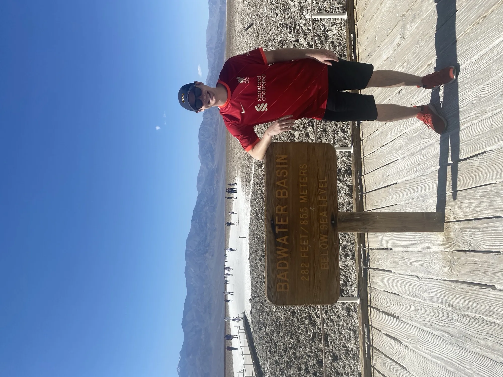
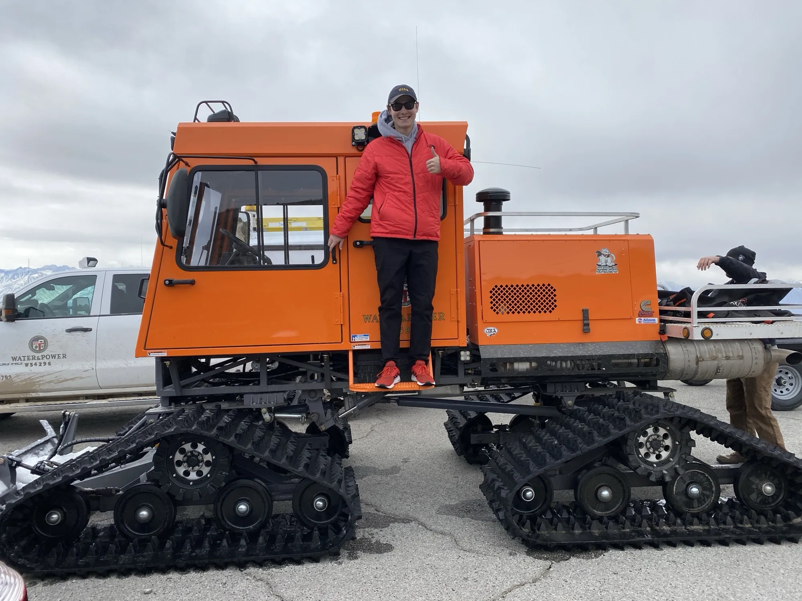
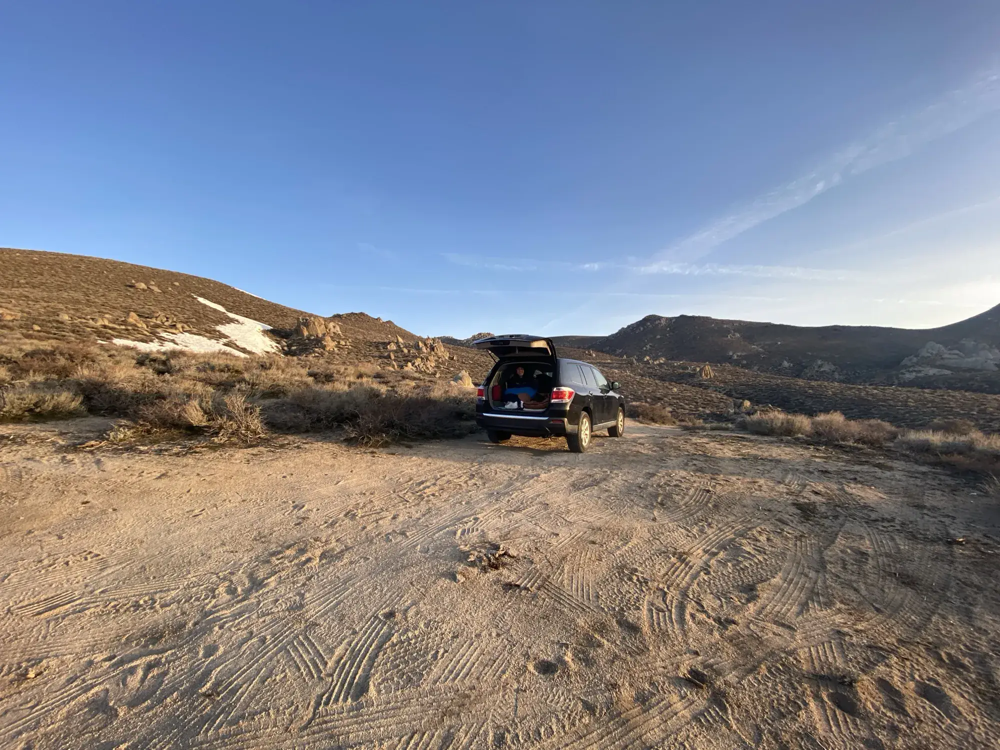
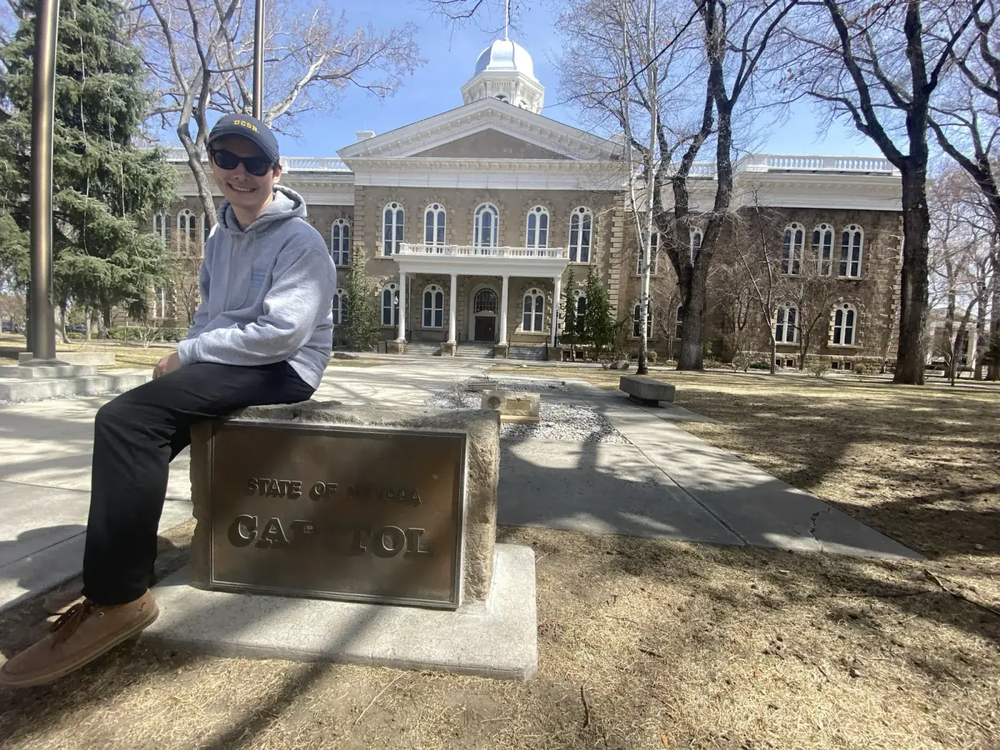
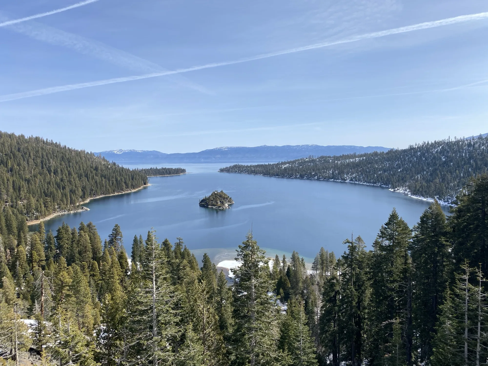
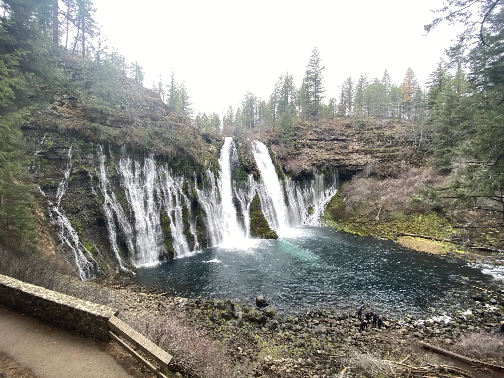
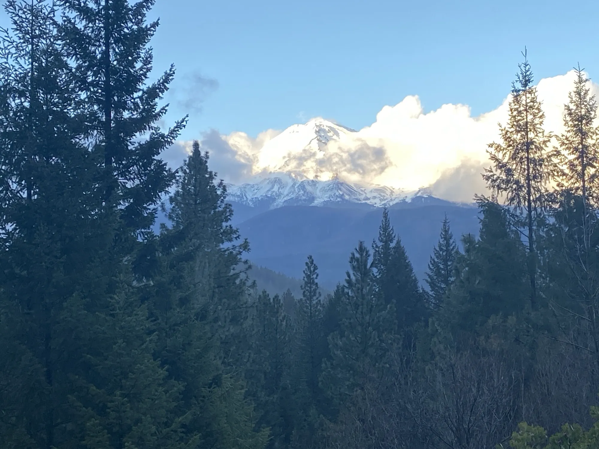
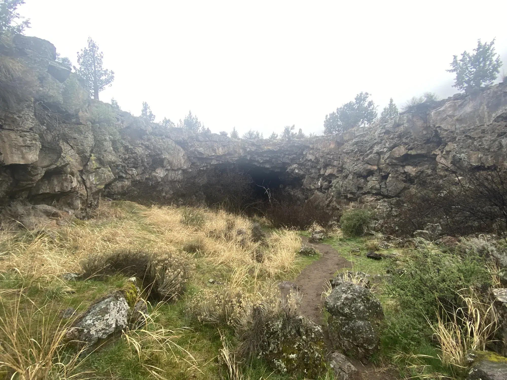

California is several different countries stacked on top of each other along the 395 and the 5, and the cleanest way to see most of them in a week is to drive up one and down the other. My friend Max and I did exactly that in March of 2022, in my mom's Toyota Highlander, on my spring break, with a vague list of stops and no real plan beyond it. By the end of the loop we had been beached on a sheet of ice high in the White Mountains and dug out by strangers, slept on a bluff over Mono Lake, eaten breakfast in Susanville, hiked up a closed forest road east of Lassen, and stood inside a lava tube called Pluto's Cave somewhere north of a town called Weed. None of that had been more than a name on a map at the start of the week.

It was the first long road trip I had ever taken without a parent in the car. Max was free, I was free, and we left San Diego on a morning in mid-March in the Highlander, with the back set up to sleep in and not much else.

## Death Valley

The drive from San Diego up into Death Valley took most of the day, and the first thing that happened in the park was a fighter jet went over our heads at low altitude in one of the long narrow valleys between the mountain ranges, the engine noise hitting us before either of us thought to look up. It turned out we had driven straight through what the aviation community calls Star Wars Canyon, a low-level training corridor where Navy and Air Force pilots run high-speed passes when the weather is clear. From there the day was a Death Valley loop. Badwater Basin, where you stand at 282 feet below sea level and look up at salt flats the color of milk. Artist's Palette, where the mineral content in the volcanic rock streaks the hills in actual greens and pinks and yellows. By dusk we were rolling into Alabama Hills and parking among a cluster of granite boulders that turned out to be a popular spot, with a dozen or so other vehicles already there doing the same thing we were.

## Alabama Hills

Alabama Hills is a stretch of weathered granite boulders and rounded hills that sits at the base of the eastern escarpment of the Sierra, just outside the town of Lone Pine, and the boulders themselves are remarkable enough that they would be a national monument anywhere else. From the campsite we picked, you walk a few steps from the car, look west, and the entire eastern wall of the High Sierra is right there, with Mount Whitney as the highest point on the skyline. In March the face of Whitney was still snowed in halfway down, the boulders in front of us were still warm to the touch from the day's sun, and the contrast did something to my brain.

The summer I was eleven, my family took me to Denali, and I have a vague memory of looking up at it and not being able to make sense of the scale. Whitney from Alabama Hills did the same thing to twenty-two-year-old me, which I had not expected. It is the highest point in the lower 48, and you can see the whole thing at once from the floor of the Owens Valley, because the eastern escarpment of the Sierra is one of the steepest sustained mountain faces in North America and there is nothing in front of it. Standing there with Max as the sun went down was the first time I thought of Whitney as a mountain I might want to climb instead of as a fact about California.

The next morning we climbed one of the boulders for a better view. From the top, the angle of the sun lit up the granite of the Sierra in a way that made the whole range look like its own country, separate from the rest of California, which it more or less is.

## White Mountain Road

The bristlecone pines live at around 10,000 feet in the White Mountains, the range that runs along the east side of the Owens Valley opposite the Sierra, and the road that gets you there climbs out of Big Pine and up through a series of switchbacks past a station called Lookout. We had read that the gate above Lookout was closed for the winter, but when we got to it the gate was open, because a crew was being dispatched up to the radio tower further up White Mountain. They were in a tracked vehicle the size of a small bulldozer with a heavy plow on the front of it, and we made the call, in retrospect a bad one, to follow them up the cleared path while we still had it.

The plow truck was faster than we expected and got out of sight ahead of us in the switchbacks. We caught up to a section where the snow was banked across the road in a low hump, the kind of thing that looked, from the driver's seat, like a few inches of soft snow over the cleared lane. Max and I talked it over and decided to gun it. The hump was not soft snow. It was solid ice under a dusting, and the front of the Highlander rode up onto it and stopped, and the rear wheels lost contact with the road and started spinning in slush, and the rear right wheel was a few feet from the edge of the road, which was a few feet from a cliff that dropped a long way into the valley.

We got out and started digging at the front of the car with our hands, trying to get the front tires onto something solid. The plan, if you could call it that, was that the plow truck would eventually have to come back down the road on its way out and they would help us out of it. That plan was wrong, because the plow truck went out a different way, and after about an hour of digging we had not seen anybody.

A sedan came up the road behind us. The guys in it got out, took stock, and figured out before we did that we were past the point of digging ourselves out alone. I have written about that rescue elsewhere, because one of the guys in the sedan turned out to be Ted Nivison the YouTuber, which is the kind of detail the [three trees post](/posts/three-trees/) is the right place for. From the angle of this trip, what I remember is that the four of them and the two of us spent a long time in the cold digging the Highlander out of the ice, while the rear wheel slid further toward the edge in slow motion every time the front end came loose. Eventually I got behind the wheel, with rocks I had thrown into the snow under the rear tires for grip, and drove the car off the ice and back onto pavement in one fast continuous motion that I am still not totally sure I made well rather than gotten lucky on.

Both groups parked on the pavement above the ice patch and hiked from there toward the Methuselah trailhead through what was, by that point, very obviously snow too thick to make it through. We got a quarter mile in before Max and I peeled off onto a side trail that looked clearer, not realizing it was a different loop entirely. The sedan guys kept going on the original trail. A few minutes later we heard their voices on a parallel section of trail just below us, and they had clearly hit the same wall of snow we had hit on ours and turned around. We all walked back to the cars, not totally sure whether we were technically hiking together or separately, and then everybody waved and we got back in the Highlander and pointed it down the mountain. The Highlander had a small ice-dent in the front bumper and a scrape down one side, but the panels mostly popped back into place over the next few weeks and there is no real evidence on the car now that any of it happened.

## North on the 395

Mono Lake sits in a basin at about 6,400 feet, alkaline and salty, ringed by tufa towers that grow underwater where calcium-rich springs meet the carbonate-rich lake water and that get exposed when the lake level drops. The lake level dropped a lot in the twentieth century because Los Angeles diverted the streams that fed it into the LA Aqueduct, and the towers became visible as a kind of accidental sculpture garden along the south shore. We boondocked on a bluff above the lake that night, with the towers black against the water and the Sierra on the other side of the basin still in late evening light.

The next day was Carson City, Tahoe, and Reno, in that order. Carson City was on the route because I have been working on collecting state capitols, and the Nevada one was right there.

Lake Tahoe in March had less snow than I had expected and fewer people, and we ended up driving most of the way around the lake. The stretch I remember most was Emerald Bay on the southwest side, where the highway climbs onto a narrow ridge and you look down into a small glacial inlet ringed by pines. It is one of the most photographed views in California, and the photographs do not oversell it.

Reno was a quick stop for an oil change on the way out of town. We boondocked that night about a hundred miles north of Reno, just inside California but very close to the Nevada line, in a pullout off the highway with no lights and a sky that was actually dark in a way that south-facing California rarely is.

## The Cascades

The next morning we got breakfast at a small place in Susanville, the closest town to where we had boondocked the night before, and from there we drove west toward Lassen.

Lassen Volcanic National Park is a volcano in northern California that erupted last in 1915, which is recent in volcano time, and the road that takes you up over it is closed in winter and most of spring. The road was still closed when we got there, so we drove a state highway through Lassen National Forest east of the park instead. The volcano was visible from the highway, snow-covered, off to the west. We pulled off at a viewpoint where a forest road was gated for the season and walked up it on foot until we got to a vista that looked down over a big canyon. There was nobody else there. The country up there is empty in a way that is different from how the desert is empty. Trees and snow and wind, no signs of anybody.

Further north on Highway 89 we stopped at McArthur-Burney Falls State Park because the sign for it was promising. Burney Falls is a 129-foot waterfall, and the part that makes it strange is that the water does not come over the top of the cliff in a single line. It seeps through the porous volcanic rock all the way down the face and emerges in dozens of separate places at once, so the whole rock face is wet, not just the main drop. Theodore Roosevelt is supposed to have called it the eighth wonder of the world. The walk down to the base is short, the place was mostly empty in mid-March, and we stood at the bottom and watched the spray for a while before getting back in the car.

Mount Shasta is a 14,179 foot stratovolcano that rises on its own out of relatively flat country, the way Whitney rises out of the Owens Valley, a single solitary peak snow-covered most of the year, and you can see it from a long way off when you start dropping in toward the I-5 corridor. We saw it through the windshield for a long stretch before we got close to it.

Pluto's Cave is a lava tube on the north flank of Shasta, formed when the outer crust of a moving lava flow cooled solid and the lava drained out leaving a hollow tunnel. My mom had told us about it. The entrance is a collapsed section of the roof, a hole in the ground in a featureless lava field, and you climb down into it stepping over loose rock. Inside, the tube was bigger than I had expected, the ceiling well above our heads and the walls wide enough apart that our headlamps could not light both at the same time. It runs for something like a third of a mile, all of it pitch dark. We walked in until the daylight from the entrance disappeared, and then a little further, and then turned around when the dark started feeling like it might actually be infinite.

Weed is a small town in the shadow of Shasta, a short drive past Pluto's Cave, and we had gone there because the name was funny. The t-shirts in the gas station play that for laughs in every direction you can think of. We ate, and then we drove south.

## Home

We got a Motel 6 south of Mount Shasta that night because we had been sleeping in the Highlander for four nights and a real shower felt earned. The next morning we drove the 5 from there to San Diego in one push. The 5 down the central valley is one of the longest stretches of straight, flat highway in California, eight hours of farms and gas stations and not much else, and I do not remember much from that stretch. The trip had already happened by the time we got on the 5.

What I came home with was a different sense of the size of the state. I had grown up in California and driven a lot of it before, in pieces, with my parents in the front seat and a destination at the end. This was the first time I had driven a real loop through it on my own decisions, with a friend in the passenger seat and no end-state besides home. The part of California I saw that week was bigger than the part I had seen in the previous twenty-two years combined.

The Highlander pulled into the driveway in San Diego on the night of the fifth day with bug splatter from two states on the windshield and a small dent in the front bumper that has, at this point, mostly worked itself out. The list of names on the map I had started the week with were now places I had been with a friend in a car my mom owned, and Whitney was the only one of them still on a list of things to come back to.
