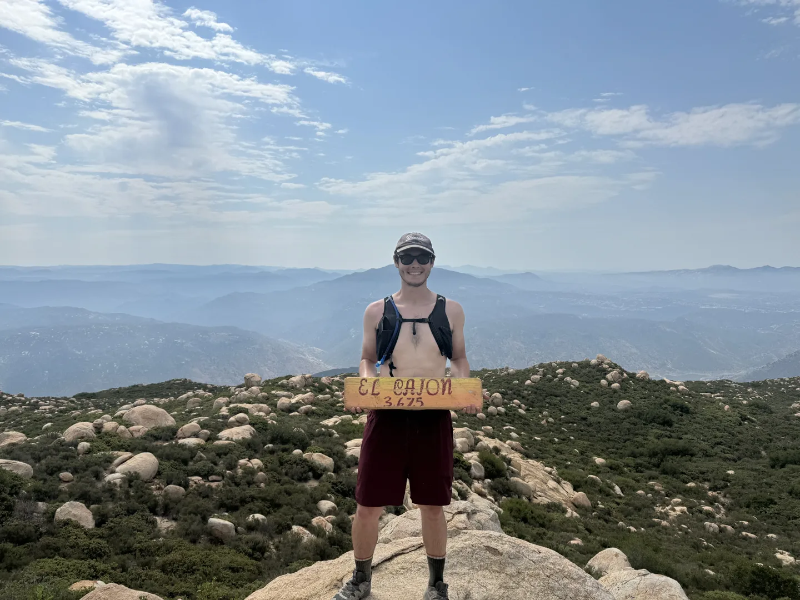
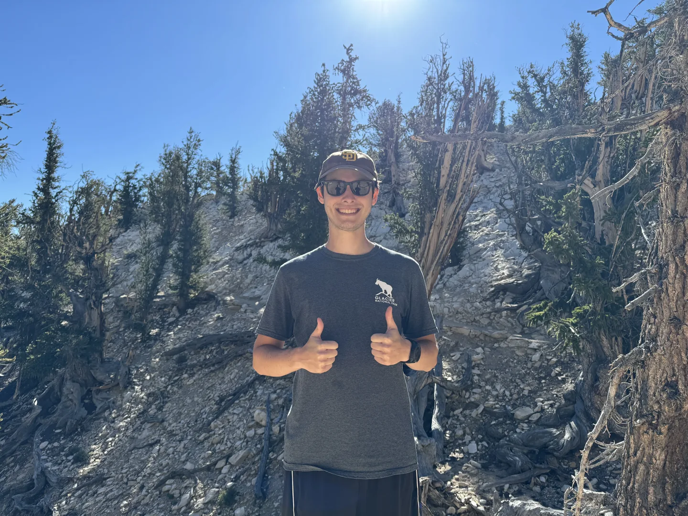


<link rel="stylesheet" href="https://unpkg.com/leaflet@1.9.4/dist/leaflet.css" />

<link rel="stylesheet" href="maps.css" />



The first time I hiked Cowles Mountain this year, my Garmin recorded an average heart rate of 176. That's higher than anything I recorded in the summer of 2024, when I was hiking every few days and feeling good on the trail. My last Cowles hike before that was July 2024, over a year and a half earlier, and my body let me know exactly what that gap cost. The watch doesn't lie about these things, and when you lay 19 GPS tracks on top of each other with heart rate coloring them green to red, patterns like that jump right out.

I've been recording most of my hikes on my Garmin Instinct 2X since April 2024, at least when I remember to start the activity. I'm working toward 1,000 miles this year between walking, running, and hiking, and the watch tracks all of it, GPS coordinates, elevation, heart rate, pace, the whole picture. I figured I'd put some of that data on a map and write about the trails I keep coming back to, because looking at this stuff on a screen is genuinely more interesting than scrolling through Garmin Connect summaries.

This isn't a trail guide. San Diego has plenty of those. This is what my hikes actually look like when you plot the GPS data, where I go, how hard my heart is working, and what the elevation profiles tell me about what kind of day I had on the trail. Every map is colored by heart rate, green where I'm cruising and red where I'm working, and you can switch between dark, terrain, and satellite views to get a better sense of the topography.

## Cowles Mountain

Cowles is my home trail. It's the highest point in the city of San Diego, sitting at 1,593 feet in Mission Trails Regional Park, and it's about a 15 minute drive from my apartment. I've hiked it 19 times since April 2024, which makes it by far the trail I know best.



<canvas id="cowles-elevation"></canvas>



That map has all 19 Cowles tracks overlaid, colored by heart rate. You can see routes from different trailheads, Barker Way up the east side, the Mesa Road approach, Big Rock Park from the north, and the Boulevard Trail from the south. The elevation profile underneath is a standard Barker Way out-and-back, about 2.8 miles and 900 feet of gain, which is the steep direct line you'll see repeated the most on the map. Switch to the terrain view and you can see why that route is so steep, the contour lines are packed tight on the east face.

The heart rate data is where it gets interesting. My summer 2024 hikes, when I was going regularly, averaged somewhere between 145 and 163 bpm depending on the route. I was in a groove, my body knew the trail, and the effort felt sustainable even on the steeper sections. Then I stopped going to Cowles. I did some hiking in that stretch, a road trip through the southwest in spring 2025 that hit Saguaro, White Sands, Carlsbad Caverns, Guadalupe Mountains, and Big Bend, but nothing I tracked on the watch and nothing with the kind of consistent elevation that Cowles gives you. My last tracked Cowles hike was July 25, 2024, and I didn't go back until February 8, 2026. That first hike back recorded an average heart rate of 176.

That's the cost of 19 months away from your home trail, measured in heartbeats. Same route, same distance, same 900 feet of elevation gain, and my cardiovascular system was working noticeably harder to do the same thing it used to handle comfortably. Two weeks later I did Cowles again and was back down to 162, which tells you something about how quickly the body readjusts when you just start showing up again.

I keep going back to Cowles because it's close, it's consistent, and it gives me a reliable baseline. When I want to know where my fitness actually stands, I hike Cowles and look at the numbers.

## Pyles Peak

Pyles Peak is my current Sunday go-to, also in Mission Trails. The route starts from the same Barker Way trailhead as Cowles but keeps going, pushing past the Cowles summit and continuing north to Pyles Peak. It's about 5.9 miles round trip with roughly 1,900 feet of gain, and I consider it a completely different hike even though it's technically a continuation of the same trail system.



<canvas id="pyles-map-elevation"></canvas>



You can see on the elevation profile how the route has two distinct pushes, the Cowles climb and then the Pyles climb after a dip in between, and the HR coloring shows where the effort actually is. The green sections in the valleys and the red on the climbs tell the story better than pace data ever could.

It's become a good routine hike, the kind of trail where I can zone out, get some elevation in my legs, and not think too hard about route choices. Not every hike needs to be an event. Sometimes you just want to move for two hours and come home.

## El Cajon Mountain

El Cajon Mountain is the hardest hike I've done in San Diego. 11.6 miles, 3,862 feet of elevation gain, 5 hours 21 minutes moving time. The trailhead is out past Lakeside, and the route climbs relentlessly for the first several miles before hitting a series of exposed granite slabs near the summit that require some light scrambling.



<canvas id="elcajon-map-elevation"></canvas>



Look at that elevation profile. The first half is a grind, and then the route flattens out along the ridgeline before the final push to the summit. My average heart rate for the whole hike was 137, which seems low compared to Cowles, but that's because the pace is so much slower on a 5 hour hike. You're not pushing hard, you're managing energy. The HR coloring on the map makes this visible, you can see the green sections where I was on flatter terrain and the red where the grade gets serious.

I went through a lot of water on this one. The last couple miles coming down I was running on empty and my knees were starting to complain, which is the kind of thing the elevation profile makes obvious in hindsight. All the stress is front-loaded on the ascent, and then you have to get back down on tired legs over loose rock. I'd do it again, but I'd bring more water and start earlier.

## Camp Horno Memorial, Recon Ridge

This one's a little different. My buddy is an ex-Marine, and he used to do this hike regularly when he was stationed at Camp Pendleton for training. It's not a named trail you'll find on AllTrails, it's a route on an active military base, and he brought me along since he still has access. Most people can't do this hike, which is part of what made it worth writing about.



<canvas id="pendleton-map-elevation"></canvas>



7.3 miles, 2,474 feet of elevation gain, about three and a half hours. Switch to satellite view on this one, it gives you a sense of the terrain better than the dark map does. Dry coastal hills, steep in places, with almost no shade and no other hikers. It felt like having the whole mountain to ourselves, which on a Friday in San Diego is basically unheard of. He set the pace and it was honest, he hikes the way Marines hike, which is faster than I'd normally go on that kind of grade.

At the top of the hill is the Camp Horno memorial, and my buddy brought beers to share with his fallen brothers, which is a tradition for the guys who hike up there. That's not something I'm going to experience on any other trail.

There's something different about hiking a place that isn't really meant for recreation. No trail markers, no parking lot, no trailhead sign. Just dirt and hills and the ocean in the distance. I liked it a lot.

## Methuselah

This one's not San Diego, but I want to include it because it was one of the more memorable hikes I've done. The Methuselah Trail is a 4.3 mile loop in the White Mountains near Bishop, California, in the Ancient Bristlecone Pine Forest. The whole point of the hike is that somewhere along this trail stands the oldest known living tree on Earth, a Great Basin bristlecone pine named Methuselah that's over 4,800 years old. They don't tell you which one it is, you just walk through the grove knowing it's one of the trees you're passing.



<canvas id="methuselah-map-elevation"></canvas>



The Eastern Sierra is a different world from San Diego. The trailhead sits above 10,000 feet, the air is thin, and the bristlecone pines are these twisted, gnarled things that look half dead but have been alive since before the pyramids were built. I've been chasing notable trees for a while now, the oldest, the largest, the tallest, and I have a whole page about all of them over at [ryan-little.com/trees](https://ryan-little.com/trees) if you're curious.

The hike itself is moderate, mostly rolling terrain through the grove at elevation, but the altitude makes everything feel harder than it should. My average heart rate was 138, which is easy by San Diego standards, but at 10,000 feet my lungs did not agree with that assessment. Worth the drive from San Diego, though. Easily.

I've been trying to get out on trails more consistently this year, partly for the 1,000 mile goal and partly because sitting at a desk doing geospatial work all day means I need to actually move in the real world sometimes. The Garmin data is fun to look back on, and the maps make it easy to see where I've been and what it cost me to get there. I'm heading to Zion National Park the week this post goes live, so there should be some good new tracks to add to the collection soon.
