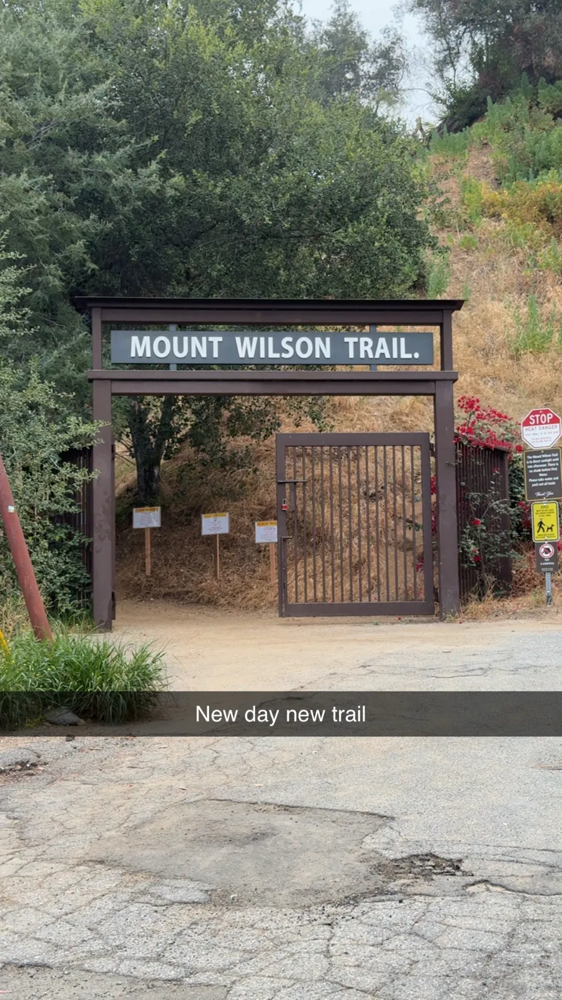
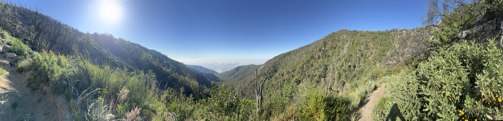
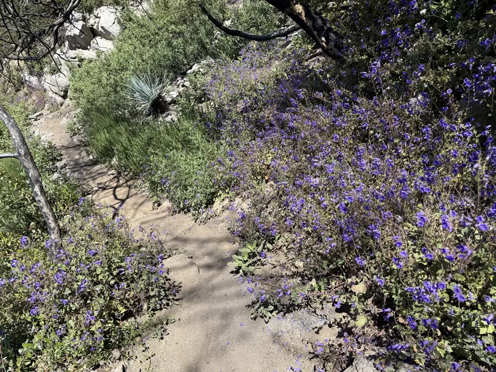
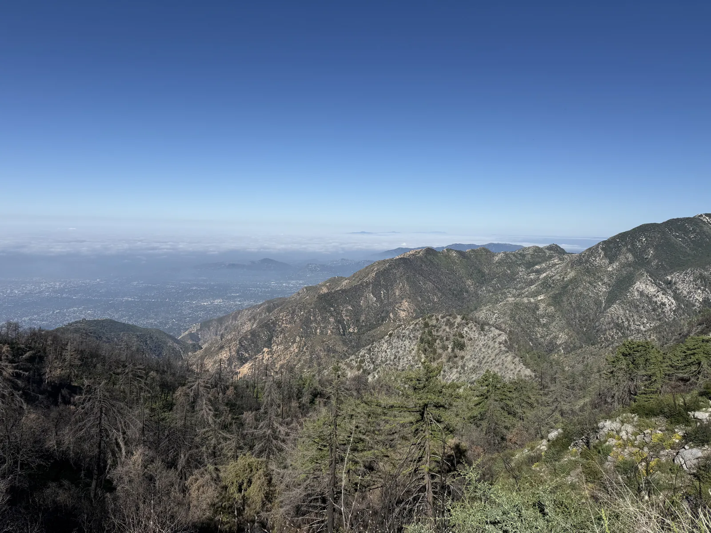
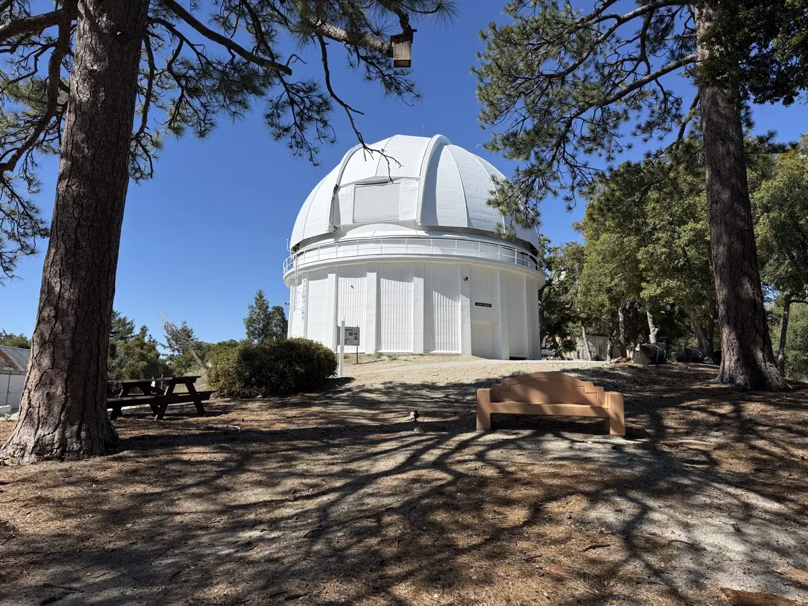
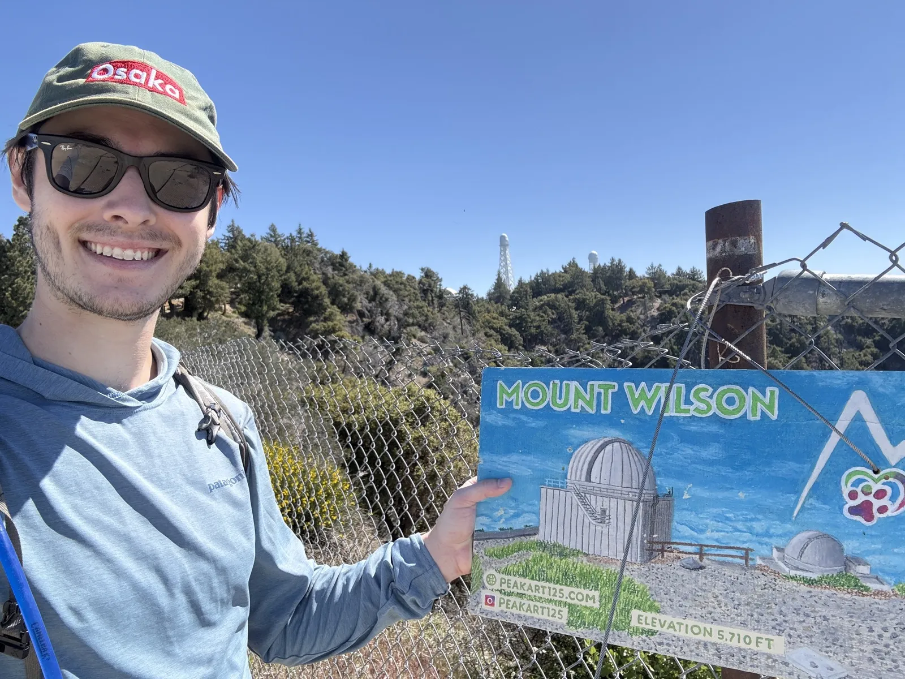
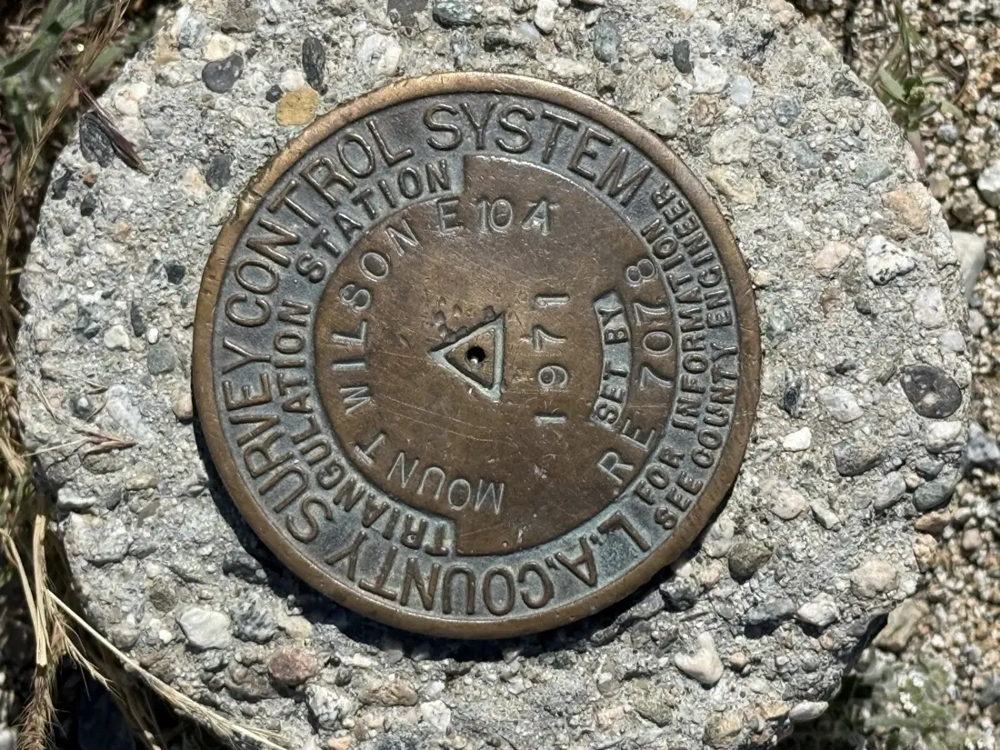


<link rel="stylesheet" href="https://unpkg.com/leaflet@1.9.4/dist/leaflet.css" integrity="sha384-sHL9NAb7lN7rfvG5lfHpm643Xkcjzp4jFvuavGOndn6pjVqS6ny56CAt3nsEVT4H" crossorigin="anonymous" />

<link rel="stylesheet" href="maps.css" />



The alarm went off around 4 in the morning and I was on the 5 heading north out of San Diego while it was still dark. Mount Wilson is about two hours from the city, and I wanted to be at the Sierra Madre trailhead early enough to get decent parking and not spend the first miles of the climb stuck behind a group, so I left in the dark and got there with enough time to settle in before starting. Getting good parking at a Los Angeles-area trailhead on a weekend feels like a small victory worth noting.

The hike is 16.4 miles out and back with around 4,500 feet of gain from the Sierra Madre trailhead to the 5,724-foot summit. My Garmin logged closer to 5,200, but the watch started in the marine layer with changing pressure and I walked around the summit complex for a while, so the trail gain figure is the more accurate number. Start time was 6:30 AM and I finished just under six hours later, average heart rate 153 and max of 189, which is about as high as I've seen the watch go. Weather at the bottom was 63 degrees and mist, though by the time I reached the summit the sky was completely clear.



<canvas id="wilson-elevation"></canvas>



The best thing that happened in the first two miles was breaking through the marine layer. There was a band of low clouds sitting over the San Gabriel Valley when I started, and as the trail climbed I went through it and came out into full sunshine, the cloud ceiling visible below me and the ridgeline lit up ahead. From that point on I had a pretty good idea I was going to like this hike.

The crowd on the trail also thinned out sharply past Orchard Camp, a wide flat stretch maybe four or five miles up, and after that it felt less like a popular LA hike and more like you were actually somewhere. The trail gets narrower past the halfway mark, switchbacking up the ridgeline where the canyon drops away on both sides, and then you hit the old Mount Wilson Toll Road, a wide graded path that was the mountain's original access route before Angeles Crest Highway came through in the 1930s, and from there it's a flat easy walk into the summit complex. The steepest stretch is at the bottom, the first few miles out of Sierra Madre, and then it eases and stays consistent the rest of the way up.

Somewhere in the middle there was a section where the trail ran through wildflowers on both sides, purples and yellows and a few colors I couldn't name, dense enough that you were walking through them rather than just past them. I'm more of a big-vistas person than a stop-and-look-at-the-flowers person, but this section was genuinely good, and I slowed down and stayed in it for a while.

The views started opening up on the upper ridgeline, looking out over the San Gabriel Valley and the LA Basin with the marine layer still sitting below the ridge on the coast side.

## The Summit

I didn't know there were telescopes up there.

I knew Mount Wilson was 5,710 feet in the San Gabriel range, and I knew it was the first of the Six-Pack of Peaks I'm working through as part of the build toward Whitney this August. What I didn't know was that the summit is home to the Mount Wilson Observatory, a cluster of domes and instruments you can walk around, with a museum inside one of the buildings. I spent a good stretch at the top going between the domes and working through the museum, and ended up at the Cosmic Café a couple of hours before it was going to open.

The thing from the museum that stuck with me was that the same person built the Mount Wilson telescopes and the Palomar Observatory, which is up in the mountains in northern San Diego County, maybe two hours from the city heading north and east. I've driven past the Palomar turnoff a number of times without ever going up, and now I have a reason to. There's good hiking on Palomar Mountain too, so it's on the list for two reasons now.

Most of the people at the summit had driven up from the highway rather than hiked, which meant the area felt more like a day trip destination than a trailhead, and most of them didn't seem to know you could walk there from Sierra Madre. I took the Six-Pack photo at the sign before heading back down.

Before leaving I found the survey marker embedded near the summit, a 1971 LA County Survey Control System triangulation disc labeled Mount Wilson E104. I look for these on hikes when I know they exist, and this one was easy to find.

## The Descent

About halfway down I turned my left ankle on the trail. I've been dealing with a recurring left ankle issue since April, three separate incidents documented in the [Whitney Goal post](/posts/whitney-goal/), and this was a fourth, though milder than any of the others. It caused some pain for a couple of minutes and then mostly resolved. The ankle is sitting around 90 percent and this didn't change the assessment much.

Near the bottom of the descent I started noticing something was off. A police car parked near the trail. Then a search and rescue van. A cop standing at a wide spot telling hikers to stay on the path and keep moving, which I did, not knowing what was going on. At the Mt Wilson Trail sign at the bottom there was another officer. At the junction with the main road there was caution tape and a third patrol car, with officers waving hikers out through a gap while keeping anyone new from going in. The trail was closed for the rest of the day.

I'd passed a few people heading up during the lower part of the descent, before the police presence became obvious, and after I got to the bottom and saw the closure I wasn't sure how they'd gotten past the first officer. Probably they'd started from a different trailhead or access point. I didn't think about it much.

The news that afternoon had more detail. A hiker had been found unresponsive a few miles up the trail from a cardiac event and didn't survive. A follow-up the next day added that it was the [second death on the Mt Wilson Trail in about a week](https://www.nbclosangeles.com/news/local/mt-wilson-hiker-cause-of-death/3889099/). I hadn't noticed anything during the hike, just the response at the bottom. That information lands differently once you've spent six hours on the same trail the same day.

## The Six-Pack

Wilson sits at 5,710 feet, first of the six, and at 16.4 miles and around 4,500 feet of gain it was the longest hiking day I'd had until Cucamonga two weeks later. San Jacinto is next, then San Bernardino Peak, Baldy, and Gorgonio at 11,503 feet. Each one is further from San Diego, higher, and longer than the last, and by the time Gorgonio comes around the Wilson day is going to look like the easy one.
