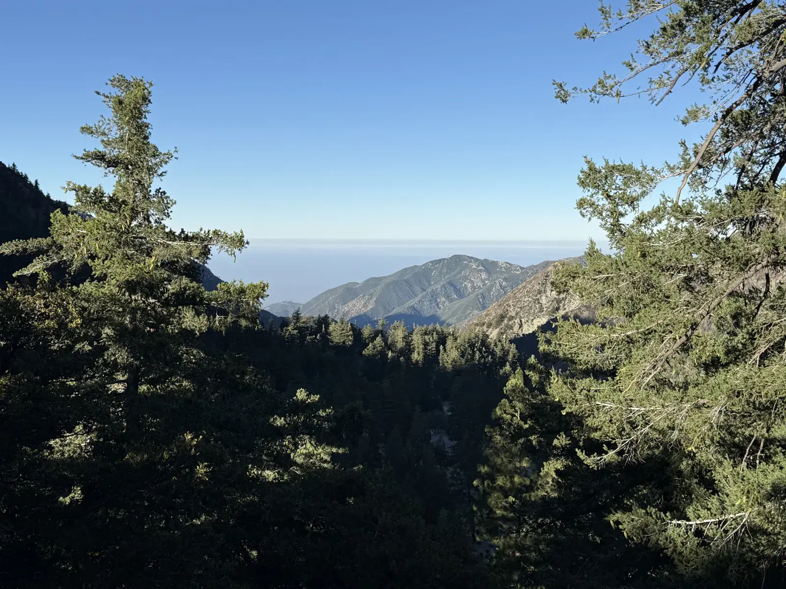
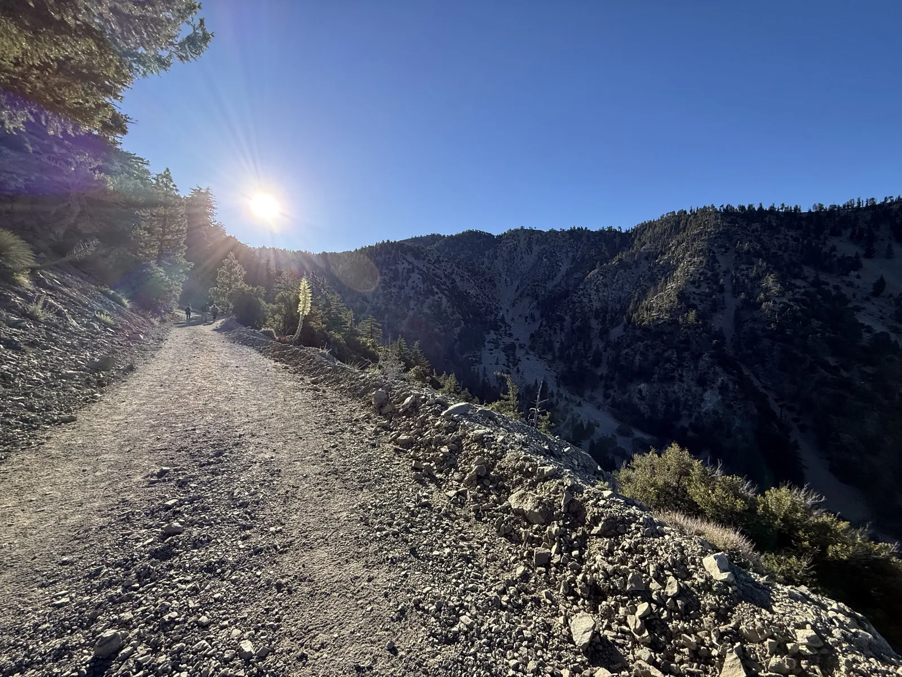
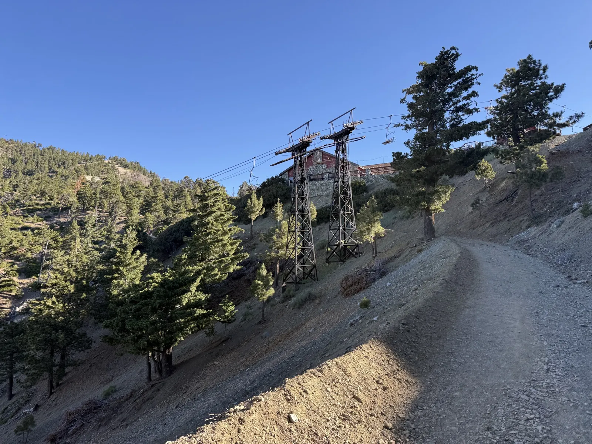
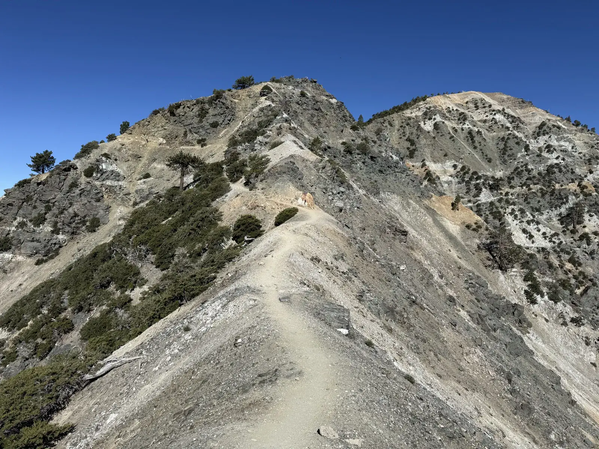
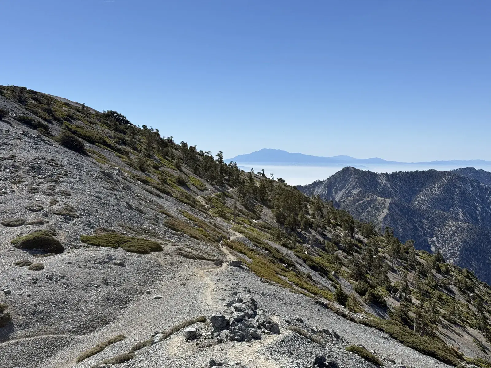
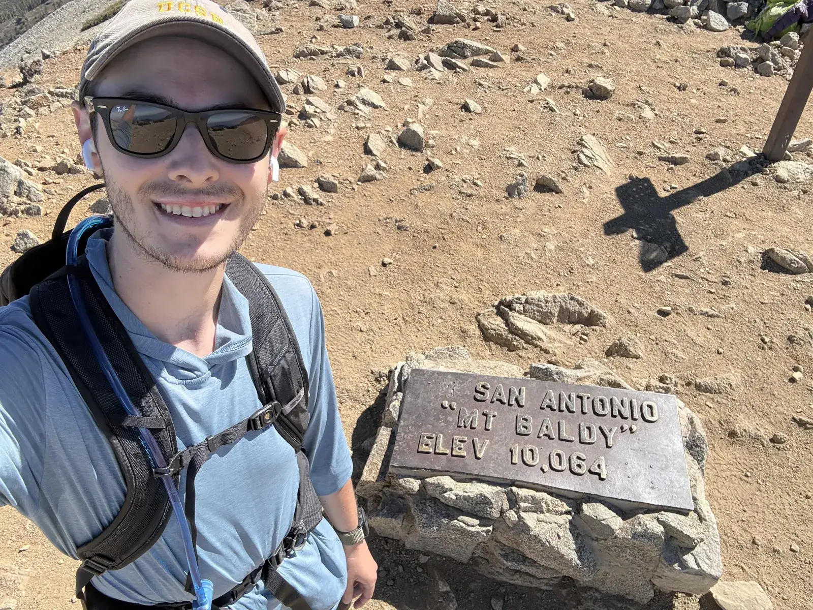
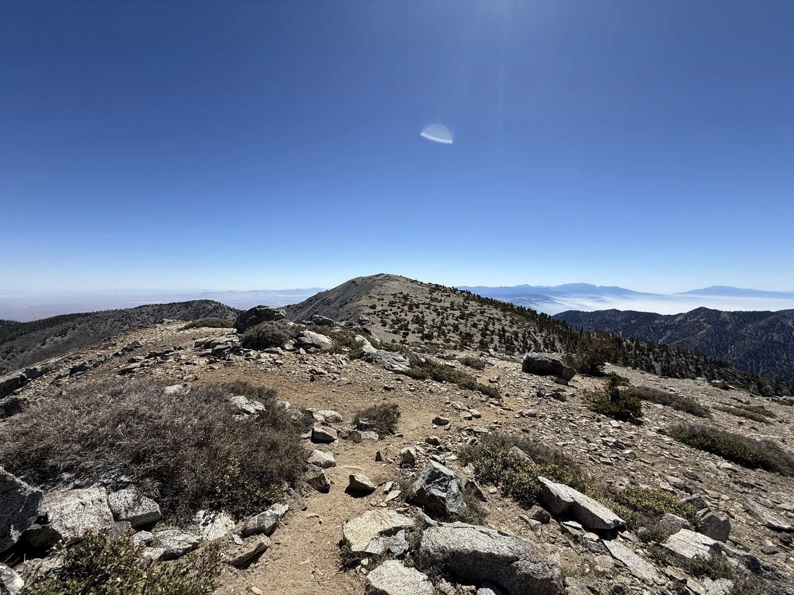
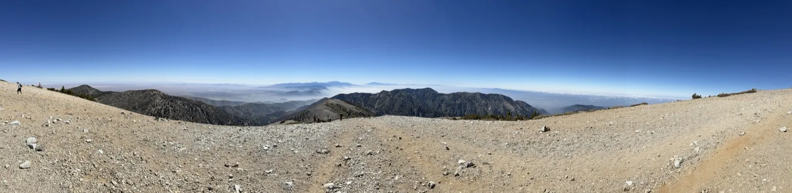
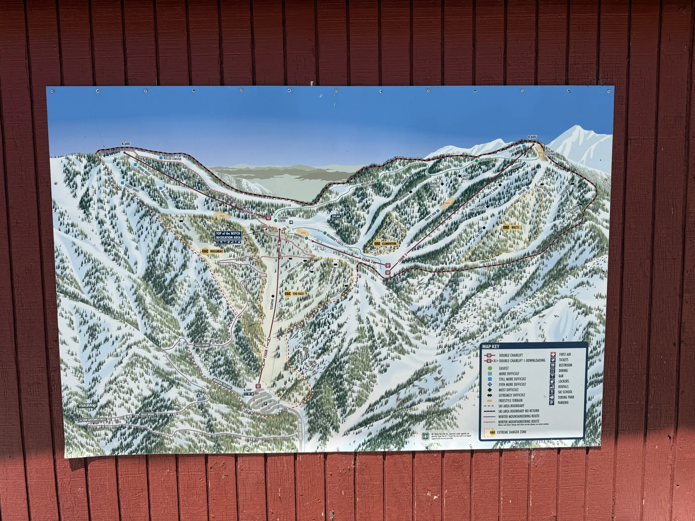
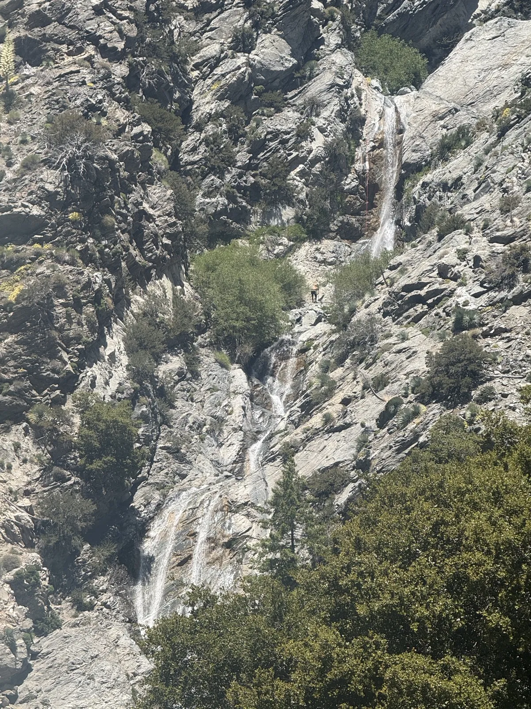

Three weeks passed between San Jacinto and this one, longer than the gap between any of the other Six-Pack hikes so far, and the reason has nothing to do with mountains. The plan had been San Bernardino Peak the first weekend of June, and then the day before, at a friend's birthday party, I caught a kickball wrong and jammed my right ring finger into a shape it isn't supposed to hold. Urgent care splinted it and sent me to a hand specialist, who gave it the actual name, mallet finger, and told me the splint's staying on until early August. The upside was that as long as it's on 24/7, I'm cleared to do whatever I want otherwise. So San Bernardino got scratched off the calendar anyway, grad school work filled some of the gap, and I let myself take real time off training instead of forcing it around a busted finger.

Three weeks later, splint still on and staying on for another month, I drove up to Manker Flats on a Sunday morning in June, which is one of the more popular trailheads in Southern California and looked it. The lot was most of the way full already, but I found a solid spot close to the trailhead and started walking not long after the sun was up.

The summit read 10,066.9 feet on the Garmin, close enough to the 10,064 feet stamped on the actual summit plaque to call it confirmed. This was the fourth of the Six-Pack, after Wilson, Cucamonga and Ontario, and San Jacinto. The watch had my heart rate averaging 146 with a max of 178, and 2,339 calories by the time I got back to the car.



## Up to the Notch

The lower trail starts under pine and fir, the kind of cover where you catch the mountains ahead of you in pieces through the branches instead of all at once.

Baldy being Baldy, I was never far from other hikers, though I spent most of the day passing them rather than the other way around, I'm generally the faster one out there and got past pretty much everyone on the way up, then a lot of them again on the way down. The one exception came not far past the trailhead, where I ended up on a steeper route through the ski area instead of the easier side road that was actually the way to go, mixed up which path was which watching a few hikers head up ahead of me. I didn't realize it was the harder option until I was coming back down later in the day and got a good look at what I'd skipped.

By 8am I was walking right past the ski lift towers and the stone building at Baldy Notch, which is the point where a good number of people just ride the chairlift up instead of hiking it. I never considered it. I wanted the extra mileage on the legs with Whitney still the whole point of this project, and the lift was already running that early for whoever wanted the shortcut.

## Devil's Backbone

Devil's Backbone gets talked up online as the scary part of this hike, a narrow ridge with real drop-offs on both sides. Having done Angels Landing earlier this year in Zion, none of it worried me. It felt comfortable the whole way across, pretty standard mountain hiking once you've done something with actual exposure to compare it to.

The ridge walking kept going past Devil's Backbone itself, more exposed rock and scattered pines with a few more hikers strung out ahead of me and the valley sitting hazy below. Baldy is one of the most hiked peaks in Southern California and it showed. I was around other people close to constantly, a real contrast from the two hours of total solitude I'd had coming down [San Jacinto](/posts/san-jacinto/) three weeks earlier.

## West Baldy

The final push to the main summit is steep enough that I took a few real breaks on it, which tracked with how San Jacinto felt at altitude. Four peaks in now, and 10,000-plus feet still isn't nothing, but it wasn't a new wall either, just the same one I already know how to manage.

The main summit was packed, which made the decision easy when I checked the AllTrails route I was following and saw it kept going past Baldy to West Baldy. So I went. The connecting ridge was easy walking, the elevation gain still a little rough on tired legs but nothing bad after already grinding up the main peak, and West Baldy itself was empty. I had the whole thing to myself, plus a better look at Iron Mountain and Mt. Baden-Powell than I'd gotten from the main summit, both of which are already on the list for after Whitney.

Of the 35 minutes of the day that weren't spent moving, most of it went to sitting up at West Baldy once I got there. The rest was photos and waiting out other hikers on the narrower sections of the ridge.

## Back down past the falls

Coming down took longer than it had any right to, which is a pretty standard feeling for me on the way down for some reason, distance and gravity working in my favor and my brain still convinced otherwise. Back at the Notch I stopped to photograph the trail map board mounted on the side of one of the resort buildings, mostly curious what the mountain looks like under snow in ski season.

I'd missed San Antonio Falls entirely on the way up, so I stopped for it on the descent instead, a tall multi-tier waterfall dropping down a rock face not far above Manker Flats. There were people up at the top of it, and one guy was actually rappelling down the face of the falls when I got there, for reasons I never figured out.

Weather was good the whole day, clear and around 59 degrees, though LA sat under its usual haze down low, which has been true of every one of these hikes so far. Against Wilson, Cucamonga and Ontario, and San Jacinto, I'd put Baldy last. Not because it's hard, it isn't, but the crowds were constant and the ski resort infrastructure at the Notch makes the middle of the hike feel more like a lift line than a mountain.

Legs felt fine afterward, and I started exercising more regularly again in the days after, though not pushing it the way I had been before the finger. Gorgonio was a week out, and that one was going to be a longer, harder day than any of the first four.
