A group of what had to be at least 20 or 30 people rolled into the Horseshoe Meadow overflow lot around 11pm and decided that was the right time to be loud about it. I was already asleep in my car, alarm set for 3:30, and I lay there awake listening to an entire crowd of strangers, fairly sure the night's sleep was already over. At some point, still awake, I looked up through the window and the sky was full of stars, more of them than San Diego ever shows me, the Milky Way smeared straight across the middle of it. Small consolation for being up at midnight because of strangers, but a real one. Eventually the group set off on their own hike up Langley, and once the lot went quiet again I actually managed to fall back asleep for a bit before my alarm went off. I doubt I was the only one they woke up.

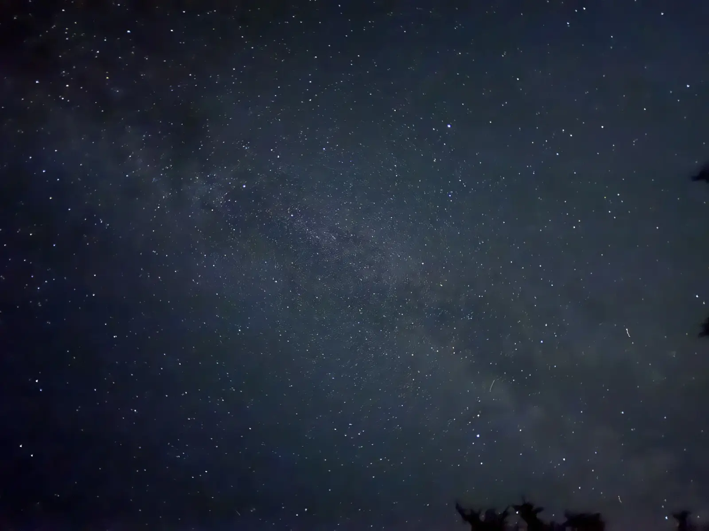

That's the way my first fourteener started, car camping alone in a trailhead parking lot at 10,000 feet, the day after driving up to scope out Whitney Portal before I ever set foot on Langley. Mt Langley wasn't a detour from the Whitney plan. It was the plan, the first real Sierra 14,000-footer I'd stood on top of, and the whole point was to find out what the next several months of training actually needed to prepare me for.

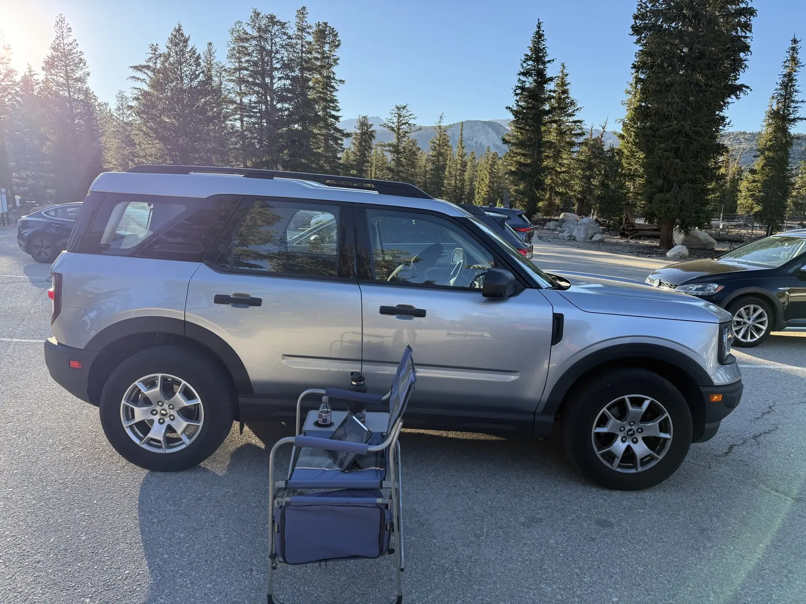

The day came out to 23.58 miles and 5,545 feet of gain, ten hours and 32 minutes total with 8 hours 28 minutes of that moving, average heart rate 147, max 180, and 4,562 calories. Garmin put the summit at 14,044 feet, close enough to the official 14,032 that the wooden sign I held up at the top backs it up almost exactly. Both numbers, mileage and gain, are the biggest of any hike in this project so far, bigger than San Gorgonio on both counts, and this was the first one at real altitude instead of the low 10,000s and 11,000s I'd been topping out at all summer.



## Into the dark

I was moving by 4:25am, which meant starting in full dark for the first time on any of these hikes. Headlamp on, following a beam of light down a trail I couldn't see past ten feet of, which is a strange way to begin something you've been building up to for months.

Not long after that my headlamp caught a wooden sign marking the edge of the Golden Trout Wilderness, Inyo National Forest, lit up out of nothing against a completely black sky. It's a strange thing to photograph, a sign meant to be read in daylight, caught mid-beam at 4:30 in the morning.

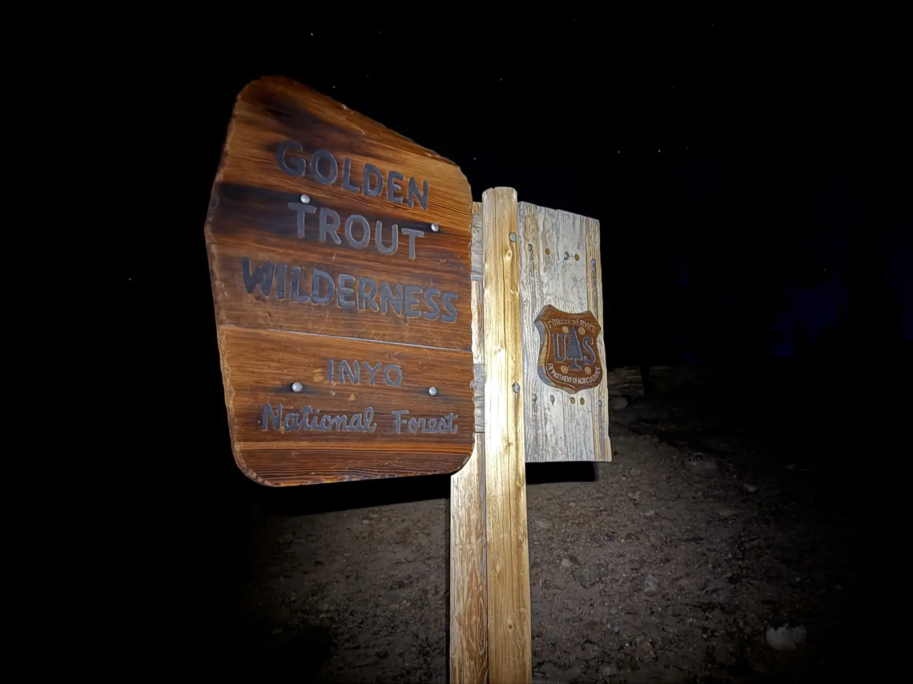

## Cottonwood Lakes at first light

By 5:30 the sky had started going pink behind the trees, the trail cutting through granite boulders stacked up on either side, and I could finally see where I was walking without the headlamp doing all the work.

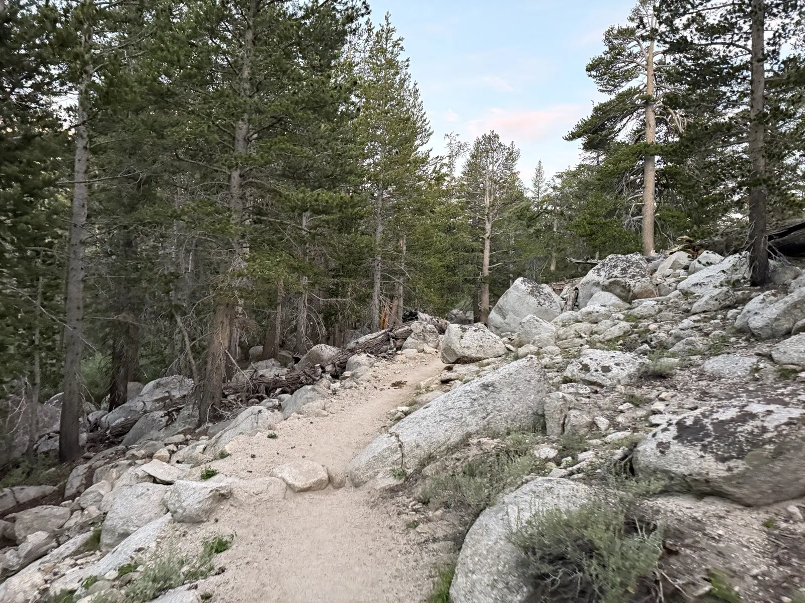

Twenty minutes later I walked past a waterfall I hadn't expected at all, a thin cascade dropping down a granite slope through the brush, water I could hear before I could see it. Nothing about the route description had mentioned it, so it was just a nice surprise on the way to something bigger.

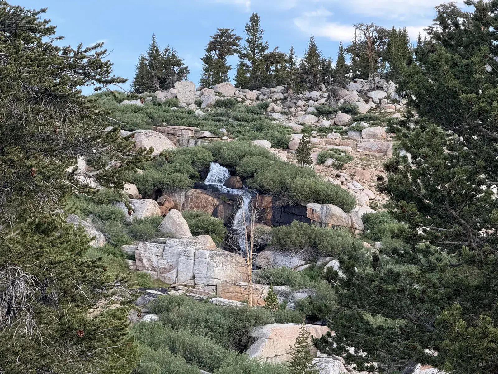

The something bigger showed up about ten minutes after that. The Cottonwood Lakes basin opened up into a meadow with a lake sitting in the middle of it, and the sun was just starting to hit Langley's summit ridge at the exact moment it started hitting the water, gold light landing on the peak and the lake at once. I stood there longer than I probably needed to.

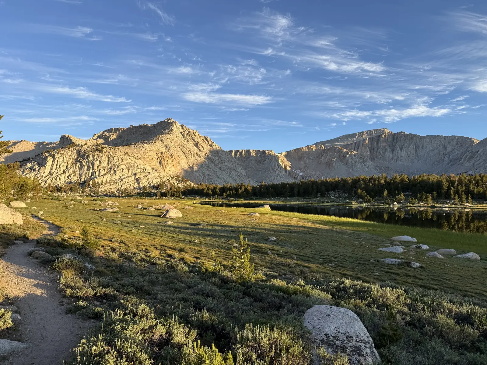

The trail kept climbing through scattered pines after that, jagged granite cliffs visible ahead through the trees, pink wildflowers still holding on trailside this late in the season.

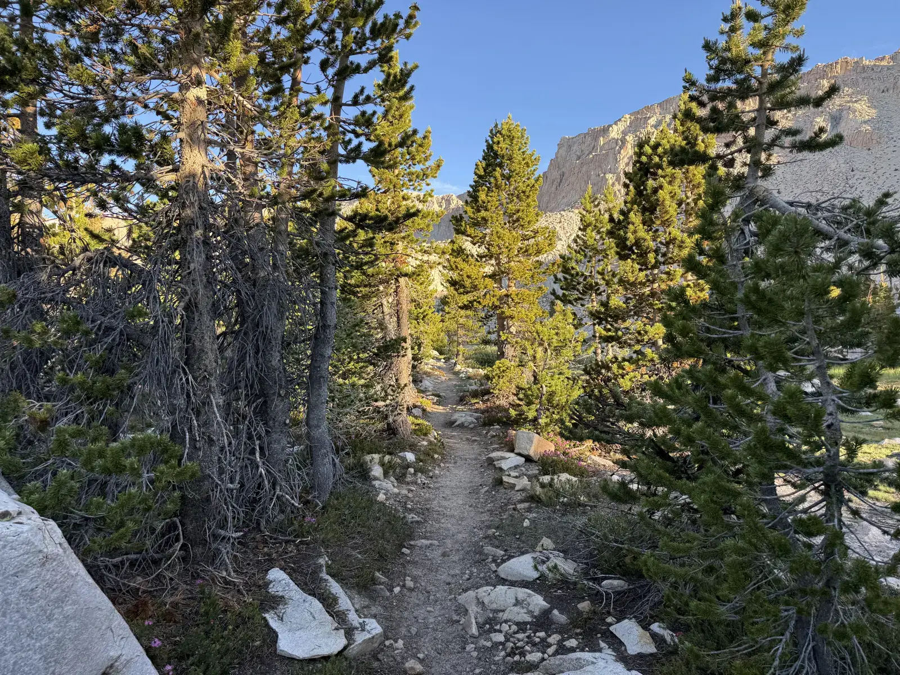

## New Army Pass

By 7:38 I'd reached the sign marking the boundary into Sequoia and Kings Canyon National Park at New Army Pass. I'd asked around beforehand about Old Army Pass, the shorter and steeper alternative, and the answer I kept getting was that it was probably climbable going up but not safe coming down with the snow still sitting up there in July. New Army Pass both ways, then, longer but the one people actually trusted.

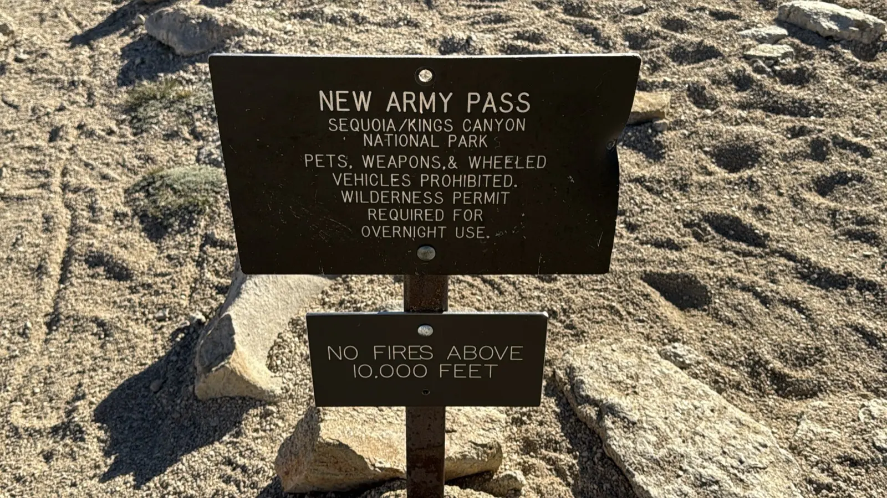

This is also about where 12,000 feet started to mean something. I'd woken up at basically sea level less than 24 hours earlier, and my body knew the difference now. Nothing dramatic, no real symptoms, just a noticeably harder time doing the same work my legs had been doing all morning.

## The last push

The final stretch to the summit is steep and sandy, cairns marking the way once the maintained trail runs out, and it was the hardest part of the day by a wide margin. Altitude was biting for real by then, and I pushed through it without anything worse than being slow, but slow was enough. Every step up that last pitch felt like it cost more than the one before it.

It was worth it the second I hit the top. The summit panorama swept from the jagged Sierra crest on one side to the Owens Valley sitting hazy on the other, and Whitney was right there in it, the tallest peak on the whole horizon, for the first time something I'd actually stood close enough to see instead of a name on a permit application. It made the whole thing feel possible in a way it hadn't from sea level.

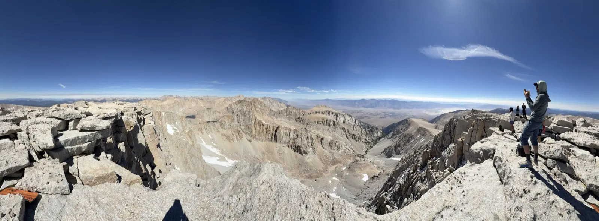

The loud group from the parking lot was up there too, on their way out right as I arrived, which meant the same people who'd cost me sleep at midnight were now leaving the summit as I reached it. I held up the wooden sign for a photo, Mt. Langley, 14,032 feet carved right into it, the Sierra crest behind me on one side and the valley dropping away hazy on the other.

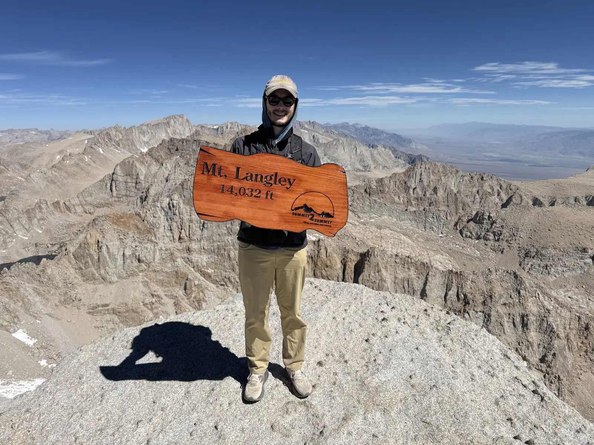

## Back down

I stuck around the top longer than usual, taking breathers here and there that the altitude demanded, and I'm still proud of the 8 hours 28 minutes of moving time it took to cover that much distance and gain at that elevation. Once I started down, though, I moved fast, fast enough that I beat the loud group back to the parking lot despite them leaving the summit ahead of me. Ibuprofen after descending New Army Pass helped more than I expected.

Lower in the basin I got a last look back at Langley's full scale, the granite face and the talus bowl beneath it spread out from an angle the ascent never gave me.

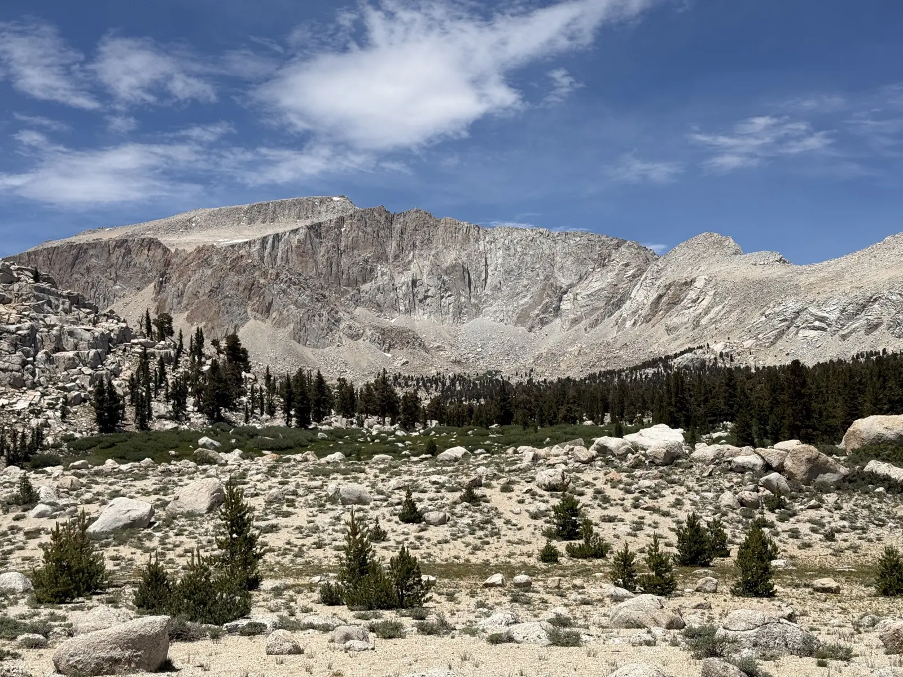

Around 2pm I passed a pack train of mules on the trail, loaded with blue coolers and leather panniers, a wrangler riding lead who turned out to work for a campground somewhere up in that basin. Random encounter, but a good one, and it's the kind of job I hadn't thought about existing until I was standing on a trail watching it happen.

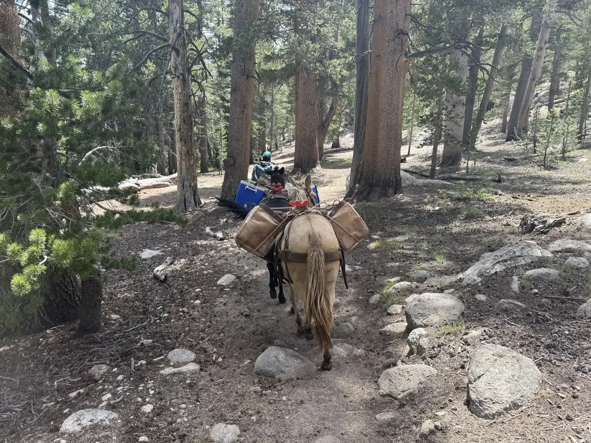

Back at the car I realized I'd grabbed my Brooks Ghosts instead of the Hoka Speedgoats I'd planned to wear for a day this long, an accident I didn't catch until it was already 23 miles too late to fix. They held up fine anyway. I'd already been to Whitney Portal the day before this hike, standing at the trailhead I'll actually be starting from, and now I've stood on top of a Sierra fourteener too. Whitney doesn't feel like a guess anymore.
