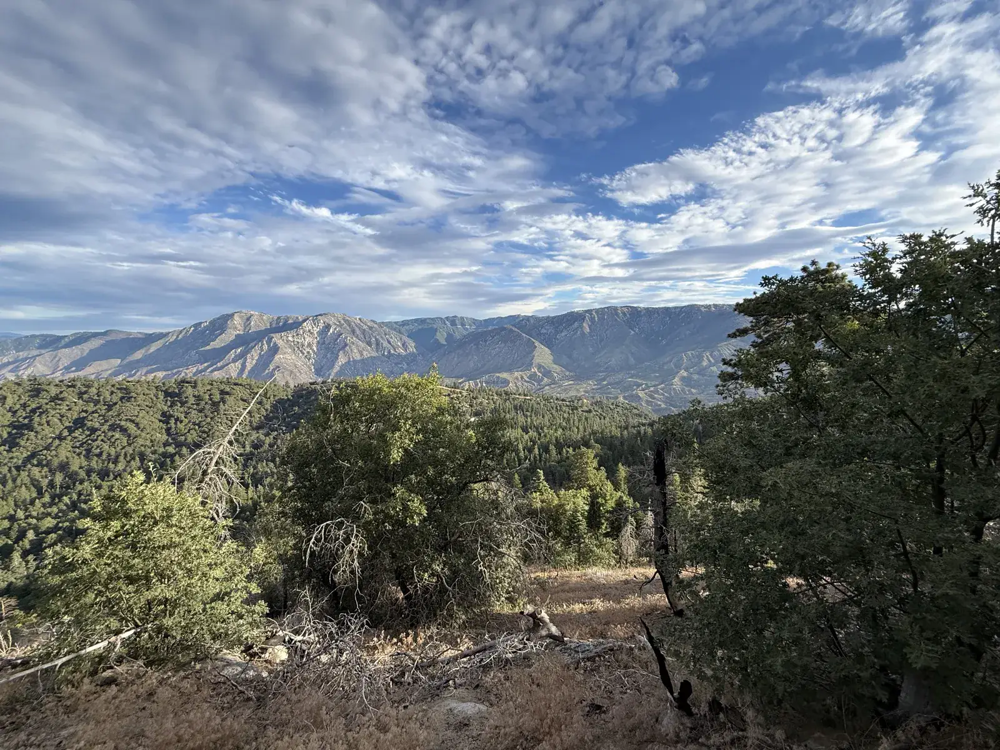
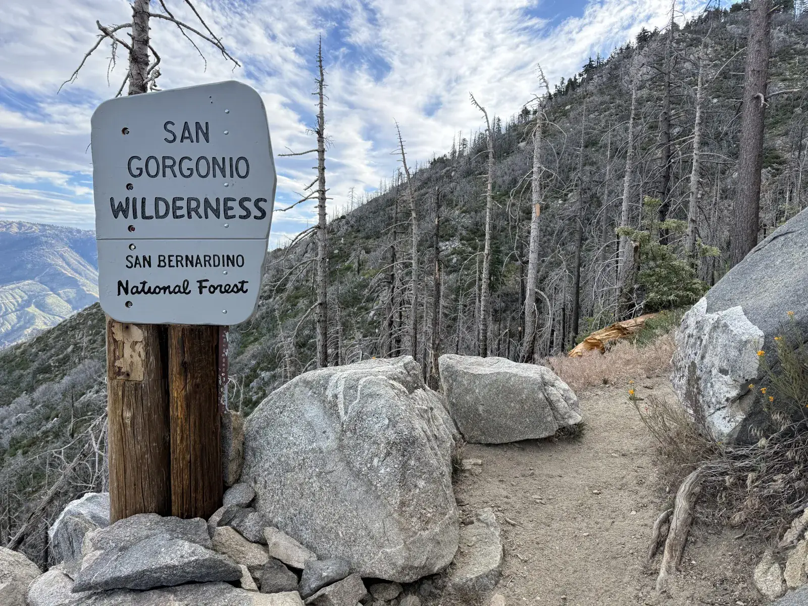
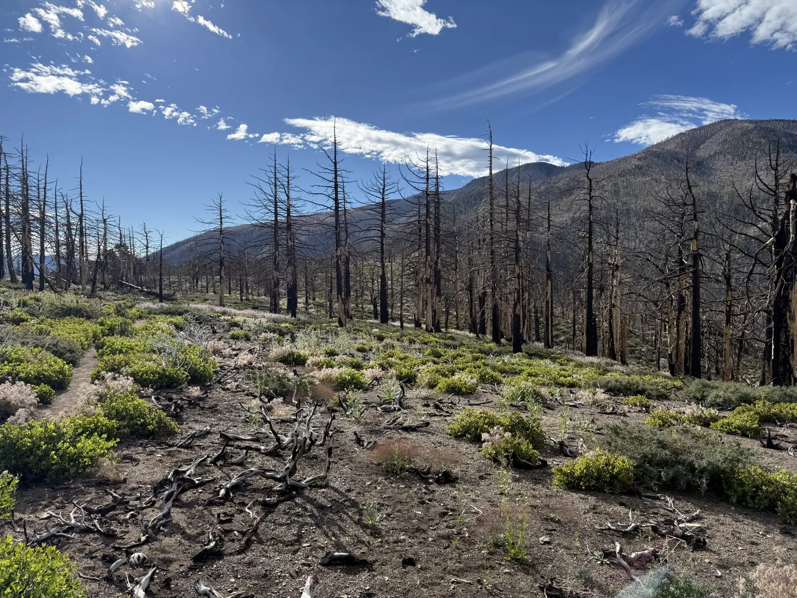
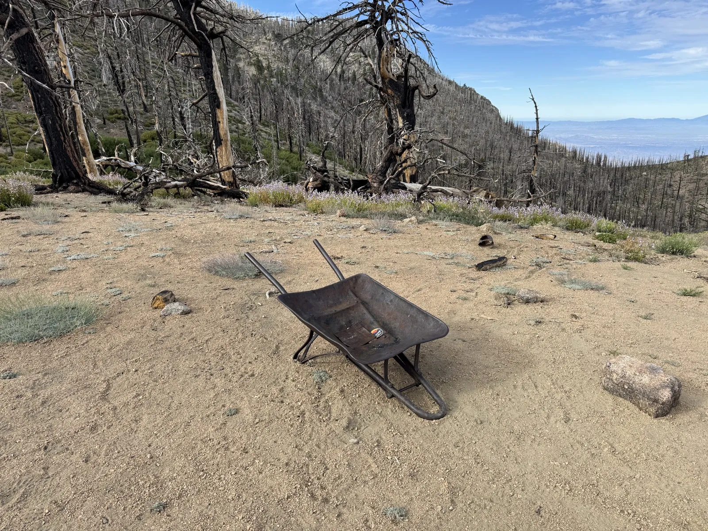
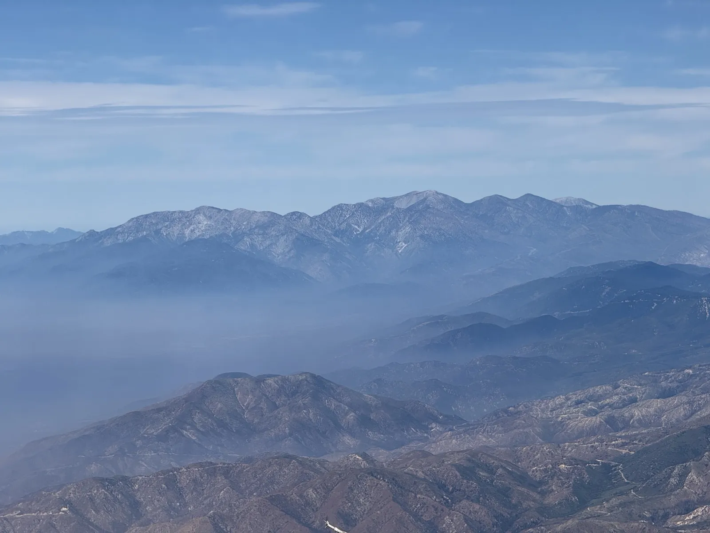
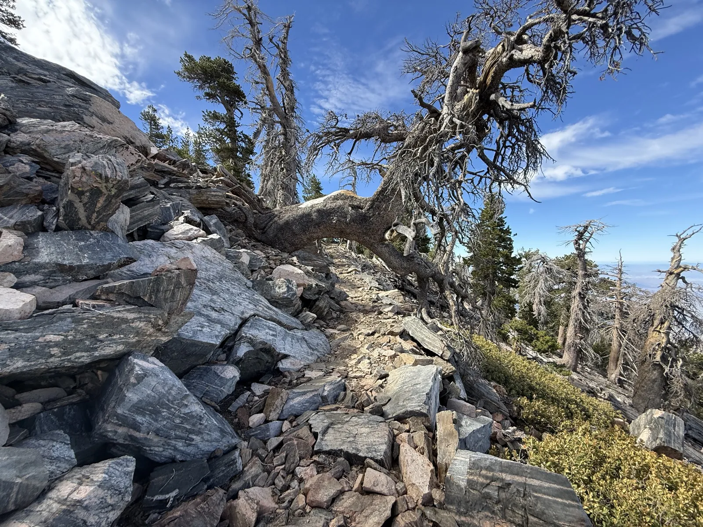
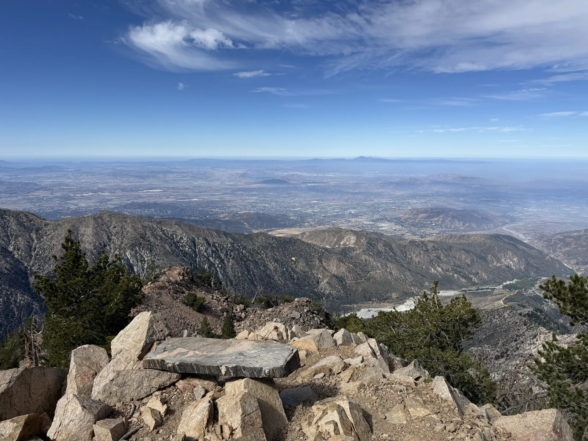
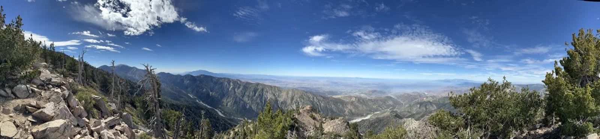
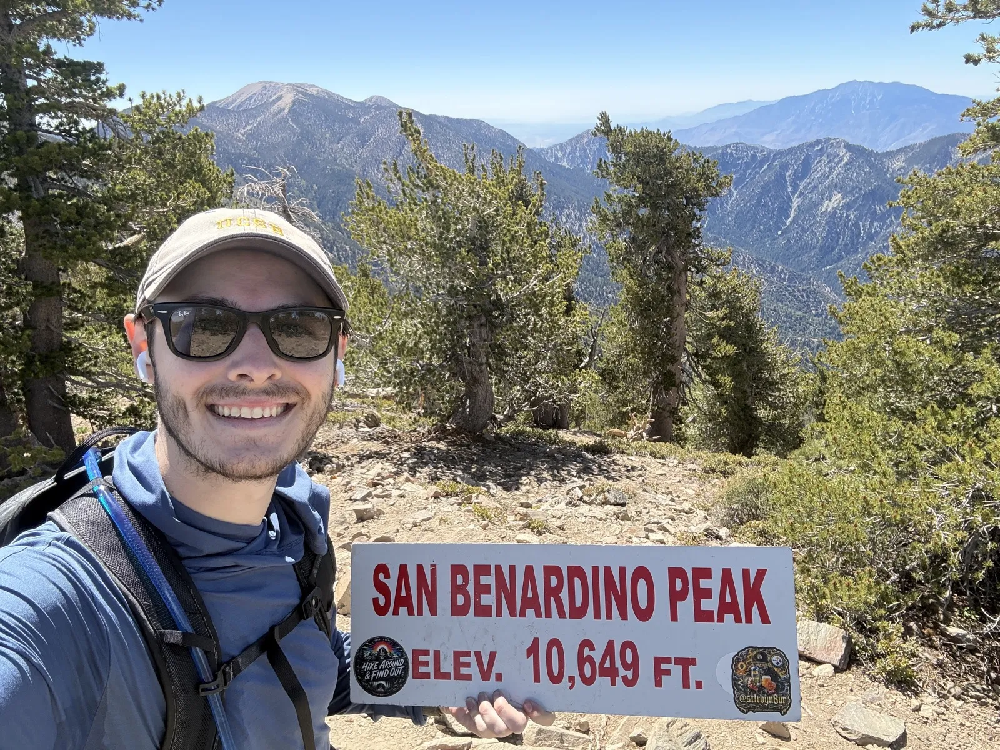
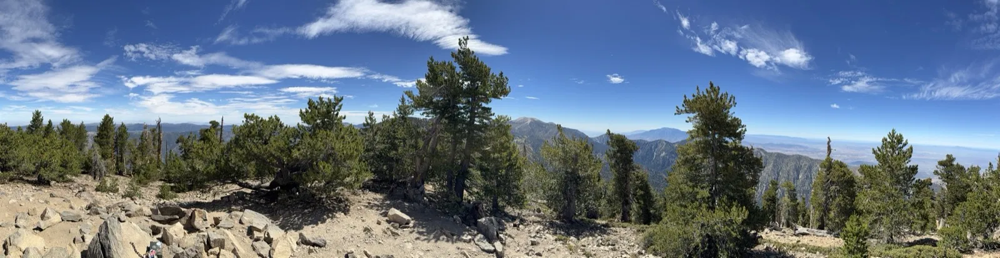

Three big mosquitoes flew into the car the second I opened the door at the Angelus Oaks trailhead, and I got all three before any of them landed a bite, which is not exactly the calm start to a hike I would have picked for myself. It did mean I finally broke out the bug spray I'd bought before the Wilson hike, all the way back at the start of this project, and never once used until now.

This is San Bernardino Peak, the standard 1W07 trail out of Angelus Oaks, and it's the sixth and last of the Six-Pack I've actually hiked, even though it sits fourth on the original list from the [Whitney post](/posts/whitney-goal/). The reason it landed out of order is already covered at the start of the [Baldy post](/posts/mt-baldy/), the mallet finger from the kickball incident pushed this one back past its planned slot, and by the time I finally got out here both Baldy and Gorgonio were already done.

Official elevation up there is 10,649 feet, and the Garmin's 10,650.3 backs up the sign at the top almost exactly. That closes out all six: Wilson, Cucamonga and Ontario, Jacinto, Baldy, Gorgonio, and now this one. Heart rate averaged 152 and maxed at 185, with 2,878 calories on the day.



## Into the burn scar

The trail out of Angelus Oaks climbs through green forest for a stretch before it doesn't anymore. Not long after sunrise I was looking out over a ridge full of streaky high clouds from a brushy overlook, still early enough that the morning hadn't decided what kind of day it was going to be.

By 7:10 the forest was gone, or most of it. A metal sign marking the edge of the San Bernardino National Forest and the San Gorgonio Wilderness stood surrounded by dead standing trunks in every direction, black and bare, with a little green forest still hanging on across the canyon on the far slope.

That's the El Dorado Fire, September 2020, 22,744 acres, started by a gender-reveal-party pyrotechnic device at El Dorado Ranch Park and pushed by wind straight into the San Gorgonio Wilderness. Some of the Forest Service closures from it didn't lift until April 2022. Almost an hour later I was still walking through it, an open slope covered in blackened standing trunks as far as the frame goes, green brush finally coming back in at ground level but nothing tall yet.

Fourteen minutes past that I found a wheelbarrow sitting alone in the dirt among the burned trees, which for a second looked like a sign that trail crews were actively working this section. They weren't. It was just old, left there for who knows how long, and the trail itself made that obvious fast.

This trail badly needs maintenance. Downed trees are stacked across it constantly, enough that I lost count of how many I climbed over or ducked under, and long stretches are choked with overgrown manzanita that scratched up both my shins for miles at a time. Not fun, and easily the least enjoyable stretch of trail on any of the six.

## No flat ground

Heart rate told the story of this one more than usual. Average came in at 152 and max hit 185, both meaningfully higher than Baldy's 146/178, Gorgonio's 130/177, or Jacinto's 140/178, despite this being a shorter day by both mileage and gain than Gorgonio. The trail is constant uphill except for one stretch in the middle, no real flat sections to recover on, and I'd also eaten and slept badly the day before, since July 4th doesn't exactly set up a clean diet or a good night's sleep.

Around 9:35 I got a hazy telephoto shot of Baldy, distinctive and jagged even from this far away, rising out of the smog in the distance.

Two minutes later the trail changed completely. The burn scar just stopped, and the summit ridge showed no fire damage at all, old gnarled pines still alive and one dead one arching right over the trail like it had fallen that way on purpose.

A couple minutes past that the trail opened up on the other side, a hazy view straight down into the San Bernardino Valley, city grid barely visible through the haze. I'm not that familiar with the area down there, so I couldn't pick out much beyond the fact that it was a lot of city.

By 9:40 I was into the summit area proper, forested ridge dropping away into the hazy valley in every direction I looked.

## The summit

I got to the top at 10:14 and held up the metal summit sign for a photo without reading it closely, which is the only reason I didn't notice in the moment that it spells its own mountain wrong. SAN BENARDINO PEAK, missing an R, apparently made and installed by someone who didn't proofread it either. I find it funny now. San Gorgonio and San Jacinto were both sitting behind me in the shot, Gorgonio on the left and Jacinto on the right, different peaks entirely from the Baldy shot earlier.

Right around then both my calves seized up, immense cramping pain in both legs at once, a first for any of these six hikes. It took a few minutes standing around waiting for it to pass before I trusted my legs again, and I still don't have a good explanation for why it happened here and not on Gorgonio, which was a longer, harder day by every number that matters.

I didn't stick around long after that. Between the overgrowth slog on the way up and wanting to get home in time to watch England play Mexico at Estadio Azteca, I moved fast, which is most of why total time and moving time were only 29 minutes apart, tighter than either Baldy or Gorgonio.

## My least favorite of the six

The descent dragged again, same as Baldy and same as Gorgonio, a pattern I've stopped expecting to break at this point. Clouds held for a while and then mostly burned off, and by the time I got back to the car it was 78 degrees at the trailhead, a big jump from the 57 it had been at the start.

Of the six, this is easily my least favorite. The elevation and distance were manageable, the trail itself was what wore on me, tree after tree to climb over and manzanita tearing at my shins for miles on end. I'm not going back to this one until it's seen some real maintenance work.

That's the Six-Pack, though, all six done: Wilson, Cucamonga and Ontario, Jacinto, Baldy, Gorgonio, and now San Bernardino. I'm happy to have it finished. What's next is more LA-area peaks and pushing further into the southern Sierra before Whitney, and if those trips don't come together, solid mileage and elevation gain around San Diego is the fallback plan.
