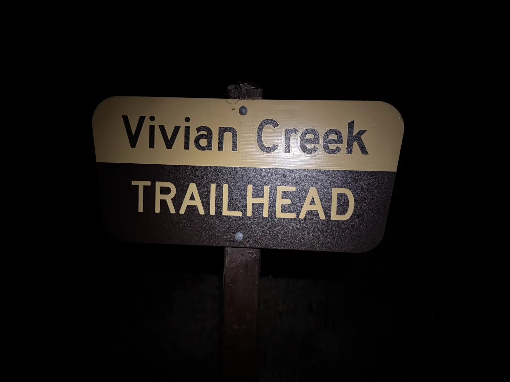
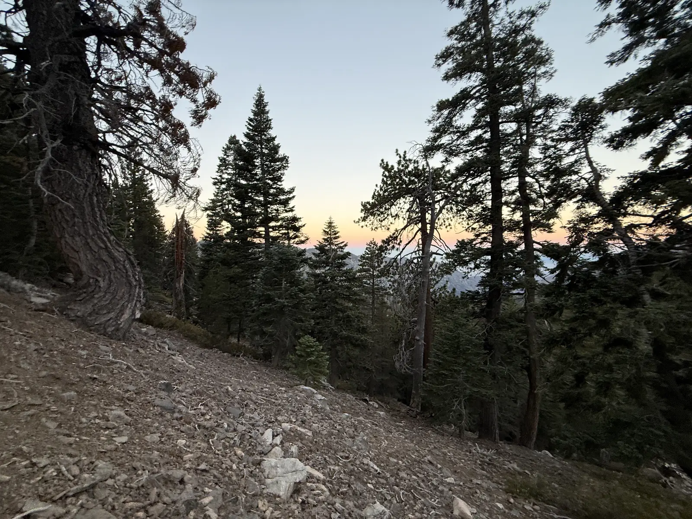
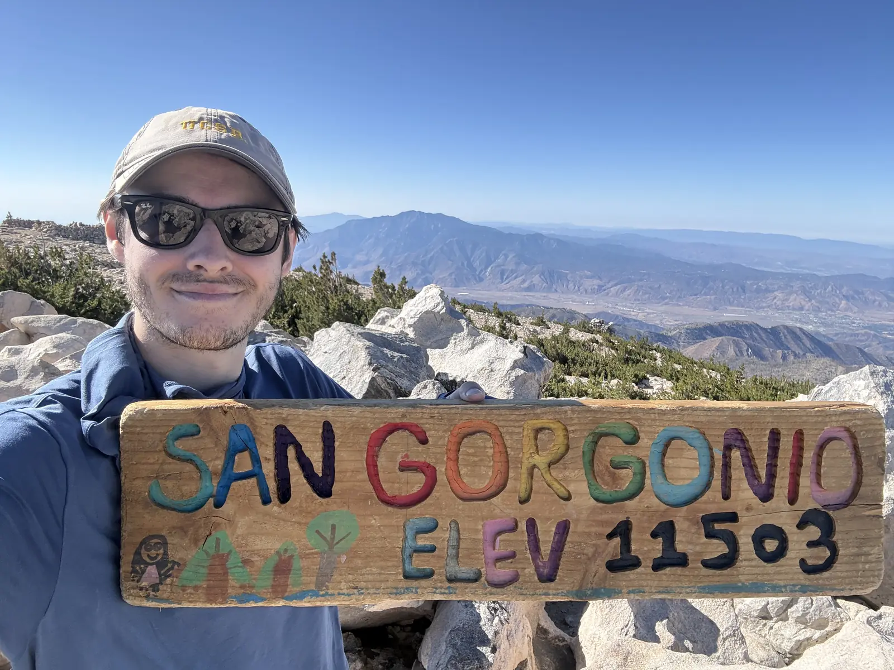
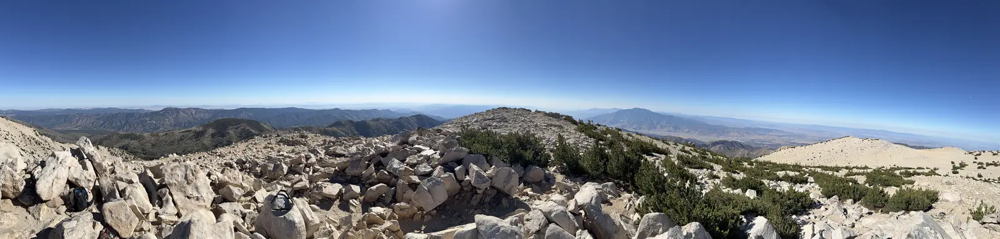
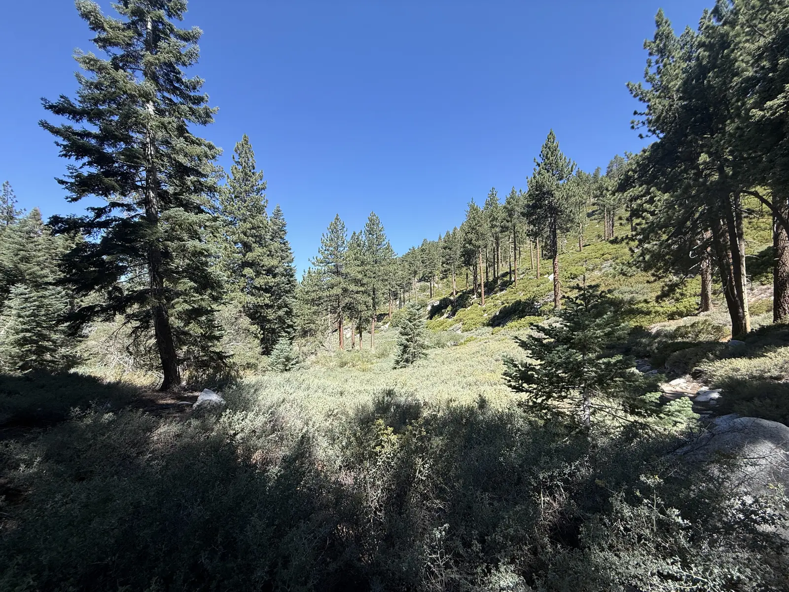
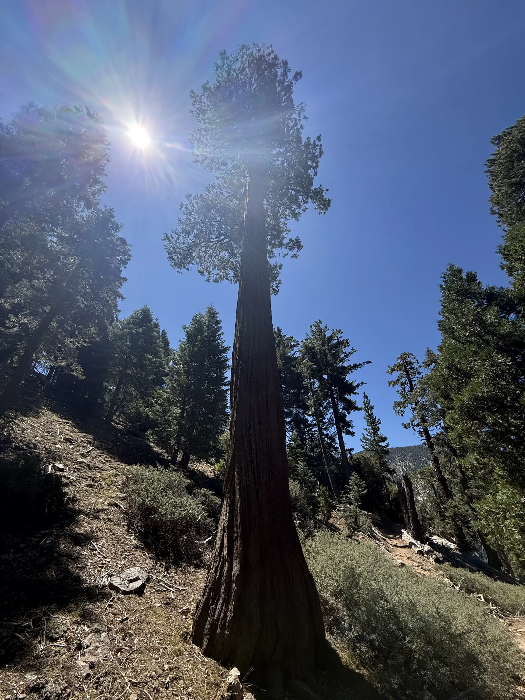
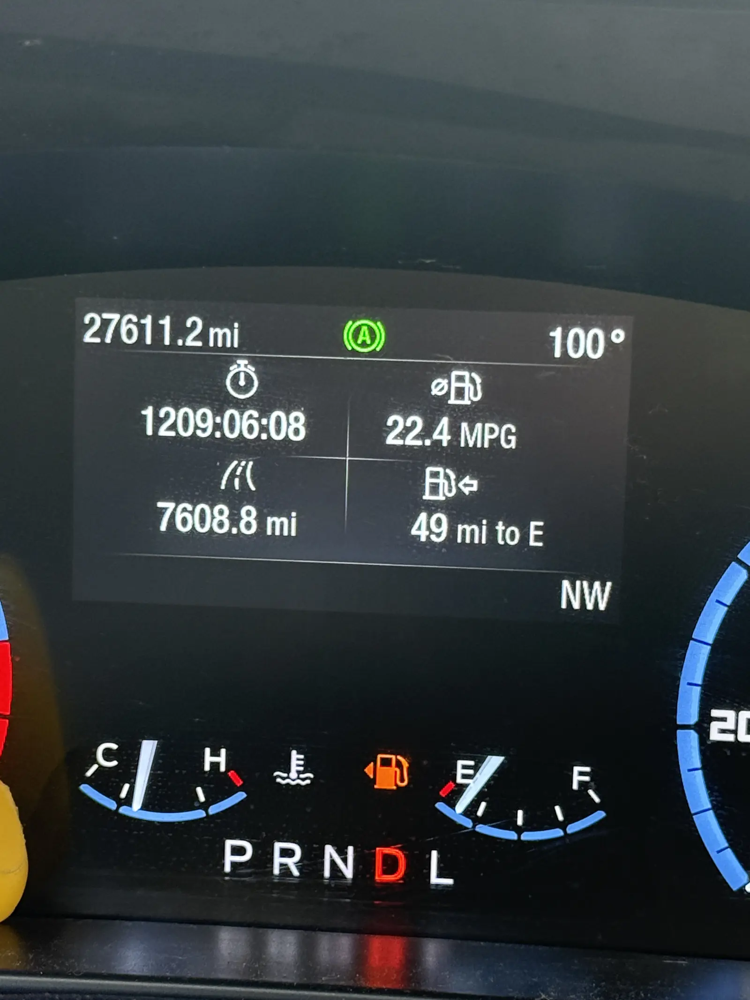

The Vivian Creek trailhead sign at 4:28 in the morning is a rectangle of brown and tan floating in a headlamp beam with nothing around it, no trees, no ridgeline, no sky. I photographed the same sign five weeks earlier in early light with the forest standing behind it, and this time I had the strange feeling of knowing exactly what was up there and being able to see none of it.

I hiked [San Gorgonio on June 28th](/posts/san-gorgonio/), the fifth of the Six-Pack and the biggest day of the set, 18.37 miles and 5,617 feet to the highest point in Southern California. I was back on August 2nd because I'd been holding a permit for that date since May, before I'd started the Six-Pack at all, and because Whitney is on the 23rd and I wanted a maintenance hike, something long enough to hold the fitness I'd built without costing me a week to recover from.

Same trail, same 9.21 miles to the top. 18.31 miles, 5,574 feet of gain, 7 hours and 14 minutes against June's 7 hours and 57. Forty-three minutes faster on a mountain I'd already climbed, off three hours and fifty-four minutes of sleep, with two bananas and an apple as the entire day's food.



## The permit picked the date

At the end of the June post I said I'd go back in August and maybe find an alternate summit route if one made sense. I didn't look. The permit I had was for Vivian Creek, I knew I wanted a long day, and on a hot one I didn't want surprises, so I defaulted to the trail I'd already walked. Familiarity was the point rather than the compromise.

The 4:28 start was the actual decision. I knew it was going to be hot and I wanted to be off the exposed upper mountain before the day caught up with me, and since I'm planning an early start on Whitney anyway, this was a free excuse to practice moving in the dark with a headlamp before it counts for something.

## Starting from a hole

I slept three hours and fifty-four minutes. I'd been drinking the night before. I ate two bananas at home before the drive up, and the only other thing I ate all day was an apple on the summit.

None of that was a plan falling apart, it's just how the weekend went, and I've made a sort of peace with it because bad sleep before a big day seems closer to normal than not. People are anxious, or they're in a tent, or it's windy, and very few of them are getting eight clean hours before an alpine start. I'd guess I won't sleep well before Whitney either unless I'm backpacking in far enough to have adjusted to my sleep system, and even then one windy night undoes all of that.

The fuel is the part I actually regret. Two bananas and an apple is not enough for 18 miles and 5,600 feet, and the way it was spaced made it worse, because the bananas were hours behind me by the time I hit the trailhead and I climbed the entire thing on nothing. I could feel it, and I'd have moved faster with real food in me.

## Nick

Somewhere on the climb I passed a guy who then stayed with me, a little way back, for most of the ascent. At the lookout before the final two miles I stopped for a longer break than usual and we started talking. His name was Nick, he lived out in the desert, and we hiked together for a while after that, mostly just talking about how much we both like being in the mountains.

He was stronger than me on the last push and summited before I did. I think that was mostly the fueling, since he'd eaten like someone doing a big day and I'd eaten like someone walking to the store, and he also does a lot of stairmaster work at the gym, which is as close to this as anything indoors gets.

## No wind this time

June's summit was brutal. Huge gusts, cold enough that I had to shelter behind rocks just to take a break, and enough of a fight that getting a photo took a few attempts. This time there was virtually no wind at all, which made it a completely different place to sit even though the rest of it was the same broad rock pile it had been, a little warmer, a little hazier, more bugs, and no cloud inversion filling the valley toward San Jacinto.

I stayed twelve minutes. In June I stayed twenty-four. I wanted to be down before the heat really arrived and I wanted to be home earlier, so I ate the apple and left.

That apple might be the best apple I have ever eaten. I don't have a better explanation for it than 11,500 feet and four and a half hours and an empty tank, but it reset something real, and I went down the mountain on it.

## Down

The descent felt different from the first few switchbacks. My legs were good the whole way, good enough that I ran a few times, short bursts on the flatter sections and the runnable pitches, trying to take time off the clock. They stayed bursts because I didn't have the fuel to hold anything steady, and with a proper breakfast and something in the pack I think I could have jogged long stretches of it instead of surging and walking and surging again.

I also carried the full three liters in the Gregory, which was probably more water than the day required. I'd planned on my running vest and filtering from the creeks, and I switched because it was going to be hot and I didn't want to gamble on water on a day like that. Three liters is six and a half pounds, and I carried most of it a long way for nothing.

Real fuel and a lighter pack is why I want to go back and do it a third time. I think the time comes down further, and I don't think it takes anything heroic to get there.

## Where the forty-three minutes came from

I assumed I'd climbed faster. I split both days' FIT files at the high point to check, and I hadn't.

| | Jun 28 | Aug 2 |
|---|---|---|
| Ascent, 9.21 mi to the top | 4:33:52 | 4:28:16 |
| On the summit | 24:02 | 12:19 |
| Descent | 2:58:57 | 2:33:21 |
| Total | 7:56:51 | 7:13:56 |

Five and a half minutes across four and a half hours of climbing is about two percent, which is inside the noise of how many times you stop to drink. Twelve more minutes came from cutting the summit stay in half. Everything else, twenty-five and a half minutes and well over half the whole improvement, came off the descent.

The descent is the exact thing I complained about in June. I wrote then that going from the top to the bottom felt like it took forever, that the ascent almost feels shorter than the descent on these long days, and I wondered whether I ought to slow down on the way up so my legs would hold together better on the way down. I never slowed down. I got stronger, and the part that used to beat me stopped beating me.

That's also my answer to how much of this was fitness and how much was knowing the trail. Knowing it helped me pace, because I could look around and know roughly what was left, and it made me more confident I'd finish. Confidence doesn't move your legs faster though. I don't think I go quicker on that trail if I'm not stronger than I was five weeks earlier, and the heart rate says the same thing, 151 average against 130, both days on the wrist sensor rather than the chest strap so at least they're wrong in the same direction. This was a harder effort, not an easier one.

## 100 degrees

I got back to the car at 11:42 and the dashboard said 100.

On Monday Garmin told me I was wrecked, readiness 1 out of 100, HRV down to 48, zero minutes of deep sleep. I felt fine. A little sore, nothing more than that, and I took the rest day anyway because the number was loud enough that I didn't want to argue with it even though I couldn't feel the thing it was describing.

Half Dome is this weekend and Whitney is on the 23rd, and the figure I keep turning over isn't the forty-three minutes, it's the twenty-five of them that came off the way down, because the part of these days I've spent all year dreading turns out to be the part that changed the most.
