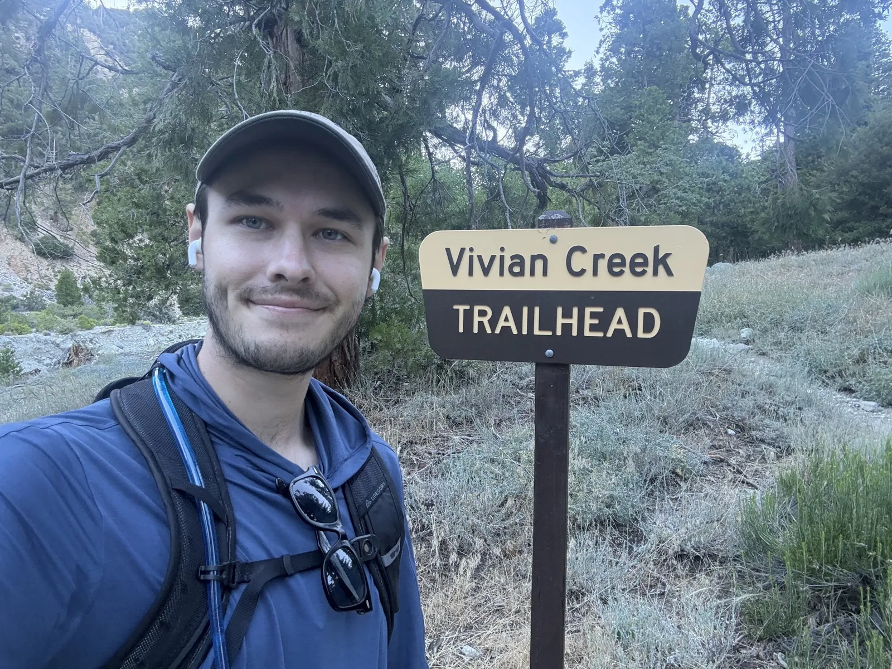
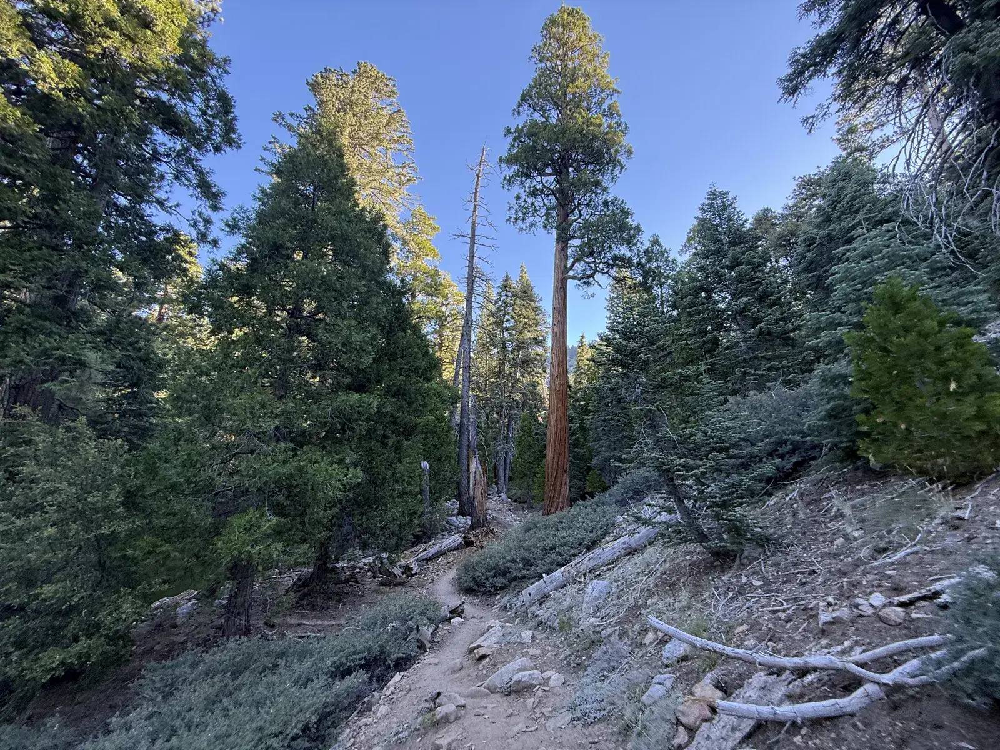
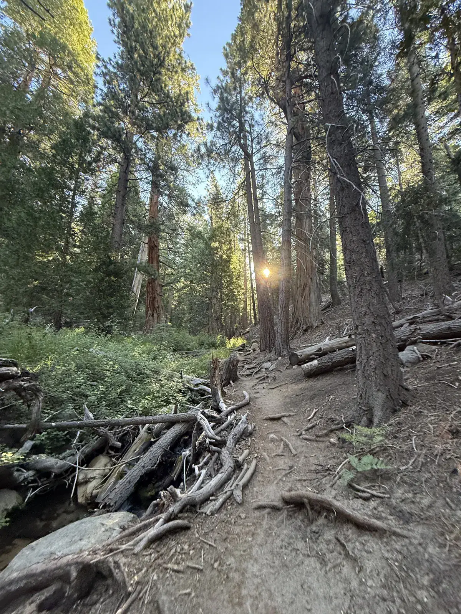
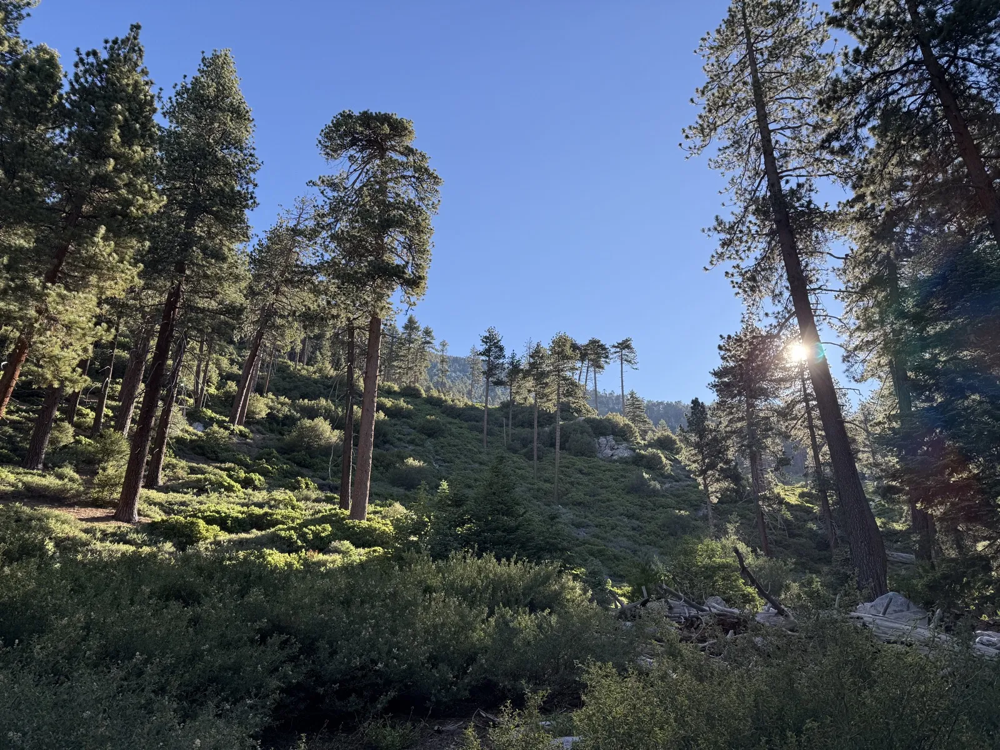
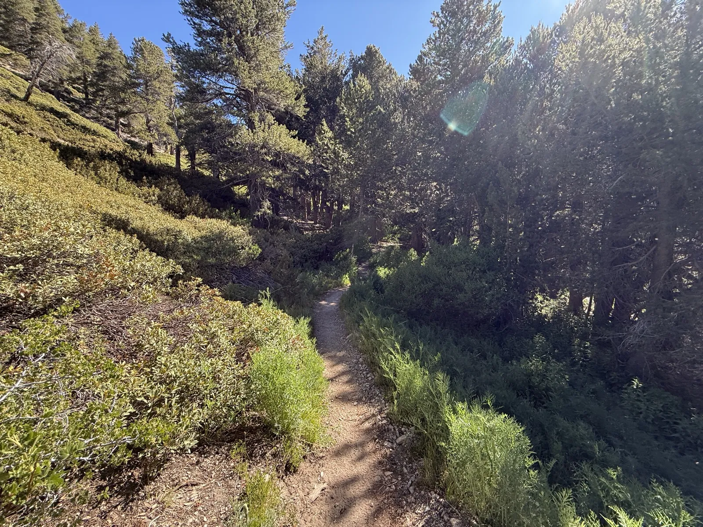
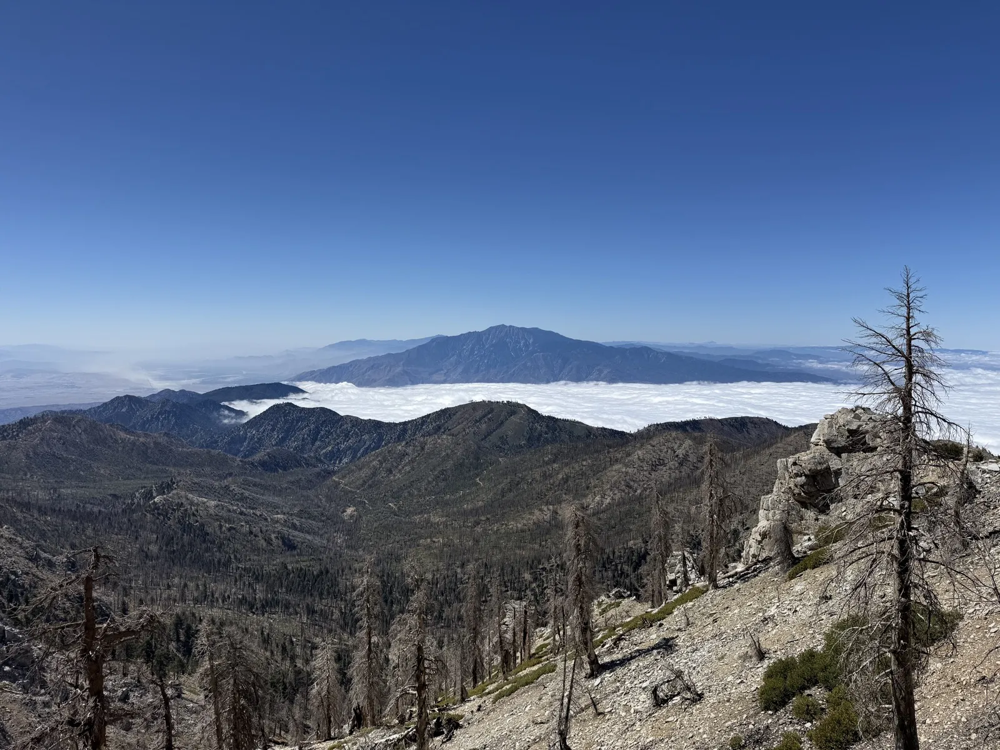
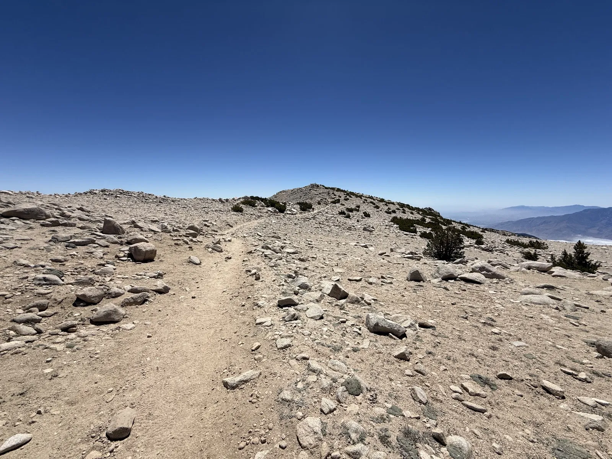
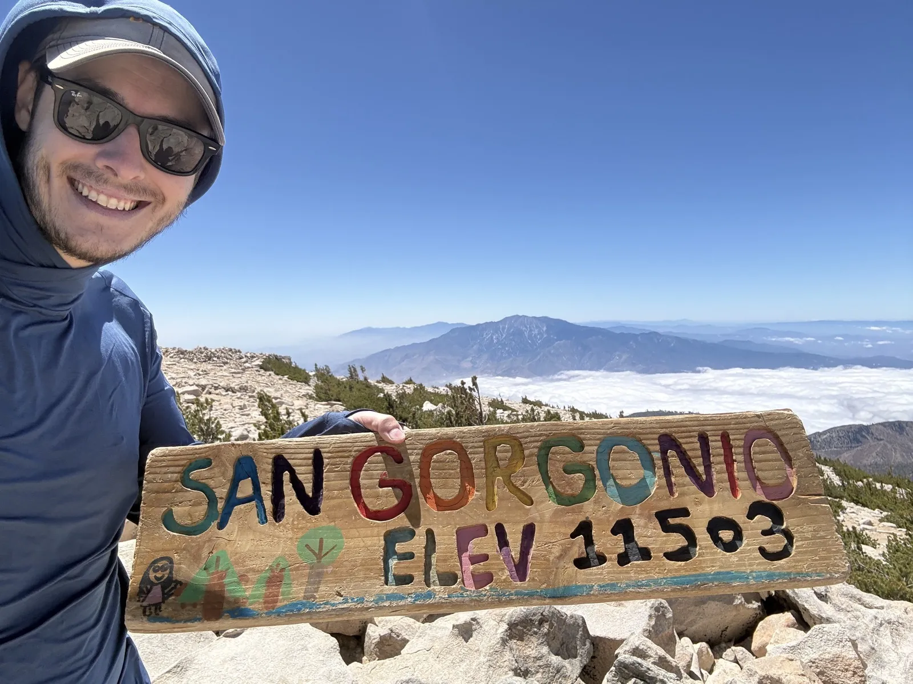
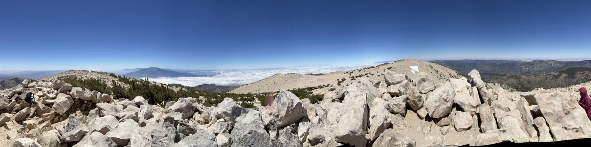
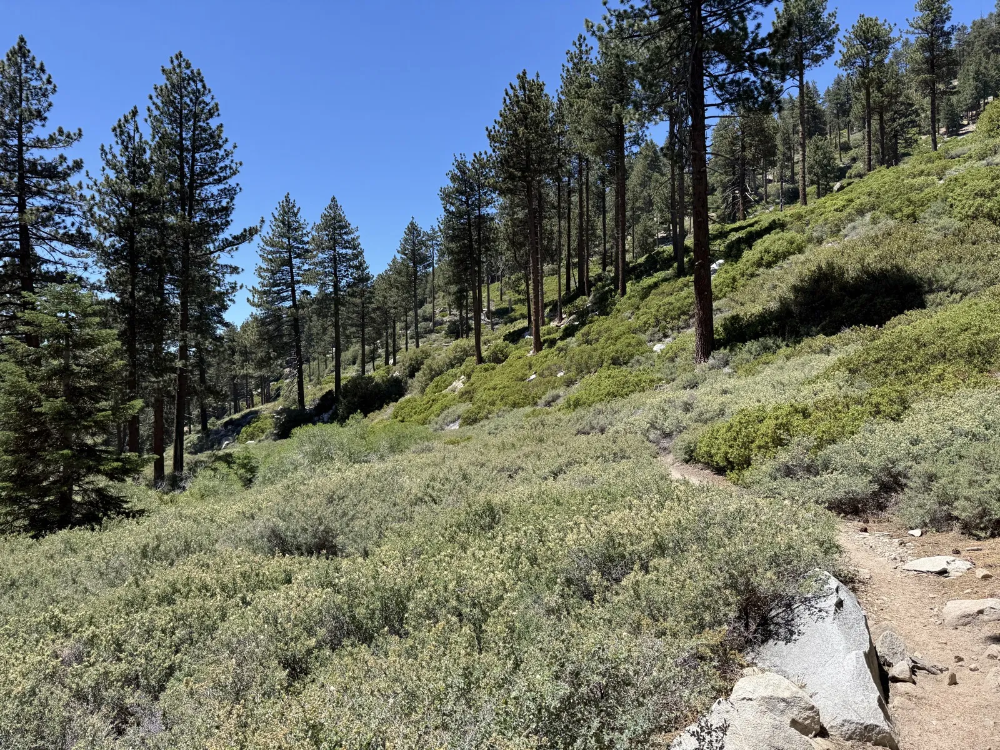


<link rel="stylesheet" href="https://unpkg.com/leaflet@1.9.4/dist/leaflet.css" integrity="sha384-sHL9NAb7lN7rfvG5lfHpm643Xkcjzp4jFvuavGOndn6pjVqS6ny56CAt3nsEVT4H" crossorigin="anonymous" />

<link rel="stylesheet" href="maps.css" />



6:50am, standing at a wooden sign that just says VIVIAN CREEK TRAILHEAD, and I'm in a part of the LA area I'd never actually been to before. Forest Falls sits up in a canyon past Yucaipa and Mentone, and the predawn drive in was easy, no traffic at all that early, the kind of drive I've done enough times now hiking around here that it doesn't really register anymore even though I don't love the wakeup itself.

This is the fifth of the Six-Pack, and it's the biggest one by both measures, the highest point and the longest day. It didn't feel like "the big one" walking up to that sign though, just the next hike on the list, one week after Baldy with my legs feeling completely fresh, no lingering soreness from the week before. I was excited for one specific reason, which is that San Gorgonio is the tallest mountain in Southern California, and I hadn't stood on top of the tallest anything yet.

The day came out to 18.37 miles and 5,617 feet of gain, seven hours and 57 minutes total with 7 hours 9 minutes of that actually moving, average heart rate 130, max 177, and 2,839 calories by the time I got back to the car. The Garmin read the summit at 11,557.7 feet, running about 55 to 60 feet hot, the same kind of GPS drift I saw on Wilson, so I'll use the official number, 11,499 feet, which is the highest point in Southern California. After Wilson, Cucamonga and Ontario, San Jacinto, and Baldy, this one closes out five of the six.



<canvas id="gorgonio-elevation"></canvas>



## Vivian Creek

The Vivian Creek Trail passes three named camps on the way up, Vivian Creek Camp, Halfway Camp, and High Creek Camp, and I expected them to work as mental checkpoints the way trail junctions usually do. They didn't. I walked through all three without any of them registering as much more than a spot where the trail happened to widen out. Halfway Camp sits about 2.5 miles into a 7.8 mile climb to the summit, which isn't halfway by any measure I can find, and I still don't know why it's called that.

The trail through here hugs the creek for long stretches, fallen logs and deadfall scattered across the bed, the sun still low enough to flare straight through the canopy.

Past the creek the forest opens up into hillside stands of tall pine with a lot more morning light getting through, and that's about where the trail turns steep for the first time, right after the Mill Creek crossing. It eases off after that for a while before doing the same thing again much closer to the summit.

The forest holds on for a good while longer past that, sun still flaring low through the trees, deadfall piled up along the trail.

## Above the clouds

About a mile, mile and a half past the San Gorgonio Wilderness boundary sign, three national forest rangers were resting in a meadow, heading up the same way I was. I passed them there on my way up, and passed them again hours later on my way down, when they were still working their way up. Neither time did anyone check my permit, they just waved me through. I never found out what they were doing up there. Their pace made me doubt they'd summit and get back to the trailhead before dark, and neither time did it look like they were carrying camping gear, so I'm still not sure if there's some kind of ranger post at one of the camps or something else going on entirely.

By this point in the Six-Pack, altitude has stopped being a wall I have to think about. San Gorgonio is the highest I've been yet, above Jacinto's 10,834 feet and Baldy's 10,064, and it didn't feel meaningfully different from either of those climbs. The first four peaks did their job preparing me for it.

The best single view of the day came around 9:08, San Jacinto standing clear above a solid layer of cloud that had filled the entire valley between it and where I was standing. I like photographing peaks I've already done, or ones I still want to do, from wherever I happen to be standing, and this was about as good an angle as I could ask for.

The trail thins out as it climbs into more of a true alpine setting, rock and small scattered trees replacing the forest, the ridge visible ahead the whole time.

## The summit

San Gorgonio doesn't come to a point the way Jacinto's boulder pile does or the way Baldy's summit plaque marks an exact spot. The top is broad and rocky, spread out enough that I actually looked over at a nearby cluster of rocks and wondered for a second if that one was higher than the marked high point. I decided to trust the trail, the signs, and the other hikers already up there instead of going to check for myself.

The sign at the actual summit is a hand-painted wooden board, not an official metal plaque, and I'd guess other hikers made it and just left it up there the way people do with these things. Some of the wooden summit signs on this project have had artist tags on them, this one didn't, but either way it's clearly not anything the forest service put up.

The wind at the top was brutal, hard gusts that had me freezing and forced me to find some kind of shelter just to sit down for my break. It made the summit photos harder to take too, everything getting blown around while I tried to hold still. The rest of the day had been mild and mostly covered, the exposed stretches only really starting in the last few miles below the summit, so the wind up top felt like its own separate weather system.

Scenery-wise I'd still put this below San Jacinto's Deer Springs route, which remains my favorite of the Six-Pack, but above Baldy, and somewhere around equal to or a little above Cucamonga and Wilson.

## The body math

Average heart rate came in at 130, well below Baldy's 146 despite this being the bigger effort by both distance and gain. I took more breaks than usual on the ascent, the two steep sections around the Mill Creek crossing and the summit push slowed me down more than I'm used to, and the long descent afterward dragged the overall average down even further. Of the 48 minutes of the day that weren't spent moving, most of it was the summit stop sheltering from the wind, with the rest scattered across those extra breaks on the way up.

The descent felt like it took forever, more than any of the other four so far. That's become a pattern for me on these longer days, the ascent almost feeling shorter than the descent even though the numbers say otherwise, which I chalk up to tired legs more than anything else. Whitney is still the whole point of this project, and my honest guess is I'll enjoy the climb up it and start disliking it the moment I turn around to come back down. Something worth trying before then is slowing down and taking more deliberate breaks on the descents themselves, just to manage the fatigue instead of grinding through it the way I did coming off Gorgonio.

Recovery afterward was normal soreness, nothing worse than what I felt after Baldy or Jacinto. I'm already looking forward to doing Gorgonio again in August, and I might pick a different summit route the second time around.
