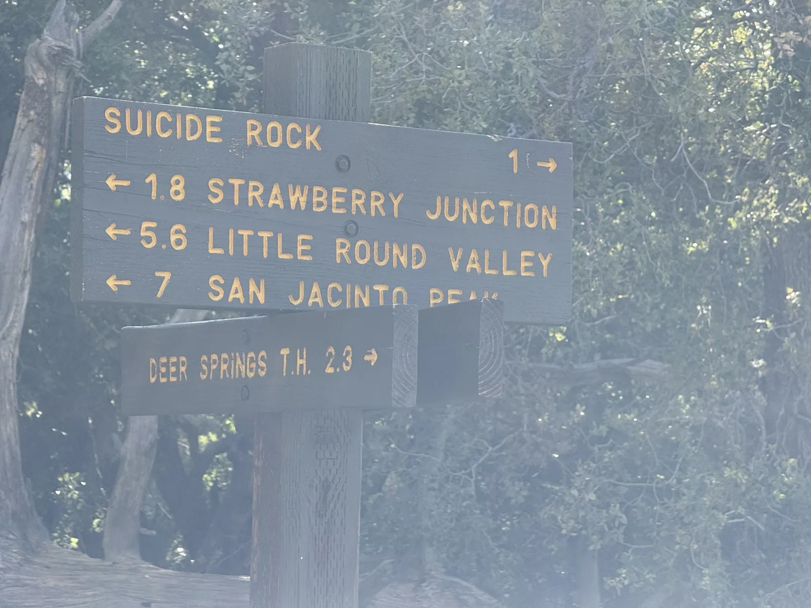
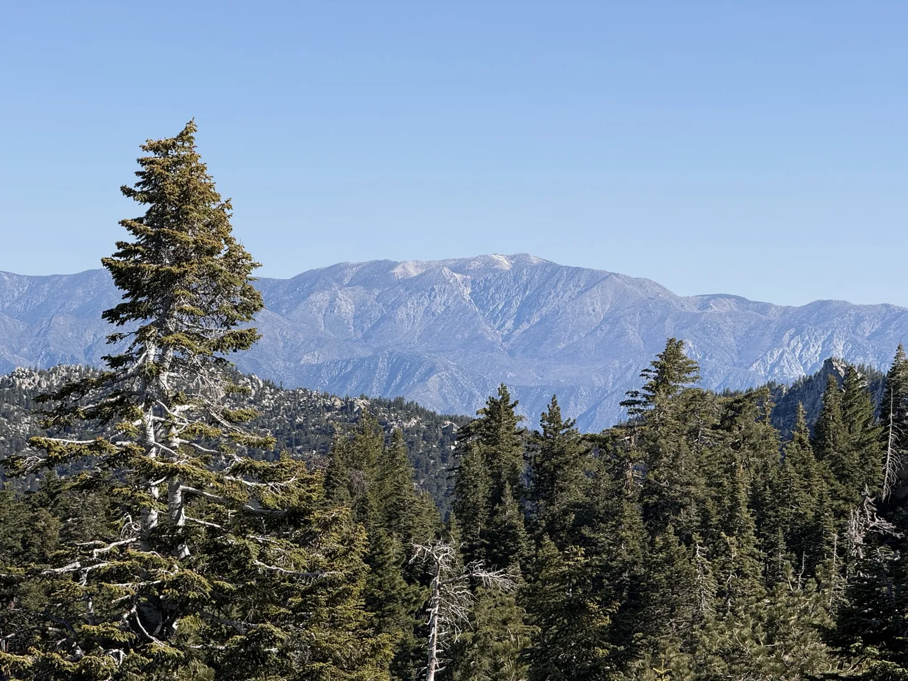
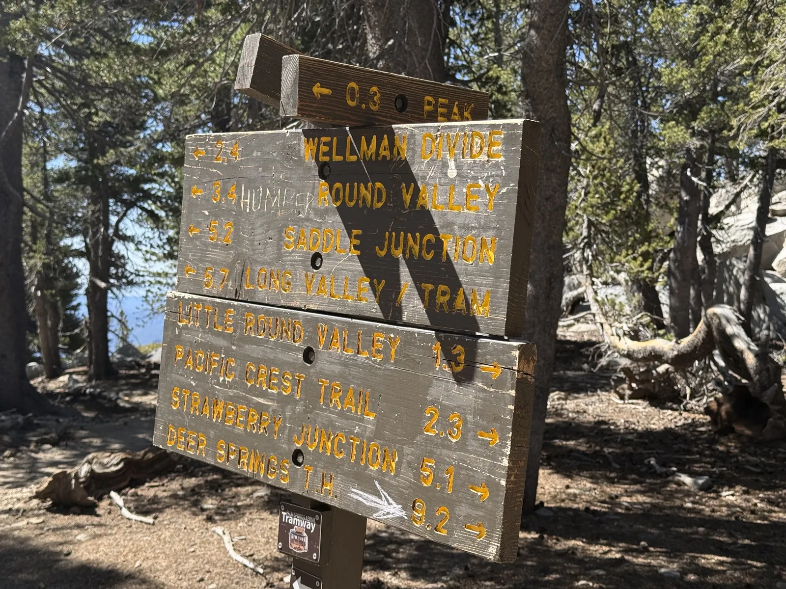
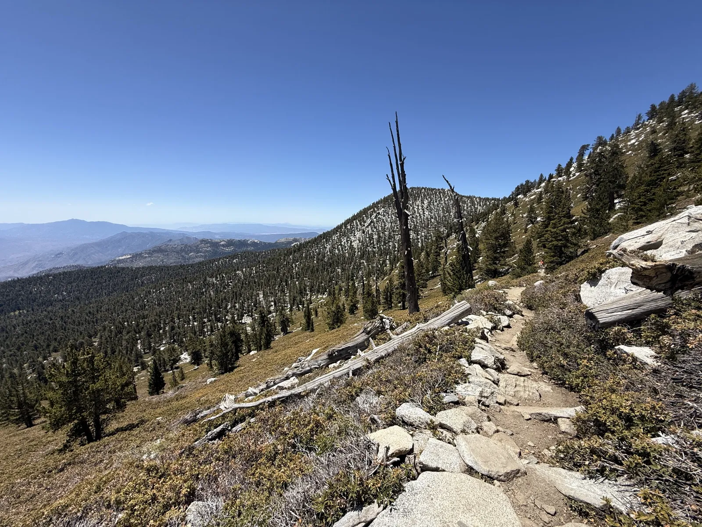
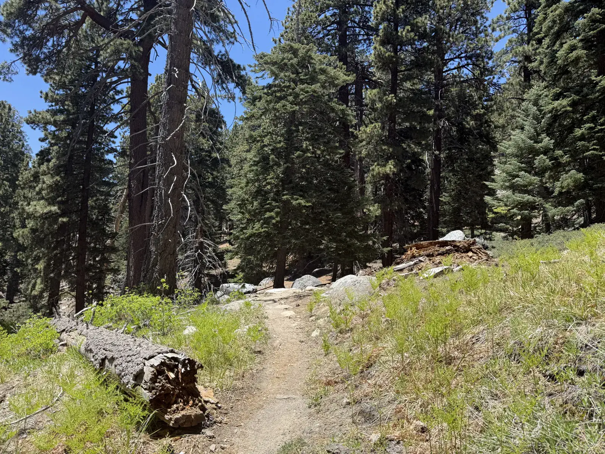

<!-- Garmin stats: 19.77 miles, 6,056 ft gain, 7h 53m, avg HR 140, max HR 178, 2,964 cal, summit 10,834 ft, start elev 5,623 ft, May 31 2026 -->


There were two coyotes on the road between the ranger station and the trailhead, both of them out in the early light when I had the road mostly to myself. I'd stopped at the ranger station thinking I could fill out a paper day-hiking permit, the way you do at a lot of these places, and found out there are no physical permits anymore, just a QR code to scan. So I scanned it and got back in the car, and then a few minutes later there were the coyotes, unbothered, doing whatever coyotes do at six in the morning, and that was the welcome back to Idyllwild after years away.

I came here as a kid, almost every winter, my parents renting a cabin so we could drive up and see snow. It was familiar in the way places from childhood are familiar, which is to say I recognized the shape of it without remembering any of the details, and this was the first time I'd ever driven up myself instead of riding in the back seat. By the time I pulled into the trailhead lot there were about four cars already there, and two more pulled in while I was sitting on the bumper putting on my shoes.

The day came out to 19.77 miles and 6,056 feet of gain, just under eight hours on trail, topping out at 10,834 feet according to the sign at the top. The Garmin had my heart rate averaging 140 and spiking to 178, and said I burned just shy of 3,000 calories getting it done. This is the third of the Six-Pack I'm working through toward Whitney, and the first one I'd call genuinely beautiful start to finish.

I went up Deer Springs and came back down through Saddle Junction and Humber Park into Idyllwild, a big loop instead of an out-and-back. There's an easier way to do San Jacinto, the Palm Springs Aerial Tramway, which lifts you most of the way up and drops you a short walk from the summit. I skipped it. I wanted to push myself, I figured I could handle the harder route, and the tram is expensive for what it actually is.

## The climb

The first hour on Deer Springs was about as peaceful as trail gets. I passed exactly three people. It was chilly but not too cold, the sun hadn't crested the mountains yet, and the sky was already that clean cloudless blue it stayed all day. The trail wasn't steep early on, so I settled into a good pace and just moved through the forest while it was still mostly mine.

The signs come at you in a steady rhythm on this trail, each one a little checkpoint with distances that remind you just how far you still have to go.


IMG_9664.webp | Strawberry Junction at 8,000ft in morning light
IMG_9673.webp | Narrow dirt trail through pine and granite, dappled light


Strawberry Junction sat at 8,000 feet in early morning light, the trail splitting toward Wellman Divide and the peak. The forest up here is the real thing, tall pines and granite boulders and that soft duff underfoot that makes the miles feel easier than they are.

Somewhere in the middle of the forest the trail opens up just enough to look across at San Gorgonio sitting on the far ridge, which is a good reminder of how high you actually are even when the trees have you boxed in.


IMG_9710.webp | Looking down at feet on the trail, pine needle duff on the ground
IMG_9720.webp | Deer Springs Trail junction sign showing distances to San Jacinto Peak


The altitude didn't show up until past the Little Round Valley campground, somewhere around 9,100 feet on the final push to the summit. Up to that point I'd felt strong. Then once I was actually rock-hopping toward the top I could feel the oxygen thinning out, and I had to stop a couple of times just to catch my breath, which doesn't happen to me much at the elevations I usually hike.

## The summit

I'd assumed the summit would be a sign and a flat patch and a view. It is not. The top of San Jacinto is basically a pile of boulders, and reaching the actual high point means doing some real climbing, hands on rock, picking your way up. That was the first surprise. The second was snow. Not on the trail itself, that was all clear, but tucked into the shadows on the slopes, holding on into the end of May. There was water flowing all over the place too.

There were a good number of people up top, including some older folks who'd ridden the tram and beaten me to it, which is its own kind of humbling after 11 miles of climbing. The views earned every bit of the route, though. All of Palm Desert and the Coachella Valley spread out on the desert floor, Joshua Tree off in the distance, and the best look at San Gorgonio I've gotten yet. I stayed about 40 minutes.


IMG_9750.webp | Summit selfie with Coachella Valley desert floor stretching out behind
IMG_9759.webp | At the San Jacinto Peak sign, 10,834 feet


## The long way down

On my way off the summit I met an older man heading down who told me to take the alternate route through Saddle Junction instead of going back the way I came, said it was the more beautiful descent. I took his word for it. That decision cost me and paid me back in roughly equal measure.

The cost: parts of the trail were overgrown enough that I was pushing through brush, and my legs took a beating from it. I also went down the wrong trail at one point and had to backtrack to find the right turnoff, which is a deflating thing to do 14-some miles into a day. The payback was the views. Idyllwild from above, Suicide Rock, the granite cliffs and domes catching the late-morning light, the whole valley dropping away below the ridgeline.


IMG_9802.webp | Junction sign on descent: Saddle Junction, Humber Park, Idyllwild
IMG_9806.webp | Wide view from the ridgeline, conifer forest falling into the valley
IMG_9809.webp | Granite dome seen from above, Suicide Rock area
IMG_9822.webp | Entering Mt. San Jacinto State Park Wilderness sign


And I had it entirely to myself. For about two hours I didn't see a single person, didn't hear anyone, just me and the trail and the cliffs. I didn't pass anyone until I was back on the Deer Springs Trail itself near the bottom. After a busy summit and a busy lower trail, two hours of complete solitude on a mountain this pretty was the part I'd go back for.

## The body math

Around mile 16 the body started filing complaints. My feet were hot and tired of carrying me, and I could tell the last few miles to the car were going to be a grind. So I did the thing that makes no logical sense but works anyway, which is that I started running some of the flatter sections because, somehow, running hurt slightly less than walking. When I finally got to the car I sat there a while and swapped into fresh socks and shoes, and then drove down out of the mountains as soon as I could because I was completely beat.

San Jacinto is my favorite hike in Southern California so far. I'd put it at a 9 out of 10, a notch above Angels Landing in Zion and a step below Half Dome. The boulder scramble at the top, the snow I didn't expect, two hours alone on a beautiful trail, all of it. I took more photos on this hike than any other, which is usually a good tell.

The gap that's still very real is the one between here and Whitney. San Jacinto tops out at 10,834 feet. Whitney is 14,505. I felt the altitude wall on the summit boulders here, and that wall is going to be a lot taller up there. I expect to be a little slower at elevation, but I tend to adapt quickly once I'm in it, and the plan is to camp the night or two before Whitney so my body is already up high when the real altitude hits, which should let me find my stride faster than I would coming up cold from the car.

Mt. Baldy is next on the Six-Pack, and I've got new Hoka Speedgoat 7s for it. I've put some road miles on them but no trail miles yet, so Baldy gets to be the test. After that I'm eyeing Mt. Langley too, which means more backcountry travel than any of these. Three peaks in, and the project has stopped feeling like training and started feeling like the point.
