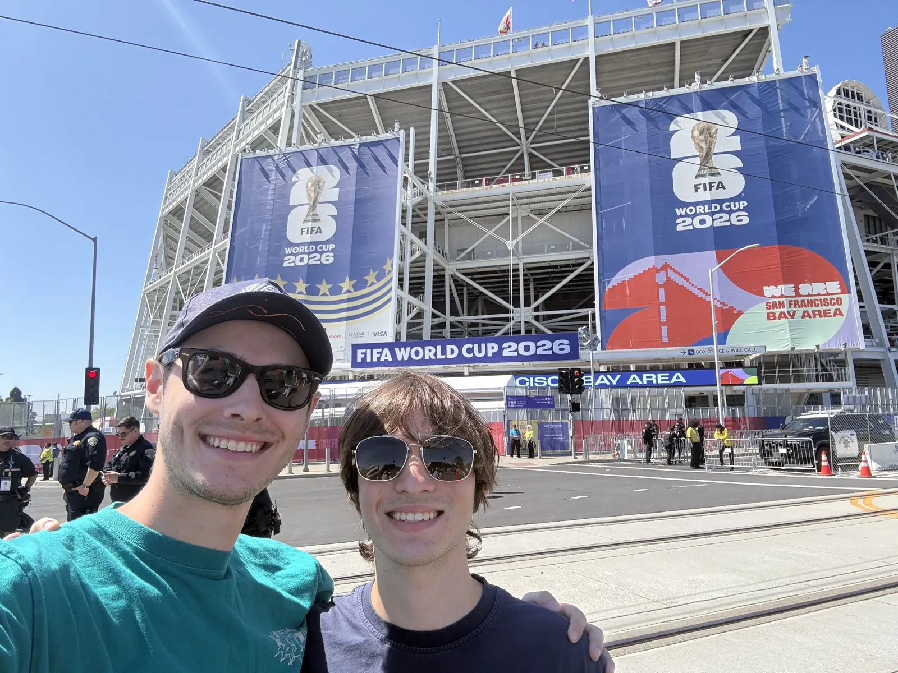
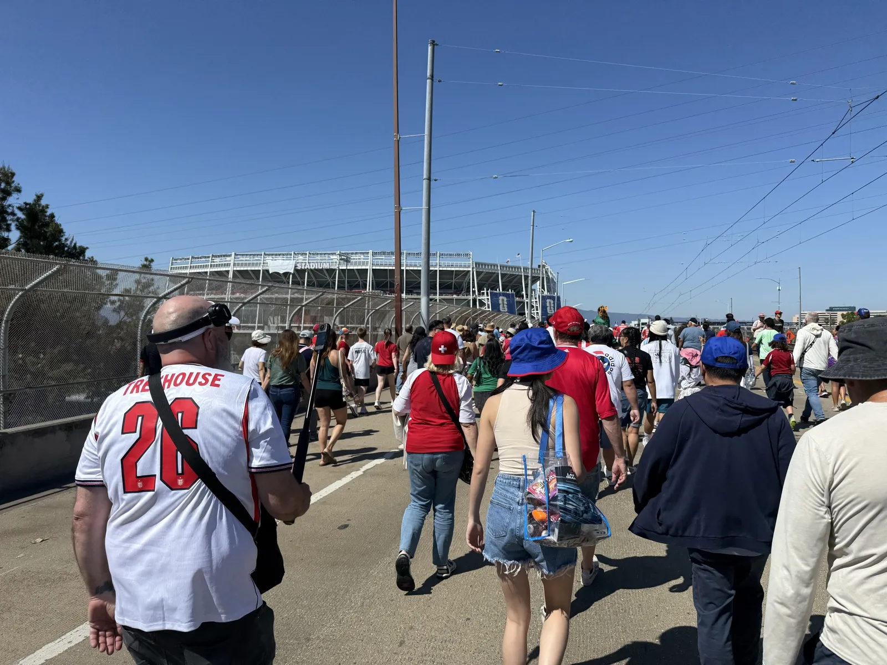
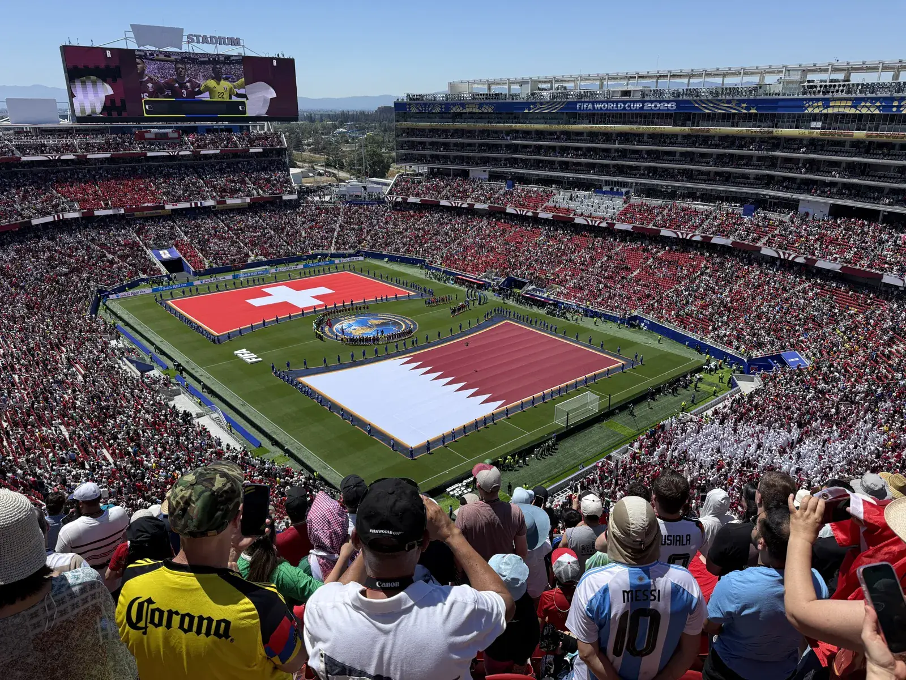
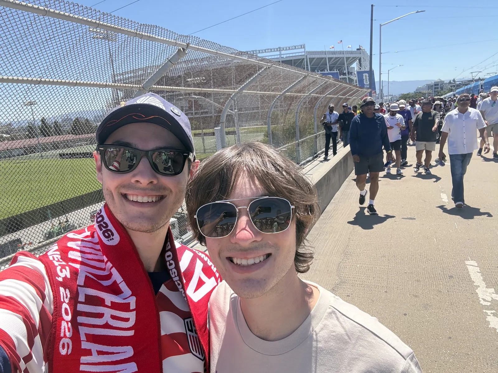

I bought the tickets about two weeks before the game, two of them for $460 total through the official FIFA reseller marketplace. Prices were high and slowly falling as gameday got closer, and I'd been watching them long enough to feel ok about pulling the trigger when I did. I didn't want to wait too long and end up with nothing, and I've seen enough horror stories from third-party sellers to know I wanted the official channel. So I locked it in and that was that.

I'd always wanted to go to a World Cup, and with it coming to the States this was the time. There was never going to be a San Diego venue, which I knew early on, because Qualcomm Stadium got demolished to build Snapdragon and Snapdragon doesn't meet FIFA's requirements. So I was open to a drive up to LA or San Jose, or even flying to Vancouver or Seattle. The San Jose match worked out for a different reason, which is that I had to be in Northern California anyway to pick up my little brother from his first year of college for summer break. That made the long drive feel a lot more worth it.

The weekend stacked up nicely. I drove up on Friday, met a friend in Sacramento and caught Bosnia vs Canada at noon at a sports bar, picked up my brother in the afternoon, and we watched USA vs Paraguay that night at a sports restaurant. Hotel in San Jose. Saturday morning we checked out, drove to the Milpitas transit center, and took the light rail in to Levi's.

The match was at noon and it was hot and extremely sunny, the kind of sun where you don't realize what's happening until later. Both of us got sunburned. I'd been to NFL games before so I knew roughly what to expect from a venue, and honestly Levi's seemed a little small. The crowd was huge though, mostly Switzerland fans in red and white, plus a lot of people in Mexico and USA gear and the occasional European or Mexican club jersey. I barely saw any Qatari fans until we got inside, where it turned out they had a full section.

The other surprise was how fast we got into the stadium. One main entrance, a crowd that size, and it still moved quick. I'd braced for a long crawl and it never came.

I wasn't there for either team specifically. This was about being at a World Cup match more than who was playing. I knew Granit Xhaka from years of following the Premier League, but I had no allegiance either way. Soccer is my number one and it's not close, I've had season tickets ever since [San Diego FC launched](/posts/why-i-follow-san-diego-fc/), I watch Liverpool, I watch the Champions League. So mostly I just wanted a good game that didn't stay scoreless.

We were in the third tier, row 9, close enough to the front that the view was solid. It got loud, comparable to an NFL game, and you could tell pretty quickly that Switzerland were the better side. Way more possession, way more chances, just no finishing quality when it counted. Xhaka looked like a midfielder and not much more, probably age catching up and slowing him down. Qatar sat deep and defended for their lives, hoping for something to go their way while Switzerland knocked on the door all day.

The penalty came in the first half. The Qatari keeper dove into a Swiss player who got a last touch to redirect the ball and essentially keep possession, and the keeper stayed down for a while. Nobody around us really knew what was happening until they started lining up for the spot kick. Breel Embolo scored it and the place roared. It turned out to be the first penalty of the entire tournament, and also Switzerland's first ever penalty goal at a World Cup, which I suspected at the time and only confirmed after.

Then Qatar equalized in the 94th minute. One-one. They scored in the dying moments and stole a point off the Swiss, and that was the loudest the crowd got all day. Qatar had never earned a single point at a World Cup before this game. The team that had been hanging on by their fingernails for ninety-plus minutes finally got the thing they'd been hoping for. Good for them, honestly.

I wanted merch and I got merch. A USA jersey, a match-specific scarf for my scarf collection, and some pins. My brother got a shirt. The scarf is the one I'm most attached to.

Then we drove straight home to San Diego, no overnight, and got back somewhere around 11 to 11:20pm. That's roughly 14 hours of driving across two days, which is rough, but I was making the trip anyway to get my brother, I got to see my friend, and it was my first World Cup match. Worth it, and it makes a good story.

This one wiped me out financially for a while, so I'm not actively chasing more tickets, but I'll take whatever I can get. Otherwise it's watch parties and bars, especially for USA games now that I've got the jersey. I've watched every game so far and once the group stage gets to concurrent kickoffs I'll be running two at once, which is a much cheaper way to do this.
