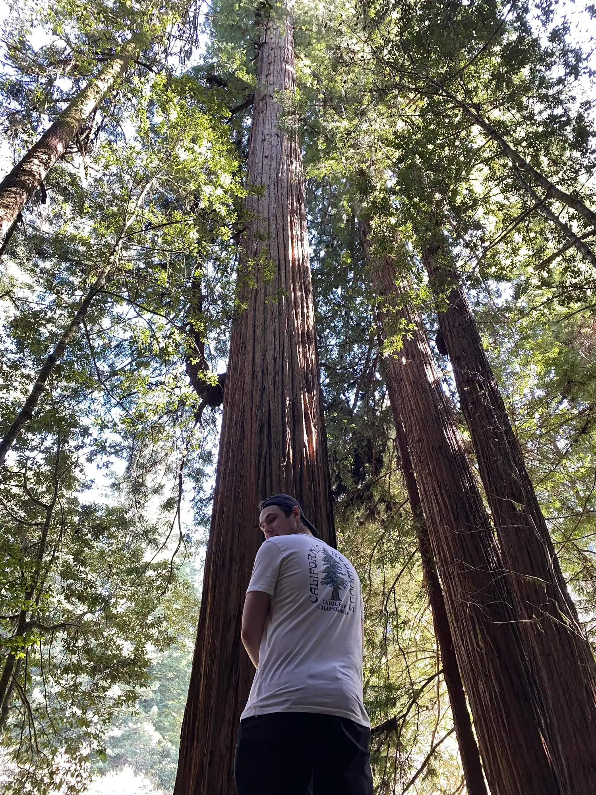
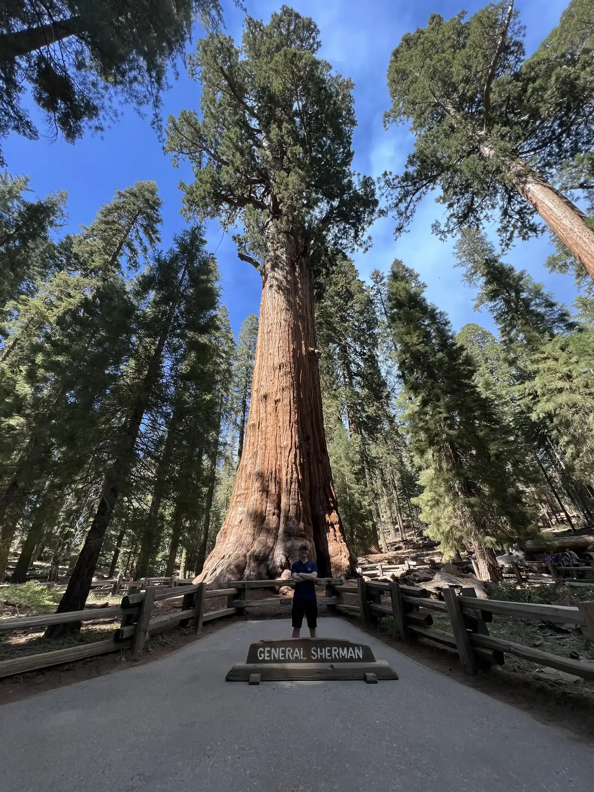
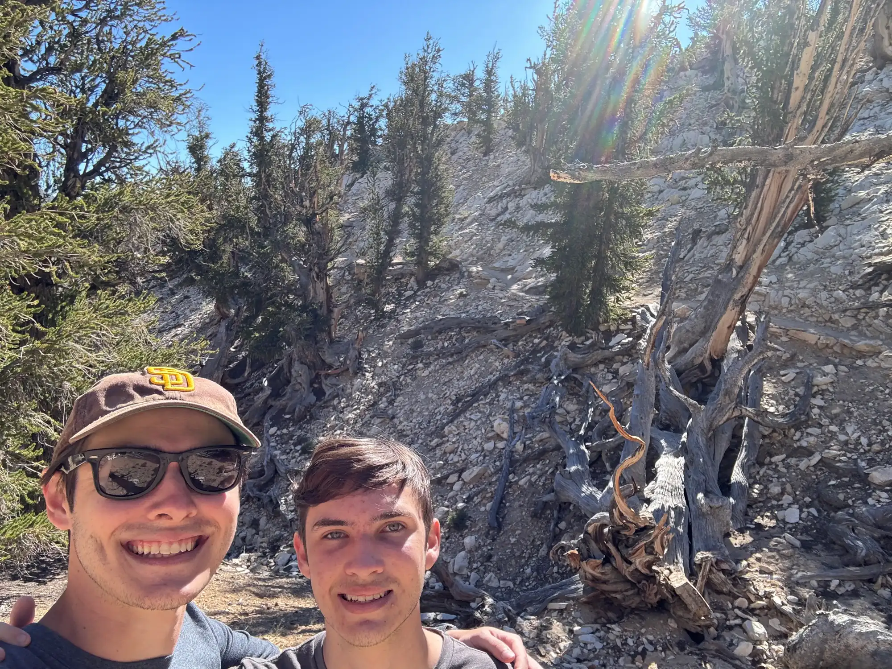

The tallest tree on Earth is somewhere in a stretch of fog-wet forest in Northern California, and the Park Service will not tell you which one it is. You can hike near it, you can stand a few hundred feet from it, you can probably photograph it without realizing, but they stopped giving out the coordinates years ago because hikers were trampling the root system trying to find it. The same thing is true for the oldest tree, a bristlecone pine up in the White Mountains, where Methuselah stands unmarked in a grove of other ancient trees that all look about the same level of battered. The largest tree is the exception. General Sherman sits behind a fence in Sequoia National Park with a boardwalk around it and a sign telling you exactly what you're looking at, because when a tree is that big, hiding it is not really an option.

I saw all three across four years, on three separate trips, without planning for it to turn into a thing. It turned into a thing anyway.

## Hyperion, August 2020

Hyperion is a coastal redwood, *Sequoia sempervirens*, and at 380 feet it's the tallest known living tree on the planet. It was only discovered in 2006, by two naturalists named Chris Atkins and Michael Taylor who were poking around an unmapped drainage in Redwood National Park with a laser rangefinder. A tree that tall had been standing there the whole time, and no one had measured it. That's the part I find hardest to get over, that in 2006 we were still finding new tallest-ever trees in California.

I went up to Redwood National Park in August of 2020, which was the summer where the world had mostly stopped and a road trip up the 101 was the closest thing to a real vacation I was going to get. The park is a different world from San Diego, cold and wet and dark under the canopy even in the middle of the afternoon, the air thick with the smell of wet bark. The trees are so tall that the ground rarely sees direct sun, which is part of why the understory stays so green and alive.

<!-- RYAN: add a specific moment from the Redwood trip if you have one — what trail you were on, what the light looked like, a detail a friend said, anything concrete. Without it this section reads as general. -->

I did not see Hyperion specifically, because nobody really does. The coordinates are withheld and the area around it is closed to off-trail hiking. What you see instead is the forest that produced it, the grove of trees that are all pushing into the 350-foot range, any one of which could be the next record-holder once somebody climbs it with a measuring tape. The knowledge that the tallest tree in the world is somewhere in the general neighborhood of where you're standing is the actual experience, and it turns out that's enough.

## General Sherman, July 2020

Before the redwoods there was Sequoia, a month earlier, a different kind of California entirely. Sequoia National Park sits up in the southern Sierra at around 7,000 feet, and the giant sequoias there are a completely different species from the coastal redwoods, *Sequoiadendron giganteum* instead of *Sequoia sempervirens*, shorter but immensely thicker. General Sherman is the headliner, the largest tree on Earth by volume, 275 feet tall with a base diameter of 36.5 feet and an estimated weight of 2.7 million pounds. It has been standing in that grove for roughly 2,200 years.

The drive up from San Diego to Sequoia is long, most of a day on I-5 and then the climb up the 198 into the park, and by the time you get to the Giant Forest the road has been twisting through switchbacks for an hour. The Sherman Tree trail is short, about half a mile downhill to the tree and then the same half mile back up, which is a small reminder at 7,000 feet that you are not going to breeze through it.

The first thing you notice is that a photograph of General Sherman does not work. The tree is too big to fit in a frame from any reasonable distance, and standing next to it the scale is so far beyond what your brain is used to that it stops registering as a tree and starts registering as a feature of the landscape, like a cliff face or a butte. The bark is a warm orange-red and fibrous, soft-looking up close, and the lowest branches start something like a hundred feet off the ground. Sequoias do not have branches where other trees have branches, because the equivalent altitude on a normal tree is just the canopy.

<!-- RYAN: a specific moment at General Sherman — standing at the fence, who you were with, what you said or thought, something grounded. Right now this section is all facts and no you. -->

What General Sherman mostly did was recalibrate what the word "big" meant for me. Every tree I saw for the rest of that trip was smaller by some amount, and I kept doing the math on how many Shermans of volume I was looking at, and the answer was always a small fraction. The grove is full of sequoias in the 1,500 to 2,000 year range, any of which would be the most impressive tree anywhere else, and they read as backup singers.

## Methuselah, July 2024

Four years later I finally got up to the White Mountains, which sit just east of the Sierra across the Owens Valley from Bishop, and which contain a grove of bristlecone pines that includes Methuselah. Methuselah is around 4,854 years old as of 2024, confirmed by a core sample taken in 1957 by a researcher named Edmund Schulman, which makes it one of the oldest known living non-clonal organisms on Earth. It was alive before the pyramids were built. It was alive before written language was standardized in most of the world. It is still alive now.

The Ancient Bristlecone Pine Forest is a different kind of place from the redwoods or the sequoias. The trailhead sits above 10,000 feet in elevation, the air is thin, the terrain is exposed and rocky with sparse vegetation, and the trees are twisted, gnarled things that look more dead than alive. That look is the point. Bristlecones survive by not growing much. A tree might be six feet in diameter and fifty feet tall after five thousand years of adding rings so thin you can barely see them without a hand lens. Slow growth means dense wood, dense wood means resistance to rot and insects, and resistance to rot means you get to keep being a tree for a very long time.

The Methuselah Trail is a 4.3 mile loop through the grove, and somewhere along it Methuselah stands, unlabeled and unmarked, because the Forest Service made the same call the Park Service made with Hyperion. If they tell you which one it is, somebody is eventually going to do something to it. So you walk the loop and you know that one of the trees you passed, probably several of the trees you passed, is older than recorded history. The Forest Service also confirmed in 2009 that another tree in the same grove is even older, around 5,070 years, and they are not telling which one that is either.

<!-- RYAN: concrete detail from the July 2024 hike — the altitude kicking your lungs, the color of the wood, a specific tree that caught your eye, the air. This one you have more recent memory of so it can be more specific than the 2020 trips. -->

The hike is not hard by distance or elevation gain, but the altitude changes everything. I was moving at a pace that would be easy at sea level and my heart rate was telling me otherwise. The landscape at 10,000 feet in the White Mountains is austere in a way that fits the trees perfectly, dry and windswept and cold even in July, a place where slow growth is the only viable strategy. The bristlecones look like what you would design a tree to look like if you needed it to survive for millennia on very little.

## Why Three

There was no plan when I went to Sequoia in July 2020. General Sherman was the reason to go, the same way Old Faithful is the reason to go to Yellowstone, a thing you check off because it is the thing. Hyperion a month later was a coincidence of road-trip geography. Methuselah four years later was the one where I realized I was collecting superlatives, that I had already seen the largest and the tallest without meaning to, and that the oldest was sitting up there in the White Mountains waiting to be the third.

The three trees are all within a day's drive of each other, all in California, all in protected public land, and all in the care of federal agencies that have collectively decided that two of them have to stay anonymous for their own safety. That seems right to me. Hyperion and Methuselah exist as facts more than as objects. You read the signs, you walk the trails, you know the trees are in there somewhere, and that is the whole experience. General Sherman is the exception because at 2.7 million pounds anonymity is not available.

Part of what I liked about seeing all three is that they are so different from each other. Hyperion is all height, 380 feet of coastal redwood reaching for the fog. General Sherman is all volume, a tree-shaped mountain with bark the color of sunset. Methuselah is neither, a fifty-foot scrap of a tree that looks like it should not still be alive but has been outlasting everything around it since the Bronze Age. Three different ways of being a remarkable tree, three different landscapes, three different reasons to make the drive.

There's a longer writeup of all three, with full stats and more photos, over on [ryan-little.com/trees](https://ryan-little.com/trees). The blog is where I keep the stories, and the portfolio site is where I keep the record. Both pages will keep growing, because there are more trees on the list. The Major Oak in Sherwood Forest is on it. The dragon blood trees of Socotra are on it. The baobabs in Madagascar are on it. I'm going to take a while getting to those, but I've been working through the California list for four years, and with Methuselah I finally finished the big three.

Four years, three trips, one state, three trees I will not forget.
