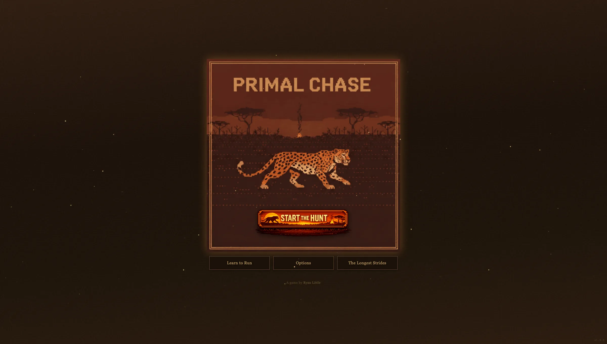

Two weeks ago this blog had one post and no plan. Now I've got 14 posts outlined through May, a publishing schedule taped to the wall (figuratively, it's a YAML file), and a daily GitHub Action that auto-publishes drafts on their scheduled dates. I went from "I should write more" to a full content pipeline in about a week, which is either impressive planning or a sign that I'm procrastinating on the actual projects I should be building. Probably both.

## The Primal Chase Dev Log (5 Parts, Fridays)

The biggest thing on the schedule is a five-part retrospective on building [Primal Chase](https://primalchase.com) version one, a browser survival game where you play as a big cat being persistence-hunted by prehistoric humans. It's intentionally unwinnable, the hunters get faster every day and your job is just to survive as long as you can. No frameworks, no dependencies, just vanilla JavaScript and a lot of CONFIG objects.

The series starts this Friday with Part 0, which covers where the idea came from and how the game design took shape before I wrote any code. From there it goes through the prototype and core game loop, the share system and analytics dashboard, the difficulty and monologue systems, and wraps up with the visual polish that gave the game its identity. Each post is a mix of design decisions, implementation details, and the stuff that didn't work on the first try.

I built V1 of Primal Chase in about ten days in mid-February, and writing about it now is partly to document the process while it's still fresh, and partly because the V2 rewrite is coming and I want a clean record of where V1 ended up.

## The Rest of the Lineup

Fridays are for the Primal Chase series through mid-April, and Tuesdays alternate between personal posts and project write-ups depending on what's ready.

On the personal side, I'm writing about hiking San Diego with Garmin GPS data, where I'll dig into elevation profiles and heart rate zones from actual hikes and what those numbers tell you about effort that the trail description doesn't. I've been hiking a lot more this year as part of a goal to hit 1,000 miles between walking, running, and hiking in 2026, and San Diego has better trails than people give it credit for. There's also a post about why San Diego FC matters to me as someone who grew up here and watched the Chargers leave, and a Fantasy F1 piece later in April once there are enough races to talk about strategy.

The project posts are the ones I'm most looking forward to writing. ClaudeFit started as a fitness dashboard with AI agents handling training guidance, and I ended up stripping all the AI out because simple rules worked better. What survived is a Garmin-integrated dashboard with ACWR tracking, heart rate zones, GPS route maps, and a gamification layer with pixel art sprites and XP quests. The post is about what I built, what I ripped out, and why. I've also got a write-up on my personal finance dashboard, which is a Google Apps Script project that pulls bank data through SimpleFIN, categorizes and deduplicates transactions, and writes everything to a Google Sheet with no server, no database, and no cron job. I haven't touched it in weeks because it just works, and that's kind of the whole point of the post.

The one I'm most excited about is Claude Code as a development environment. I use Claude Code with custom skills, MCP servers, a knowledge hub, and subagents to build basically everything now, and I want to walk through the actual workflow rather than writing another AI tool review. How I capture knowledge mid-session, how skills enforce consistency, how subagents parallelize work, what the day-to-day actually looks like.

## What's Further Out

Two bigger projects are tied to their own blog series, and the posts will come as the projects progress rather than on a fixed schedule.

I'm building an **RF viewshed tool**, a web-based radio frequency propagation and line-of-sight tool that pre-loads FCC transmitter data and layers GIS datasets on top of terrain. The gap between expensive enterprise tools like CloudRF and janky open-source CLI tools like SPLAT! is wide, and I think a map-first web tool could fill it. The other series is **Learning Geospatial Python in Public**, where I'm documenting the process of picking up GeoPandas, Rasterio, and Shapely by building a wildfire risk dashboard for San Diego County. I have a geography degree with a GIS emphasis and I work in the geospatial industry, but I've done most of my spatial analysis in ArcGIS Pro, not Python, so this is genuinely new territory for me. Both of those start sometime in late April or May.

## The Schedule

I'm publishing twice a week, Tuesdays and Fridays, and planning to keep that cadence going as long as I can. It's aggressive for someone who also has a full-time job and all these side projects, but I front-loaded the writing when the schedule was fresh and I had momentum, and the auto-publishing system means I can batch work ahead of time and let GitHub Actions handle the rest.

If you read the [knowledge hub post](/posts/building-a-personal-knowledge-hub/) last week, you already know I'm big on building systems that run without me babysitting them. The blog publishing pipeline is the same idea, write the posts, set the dates, and let automation do the scheduling. Fourteen posts in three months, and the first batch is already drafted.
