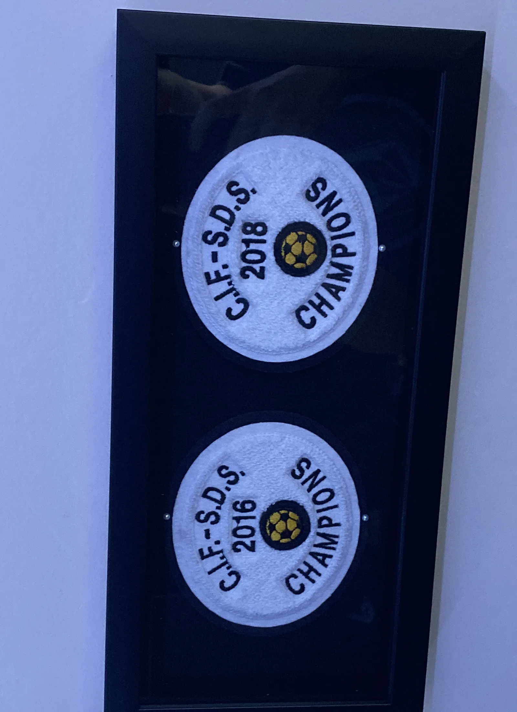
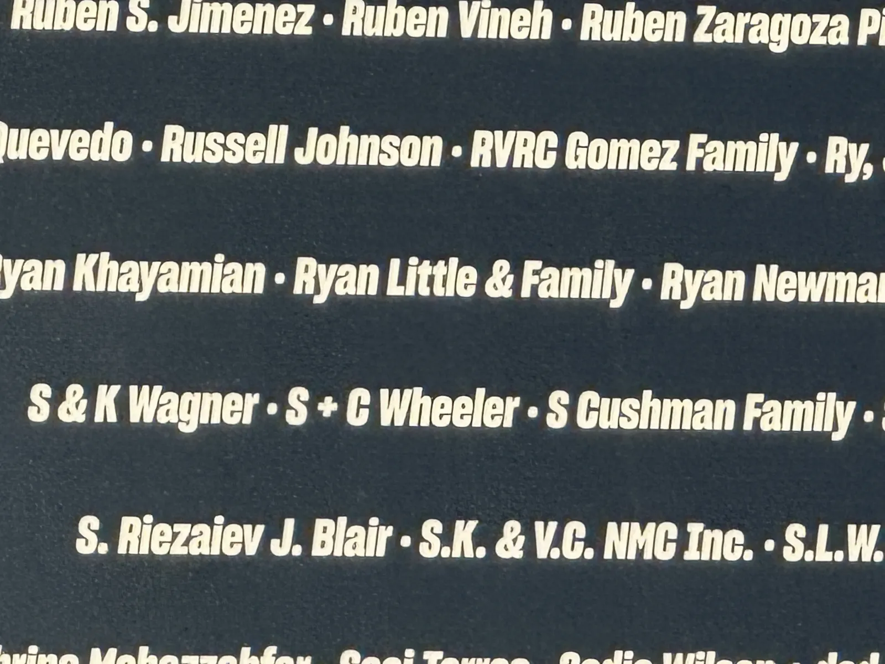
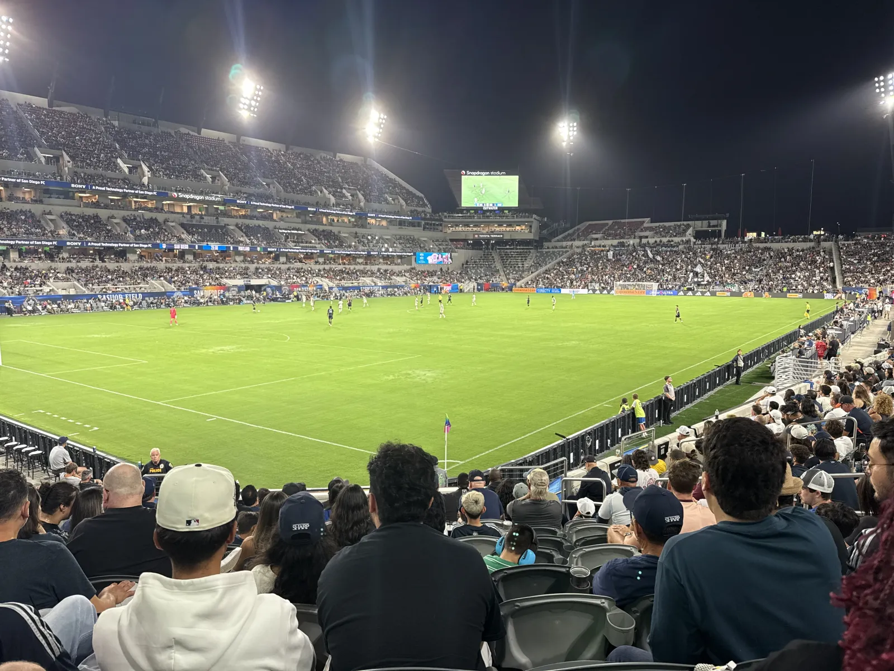
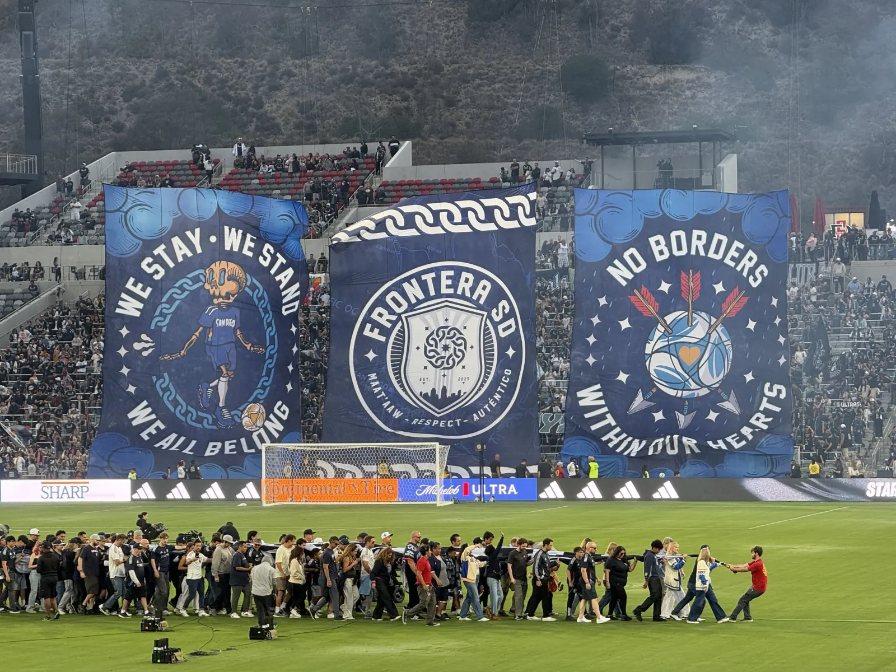

I always told myself that if San Diego ever got a professional soccer team, I'd get season tickets. Not think about it, not check prices, just get them.

I've been playing soccer since I was three years old, my dad played growing up and passed it down to me, and I spent over ten years in club before winning two CIF championships with my high school team. Soccer has been the constant in my life for as long as I can remember. I've followed Liverpool since I was a kid, watched every World Cup since South Africa in 2010, and always felt like something was missing without a local team to actually show up for.

So when San Diego FC became real, I didn't hesitate.

## Before the First Whistle

I was at the Rady Shell with a couple hundred other people for the Chucky Lozano announcement, and it was a full spectacle, fanfare and banners and the kind of moment that made it real, that San Diego was actually getting a legitimate MLS club. Lozano's situation didn't end up working out after the locker room issues last season, which was disappointing, but at the time it felt like proof that the club was serious about competing. I had three season tickets locked in before the team had even played a game, which meant my name went up on the founding members wall at Snapdragon Stadium, something that still feels surreal when I walk past it on the way in.

We were locked in for the full season and hoping the team would be good, but it was impossible to know what we actually had until the games started.

## Matchday

Every home game looks roughly the same. I park in Mission Valley and take the trolley into Snapdragon wearing a custom home jersey with my last name on the back and the number 10. They gave away a hat at the first game and I pinned my founding member pin to it, and now it's what I wear to every match and every bar outing where I'm watching a game. I grab pizza before the match, get to the seats about twenty minutes before kickoff, and settle into row 9, which we moved up to this year from row 12 at the same cost. I'm part of the supporter's union but not in a specific group, just a fan with good seats and opinions about our backline.

I usually go with my grandfather and my mom, making it a family thing, and sometimes my friends come along too. Having something that consistently brings us together on weekends, that we all actually look forward to, is probably the part of this I value the most. I've missed fewer than five home matches total since the club started, and even when I can't be there I watch every game, including during my trip to Japan last year where I was streaming at odd hours to keep up with results. I love our style of play even if I wish they wouldn't pass around the back so much under pressure.

## San Diego Sports, a Mixed Bag

San Diego has a complicated history with professional sports. We were a big Chargers family, and watching them leave for LA was disheartening in a way that's hard to explain to someone who hasn't lived through it. I don't have ill will towards the team itself, most of my frustration, and I think this is true for a lot of people here, goes toward Dean Spanos and the ownership decisions that forced it.

People love calling San Diego a fair-weather sports city, and I don't think that's true. The connection between the city and its teams is real, but San Diego is one of the most expensive places to live in the country, and a lot of people here are barely making it with housing costs alone. Spending money on regular season tickets when your team hasn't won anything in decades is a tough sell, and it doesn't mean people don't care, it means they have to pick their spots. I was at Petco the year it opened and it was packed, and the Park at the Park for cheap lawn seats was a genius move to get people through the door. Things have gotten more expensive since then and priced a lot of fans out.

The Padres have been a lot more fun recently, and I still make it to a couple games at Petco every season, but 162 games makes it hard to stay locked in the way you can with a soccer schedule. I was at Petco for NLCS Game 1 in 2022 when the Phillies beat us, right after we'd knocked the Dodgers out in the division series, and that one stung. But the energy at Petco during those playoff runs is the same kind of energy you feel at Snapdragon for our big matches, the whole city showing up and being loud together, and that's something San Diego hasn't always had enough of.

## Here to Play

That's what makes SDFC feel different. Making the playoffs in our first season was a statement, going to the Western Conference Final in year one was something I genuinely didn't think was possible, and watching Anders Dreyer put on MVP-caliber performances week after week gave the whole city someone to rally around. The same LA rivalry that drives Padres-Dodgers exists in the MLS too, and having a team that can go toe to toe with the Galaxy and LAFC gives San Diego another reason to care.

The club still has things to figure out. Most games are well attended but there are sections that sit empty, and a lot of that comes down to ticket pricing that doesn't make sense when better seats are available for less elsewhere in the stadium. Snapdragon's design doesn't help either, with so many seats designated as club sections that sit largely empty on regular match nights, cutting down the available inventory for everyone else. I think it'll even out as the team becomes a mainstay and the initial pricing settles, but right now the club is trying to capitalize on the excitement and it shows.

This year has built on last season's momentum. Beating Deportivo Toluca in the first round of the Concacaf Champions Cup, actually competing and winning in continental play, is proof that this isn't a fluke. What gives me the most confidence long-term is the Right to Dream academy system, which is built around giving opportunities to players who wouldn't make it to a professional league because of money or where they're from. Bryan Zamble signed with the club days after his 18th birthday and scored within five minutes of his first professional game for us, and that's exactly the kind of pipeline that makes me think we'll be competitive for years.

Soccer is the best sport on earth, and its appeal across every continent and culture is proof of that. I'll be on that trolley for every match I can make, pizza in hand, same jersey, same family next to me in row 9. I promised myself I'd show up if we ever got a team, and two seasons in I haven't found a reason to stop.
