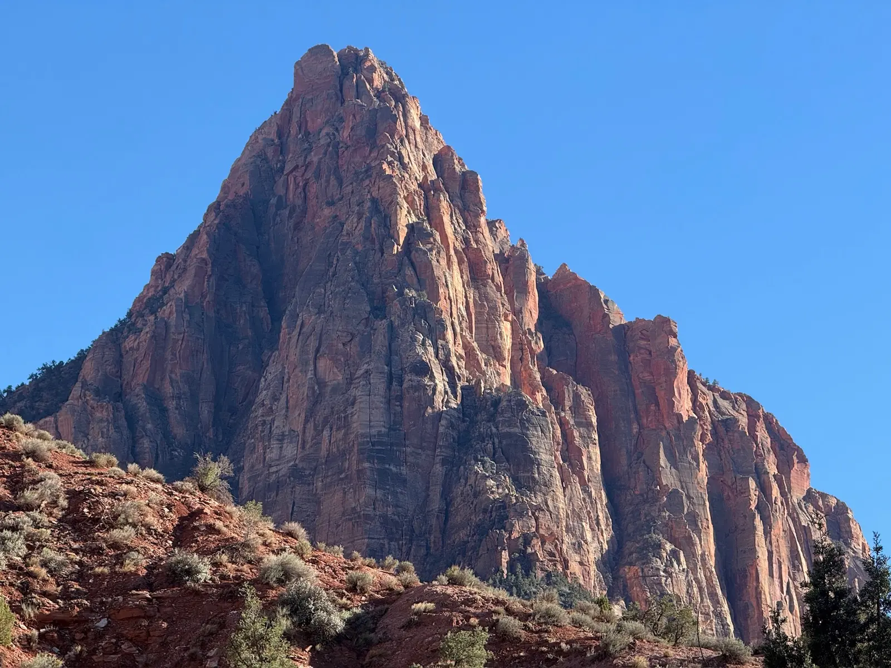
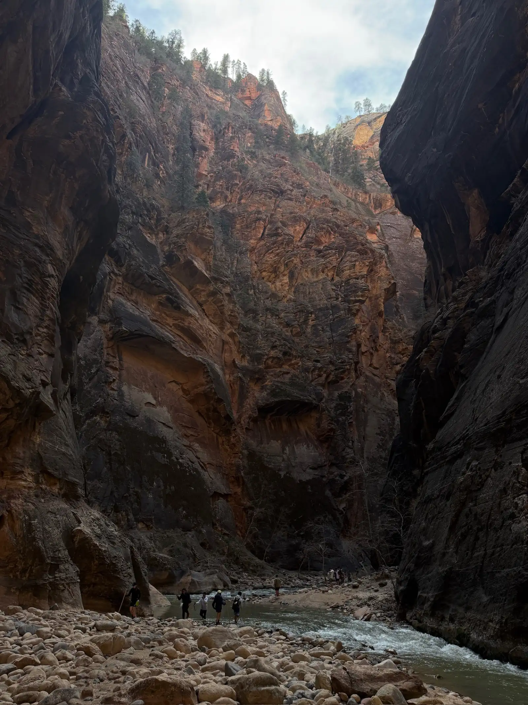


<link rel="stylesheet" href="https://unpkg.com/leaflet@1.9.4/dist/leaflet.css" integrity="sha384-sHL9NAb7lN7rfvG5lfHpm643Xkcjzp4jFvuavGOndn6pjVqS6ny56CAt3nsEVT4H" crossorigin="anonymous" />

<link rel="stylesheet" href="maps.css" />



The last line of my [Hiking San Diego](/posts/hiking-san-diego-with-gps-data/) post mentioned I was heading to Zion the week it went live. That was true, and the Garmin was running the whole time. Three days, three trails, and a stop in Vegas on either side that probably added more steps to the watch than any of the actual hikes did.

I've had the Garmin on other national park trips, but Zion was the first one where I actually tracked every hike as an activity, and looking at the GPS and heart rate data afterward made the whole experience more interesting in retrospect. You remember how a trail felt, but the data shows you things you didn't notice in the moment, like how flat The Narrows actually is despite feeling like a full day of effort, or how Angels Landing pushed my heart rate to 188 while the 8 miles of river hiking in The Narrows barely got me above 160.

The chart below is step data from my Garmin for the entire trip, pulled in 15 minute intervals and stitched together as one continuous timeline. The blue shaded bands are sleep periods, the green segments are the three tracked hikes, and the gold is Vegas walking. 94,773 steps in six days.



  
<canvas id="step-timeline-chart"></canvas>

  

     Tracked Hike
     Vegas
     Walking
     Sleep
  



What stands out about the Vegas days is when the steps happened. On March 18th I walked 12,593 steps but almost all of them came after 8 PM, walking the Strip with friends after a late dinner. On the 22nd the same pattern, 13,051 steps with the line flat all morning while we recovered from The Narrows and then ramping up around 2 PM once we got back to Vegas. The Garmin clocked a sleep score of 44 after the first Vegas night with a "late bed time" warning, and the next night was worse, a score of 40 after not getting to bed until almost 2 AM. Compare that to the Zion nights where I was asleep by 9 PM and the sleep scores jumped to 87 and 58. The watch basically told me that two nights in Vegas did more damage to my recovery than three days of hiking in a national park.

## Watchman Trail

We drove from Vegas to Springdale on the 19th, and that afternoon we wanted something easy and nearby to get a feel for the park before the bigger days. The Watchman Trail starts right near the visitor center and climbs to an overlook above the town, and it was the best option for an arrival-day hike.



<canvas id="watchman-map-elevation"></canvas>



3.1 miles, 525 feet of elevation gain, about 82 minutes of moving time. My average heart rate was 118, which is basically a walking pace for me, and the max of 164 only hit on a couple of short steep sections near the overlook. You can see on the map how the trail climbs up to a loop at the top, a plateau where you walk around and get different views of the canyon, Springdale below, and the Watchman itself to the south, which is where the trail gets its name.

It was 88 degrees when we started, which is hot for mid-March and made the exposed sections feel longer than they were. The overlook itself is worth the walk though. You're looking straight down at Springdale and up-canyon toward the main valley, and at 5:30 in the evening the light was hitting the sandstone walls in a way that made the whole place look like it was on fire. It's an easy hike by any standard, but Zion isn't the kind of place where easy means boring. The scale of the canyon walls makes even a short trail feel like you're somewhere significant.

## Angels Landing

This was the day. Angels Landing is the hike in Zion, the one everyone talks about, and the one that now requires a permit during peak season. My friend Sam got lucky in the day-before lottery and pulled a permit for March 20th, which turned out to be a perfect weather window with clear skies and 59 degrees at the trailhead when we started around 9:45 in the morning.



<canvas id="angels-landing-map-elevation"></canvas>



7.6 miles, 2,556 feet of elevation gain, 4 hours and 47 minutes total time. Look at that elevation profile. The first couple miles follow the West Rim Trail up a series of switchbacks, then you hit Walter's Wiggles, which is a set of 21 short tight switchbacks carved into the cliff face that gains about 250 feet in a quarter mile. After that you reach Scout Lookout, where most people stop, and from there the final half mile to the summit is the chain section that gives Angels Landing its reputation.

My average heart rate for the whole hike was 139 and it maxed out at 188. The HR coloring on the map tells the story, green on the relatively flat canyon floor sections and solid red through the switchbacks and the chain section. I spent 79 minutes in vigorous intensity zones and burned 1,882 calories, which is close to what I burned on El Cajon Mountain despite the distance being shorter, because the climbing is steeper and more sustained here.

The chain section itself is a different kind of hiking. You're on a narrow rock fin with drops of over a thousand feet on both sides, holding onto chains bolted into the rock, and the trail is maybe three feet wide in places. My heart rate in that section wasn't just from the physical effort. The exposure is real, and even though I'm fine with heights, the drops on either side demand your attention. The chains felt solid and I kept moving. The summit is a flat-ish area maybe the size of a basketball court, and the views are up there with anything I've seen on a trail.

We started at 59 degrees and the Garmin logged a max of 100 by the time we finished nearly five hours later, which tracks with how the exposed rock felt on the upper sections in the afternoon sun. The extra mileage on this one came from continuing further up the West Rim Trail after the Angels Landing summit, which added distance and some elevation before we turned around and headed back down.

## The Narrows

Day three, and the legs were feeling the 2,500 feet of climbing from the day before. The Narrows is Zion's other iconic hike, and it's completely different from Angels Landing. Instead of climbing a cliff face, you're walking up the Virgin River through a slot canyon with walls a thousand feet tall and barely any elevation change.



<canvas id="narrows-map-elevation"></canvas>



The GPS says 8.3 miles, but I don't trust that number given how much the signal was bouncing off the canyon walls. A better estimate comes from the step count, 12,228 steps at a shorter-than-normal stride for river hiking puts the real distance closer to 5 or 6 miles. Only 486 feet of elevation gain over the whole route, 4 hours and 16 minutes total. That elevation profile is almost flat compared to Angels Landing, and my average heart rate of 116 reflects that. But 116 doesn't mean it was easy. You're wading through a river for most of the hike, sometimes knee-deep, sometimes thigh-deep, over slippery rocks you can't see through the water. Every step is deliberate because one wrong foot placement and you're sitting in a cold river. Some of my friends rented neoprene socks, water shoes, and hiking poles from one of the outfitters in Springdale, but I went in my normal trail runners and hiking socks. The river was cold enough in March that I was jealous of the rental gear for the first stretch, but after a while I got used to the temperature, and on the way back I barely felt it.

The GPS track on this one is worth looking at, but take it with some skepticism. The canyon walls are so tall and narrow that the Garmin's GPS signal bounces all over the place, and you can see the track jumping between the canyon walls in spots where I was definitely just walking straight up the river. It's still fun to see the route laid out, and it gives you a sense of how the canyon twists and tightens, but this is what happens when you ask a satellite to find you at the bottom of a slot canyon with a few hundred feet of sandstone on either side. There's no maintained path, no boardwalk, no packed dirt. The river is the trail, and the canyon is so narrow in places that the sky is just a thin strip of blue above you.

My watch logged 12,228 steps, which feels low for the time spent until you realize how slow river hiking is. Each step is measured and careful, not the rhythmic stride you get on dry trail. The Garmin had my moving time at about 2.5 hours versus 4.3 hours total, which means I spent almost two hours stopped, resting, taking photos, or just standing in the river looking up at the walls. That's more time standing still than I've spent on any other hike I've tracked, and it speaks to how much of The Narrows is about the experience of being in the canyon rather than the physical act of hiking through it.

## The Trip

Angels Landing is the hike that stuck with me the most. The Narrows was a completely different kind of experience, walking through a river in a slot canyon with a thousand feet of sandstone overhead, and Watchman proved the park is worth showing up for even when your legs haven't recovered from a Vegas night. But something about the chain section on Angels Landing, the exposure and the effort and the views from the top, is what I keep coming back to when I think about this trip. I've been building toward a [Mt. Whitney attempt](/posts/whitney-goal/) later this year, and Zion gave me something I didn't have before, sustained climbing data at altitude and recovery numbers between the big days. The part that surprised me is still that the trails weren't what wrecked my numbers. Three days of climbing canyon walls left me with sleep scores in the 80s, and two nights on the Strip dropped me into the 40s.
